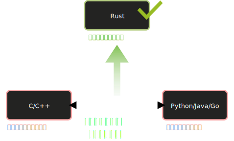
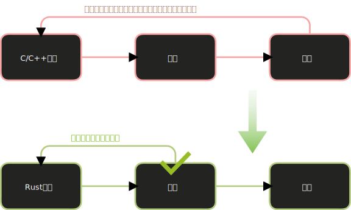

# Rust 是什么

你可能听说过 Rust 很难学，也可能听说过它是”程序员最爱的语言”，甚至两者都听说过。这两件事并不矛盾——Rust 确实有一定的学习曲线，但它试图解决的问题是真实存在且困扰编程世界数十年的老难题。

学习 Rust 之前，先搞清楚它**为什么存在**，能帮你在遇到困难时不至于放弃。

## 一个长达几十年的矛盾

在编程语言的世界里，有一对长期对立的需求：

**高性能、底层控制** vs **安全、高效的开发体验**

- C 和 C++ 给你完全的底层控制，可以精确管理内存，运行极快。代价是：一不小心就会有内存泄漏、空指针崩溃、数据竞争等 bug，找起来极其痛苦。
- Python、Java、Go 等语言有垃圾回收器（GC）帮你管内存，开发体验好，但运行时有额外开销，无法用于对延迟和资源极敏感的场景（比如嵌入式系统、操作系统内核）。

这就是那个矛盾：**要么安全，要么快，二选一。**

Rust 的答案是：**不，两者可以兼得。**

> Rust 不靠运行时 GC 来保证内存安全，而是通过编译期的所有权系统，在代码运行之前就把不安全的写法拒之门外。

## Rust 的核心思路：让编译器当守门员

传统语言里，内存 bug 通常在**运行时**才暴露——程序崩了、客户投诉、深夜排查。

Rust 的做法完全不同：它在**编译期**就检查内存安全。如果你写了一段可能出问题的代码，Rust 编译器会直接拒绝编译，并给出详细的错误信息告诉你哪里出了问题。

这一套机制的核心叫做**所有权系统**（ownership），我们后续会详细学习。现在只需要记住一件事：

**在 Rust 中，以往那些只能靠测试和代码评审才能发现的 bug，编译器会在你运行之前就帮你找出来。**

这对团队协作意义重大——你不再需要依赖每个人都”足够小心”，编译器本身就是那道安全网。

## Rust 没有运行时开销

Rust 实现内存安全的方式是**编译期分析**，不是运行时的垃圾回收器。这意味着：

- 没有 GC 的暂停（GC pause）
- 没有运行时的额外内存占用
- 可以精确控制内存布局
- 可以用于嵌入式、内核、实时系统等对资源极其敏感的场景

Rust 追求的是**零开销抽象**（zero-cost abstractions）：你写的高层代码，编译后和手写的底层代码一样快。如果用不到某个特性，就不付出该特性的开销。

## 一句话总结

**Rust 是一门让你同时拥有 C 的性能和 Python 的安全感的系统编程语言——它用编译期的所有权检查，在不引入运行时开销的前提下，彻底消灭内存 bug。**

# Rust的适用范围

## 谁适合学 Rust

| 人群 | 为什么适合 |
| --- | --- |
| **系统/嵌入式开发者** | 保持 C/C++ 同等性能的同时摆脱内存 bug；汽车电子、工业控制、物联网已有大量实践 |
| **后端/基础设施开发者** | 适合构建高性能 Web 服务、CLI 工具、数据库引擎；并发模型让编译器在编译期阻止竞争条件 |
| **学生和技术爱好者** | 真正理解内存、生命周期、栈与堆——这些在其他语言里被抽象掉的基础概念 |
| **任何想写更可靠软件的人** | 学 Rust 会改变你思考程序正确性的方式，受益于所有语言 |

## Rust 现在用在哪里

- 浏览器引擎 ：Firefox CSS 引擎 Stylo 、独立浏览器引擎 Servo
- 操作系统 ：Linux 内核已接受 Rust 代码； Redox OS 是完全用 Rust 编写的操作系统
- 嵌入式 ： Embassy 是专为微控制器设计的 Rust 异步框架，越来越多的汽车电子项目也在引入 Rust
- Web 框架 ： Actix Web 和 Axum 是最流行的 Rust Web 框架
- 异步运行时 ： Tokio 是 Rust 生态中最广泛使用的异步运行时
- 桌面应用 ： Tauri 用 Rust 替代 Electron，打包体积从几百 MB 降到几 MB
- 终端工具 ： Alacritty （终端模拟器）、 ripgrep （极速文本搜索）、 fd （find 替代品）、 bat （带语法高亮的 cat）

Rust 不是一门试图替代所有语言的语言。它有明确的定位：**在需要高性能和底层控制的地方，提供内存安全保障**。

> Rust 连续多年被 Stack Overflow 开发者调查评为「最受喜爱的编程语言」第一名。

接下来，我们从安装环境开始，第一步一步把 Rust 跑起来。

# 练习题

## 关于 Rust 的定位

加载题目中…

## 零开销抽象

加载题目中…

## 与其他语言的对比

加载题目中…

## Rust 的适用场景

加载题目中…

## 编译器的角色

加载题目中…