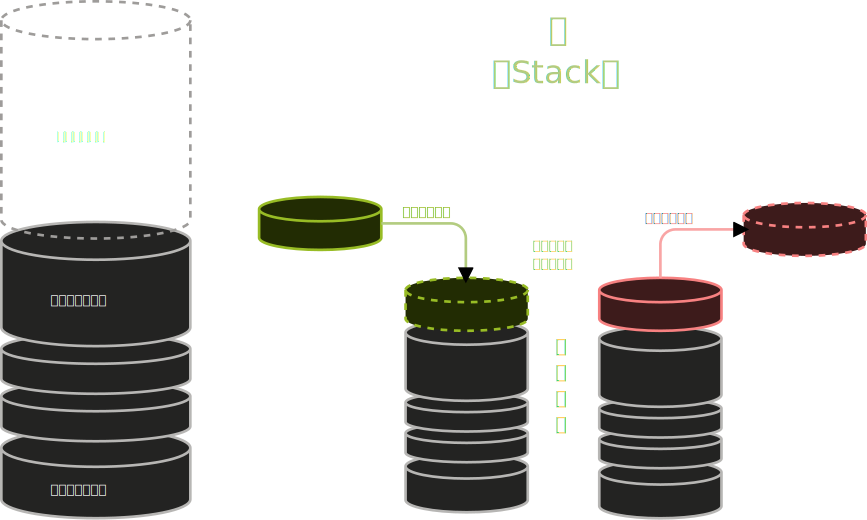
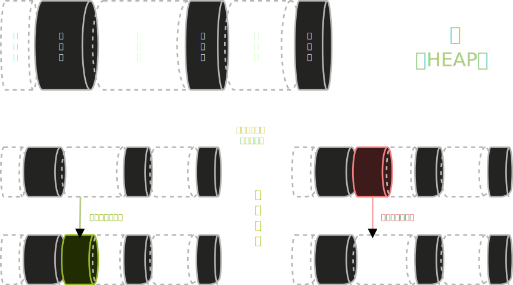
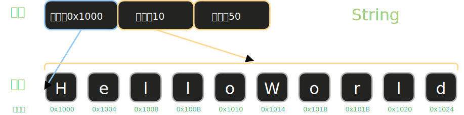
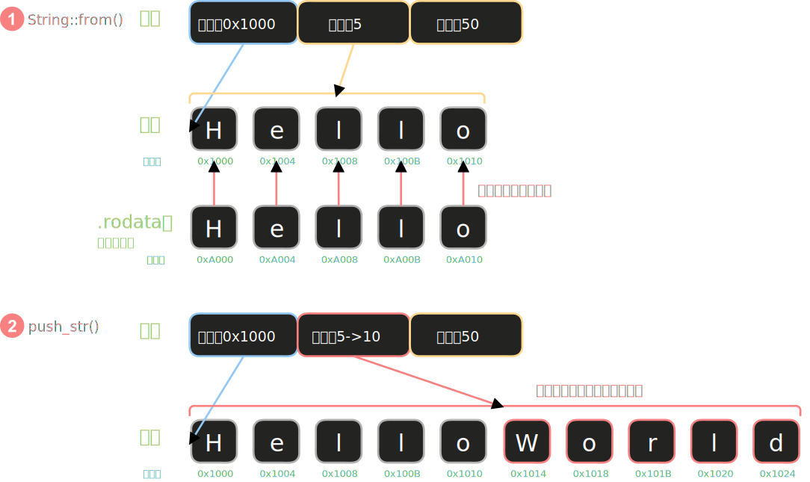
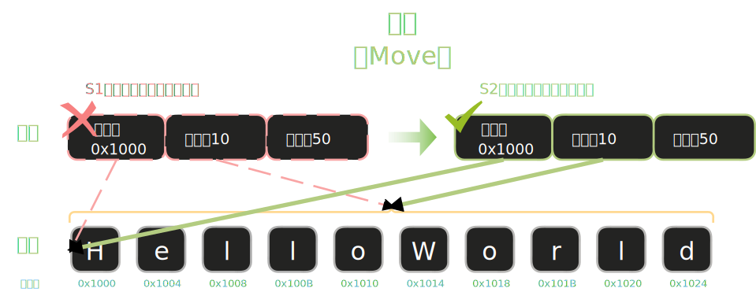
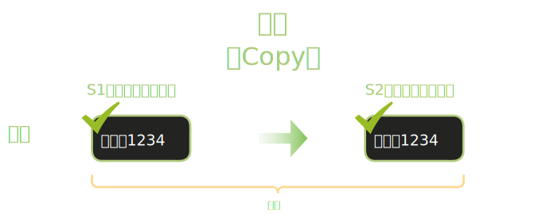
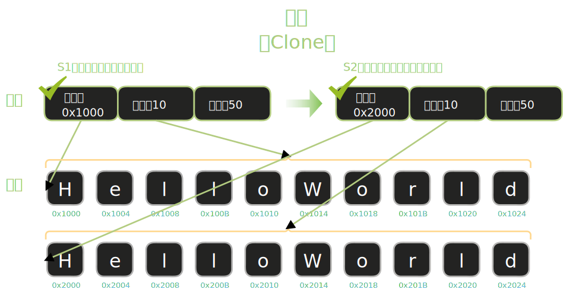

# 内存基础：栈与堆

Rust 中的所有权系统根本上是在管理数据在内存中的位置和生命周期。要理解所有权，必须先知道栈（Stack）和堆（Heap）的区别。

## 栈（Stack）

栈用于存放函数调用的栈帧和那些**大小在编译期已知的小数据**（例如整数、布尔、固定大小的数组、指针元信息等）。栈的分配与释放遵循 LIFO（后进先出），速度很快且不需要运行时的分配器，但栈空间有限，无法直接保存运行时大小可变的数据。



## 堆（Heap）

堆用于动态分配**大小不确定或较大的数据**（例如 `String`、`Vec<T>`、Box 指向的值等）。堆上的内存通过分配器（allocator）管理，分配/释放成本较高，且需要通过所有权或智能指针在程序中跟踪谁负责释放这块内存。



## 栈与堆的配合：以 String 为例

栈存放**大小编译期已知**的数据，堆存放**大小运行时可变**的数据——但实际应用中，如果需要使用到堆，往往两者都要用到。让我们用 `String` 类型来看看它们如何配合：

```rust
fn main() {
    let s = String::from("hello");
    // s 是什么存在栈上？整个字符串内容在哪？
}
```

### String 的内存结构

`String` 在栈上只存**三个字**：

- ptr ：指向堆上数据的指针
- len ：当前字符串的字节数（这里是 5）
- capacity ：堆上已分配内存能容纳的最大字节数（通常 ≥ len）

真正的字符数据 `"HelloWorld"` 存在**堆上**，通过 `ptr` 指针来访问。



### from() 和 push_str() 做了什么

这两个操作涉及不同的内存变化：

<div class="code-runner" data-full-code="fn%20main()%20%7B%0A%20%20%20%20let%20mut%20s%20%3D%20String%3A%3Afrom(%22hello%22)%3B%0A%20%20%20%20println!(%22len%3A%20%7B%7D%2C%20capacity%3A%20%7B%7D%22%2C%20s.len()%2C%20s.capacity())%3B%0A%0A%20%20%20%20s.push_str(%22%2C%20world!%22)%3B%0A%20%20%20%20println!(%22len%3A%20%7B%7D%2C%20capacity%3A%20%7B%7D%22%2C%20s.len()%2C%20s.capacity())%3B%0A%7D" data-mode="run"><pre class="code-runner-pre"><code class="language-rust"><span class="line"><span style="color:#F97583">fn</span><span style="color:#B392F0"> main</span><span style="color:#E1E4E8">() {</span></span>
<span class="line"><span style="color:#F97583">    let</span><span style="color:#F97583"> mut</span><span style="color:#E1E4E8"> s </span><span style="color:#F97583">=</span><span style="color:#B392F0"> String</span><span style="color:#F97583">::</span><span style="color:#B392F0">from</span><span style="color:#E1E4E8">(</span><span style="color:#9ECBFF">"hello"</span><span style="color:#E1E4E8">);</span></span>
<span class="line"><span style="color:#B392F0">    println!</span><span style="color:#E1E4E8">(</span><span style="color:#9ECBFF">"len: {}, capacity: {}"</span><span style="color:#E1E4E8">, s</span><span style="color:#F97583">.</span><span style="color:#B392F0">len</span><span style="color:#E1E4E8">(), s</span><span style="color:#F97583">.</span><span style="color:#B392F0">capacity</span><span style="color:#E1E4E8">());</span></span>
<span class="line"></span>
<span class="line"><span style="color:#E1E4E8">    s</span><span style="color:#F97583">.</span><span style="color:#B392F0">push_str</span><span style="color:#E1E4E8">(</span><span style="color:#9ECBFF">", world!"</span><span style="color:#E1E4E8">);</span></span>
<span class="line"><span style="color:#B392F0">    println!</span><span style="color:#E1E4E8">(</span><span style="color:#9ECBFF">"len: {}, capacity: {}"</span><span style="color:#E1E4E8">, s</span><span style="color:#F97583">.</span><span style="color:#B392F0">len</span><span style="color:#E1E4E8">(), s</span><span style="color:#F97583">.</span><span style="color:#B392F0">capacity</span><span style="color:#E1E4E8">());</span></span>
<span class="line"><span style="color:#E1E4E8">}</span></span></code></pre></div>

- **`String::from("hello")`**：   - 从只读数据区读取字面量 "hello"   - 在堆上分配新空间   - 复制内容到堆上   - 在栈上创建 String 结构体指向这块堆内存
- **`push_str(", world!")`**：   - 检查当前容量是否足够   - 若容量不足，重新在堆上分配更大的空间，移动旧数据过去   - 追加新内容   - 更新 len（容量 capacity 可能也会改变）



# 数据流动的三种方式

理解了栈与堆的区别，现在来看 Rust 里数据在变量之间”流动”时会发生什么。这是初学者最常卡住的地方——同样是 `let b = a` 这行代码，对整数和对 `String` 的行为截然不同。

## 移动（Move）



当你把一个 `String` 赋值给另一个变量时，发生了什么？

<div class="code-runner" data-full-code="fn%20main()%20%7B%0A%20%20%20%20let%20s1%20%3D%20String%3A%3Afrom(%22hello%22)%3B%0A%20%20%20%20let%20s2%20%3D%20s1%3B%20%2F%2F%20s1%20%E7%9A%84%E6%89%80%E6%9C%89%E6%9D%83%E7%A7%BB%E5%8A%A8%E7%BB%99%20s2%EF%BC%8Cs1%20%E4%BB%8E%E8%BF%99%E9%87%8C%E5%BC%80%E5%A7%8B%E6%97%A0%E6%95%88%0A%20%20%20%20println!(%22%7B%7D%22%2C%20s2)%3B%0A%7D" data-mode="run"><pre class="code-runner-pre"><code class="language-rust"><span class="line"><span style="color:#F97583">fn</span><span style="color:#B392F0"> main</span><span style="color:#E1E4E8">() {</span></span>
<span class="line"><span style="color:#F97583">    let</span><span style="color:#E1E4E8"> s1 </span><span style="color:#F97583">=</span><span style="color:#B392F0"> String</span><span style="color:#F97583">::</span><span style="color:#B392F0">from</span><span style="color:#E1E4E8">(</span><span style="color:#9ECBFF">"hello"</span><span style="color:#E1E4E8">);</span></span>
<span class="line"><span style="color:#F97583">    let</span><span style="color:#E1E4E8"> s2 </span><span style="color:#F97583">=</span><span style="color:#E1E4E8"> s1; </span><span style="color:#6A737D">// s1 的所有权移动给 s2，s1 从这里开始无效</span></span>
<span class="line"><span style="color:#B392F0">    println!</span><span style="color:#E1E4E8">(</span><span style="color:#9ECBFF">"{}"</span><span style="color:#E1E4E8">, s2);</span></span>
<span class="line"><span style="color:#E1E4E8">}</span></span></code></pre></div>

Rust 把 `s1` 栈上的三元组（ptr, len, capacity）**拷贝**给了 `s2`，然后**让 `s1` 失效**——这个操作叫做**移动**（move）。注意：堆上的数据没有被复制，只是所有权换手了。

这样就解决了**二次释放**（double free）问题：现在只有 `s2` 是有效的，只有它离开作用域时才会释放内存。

下面这段代码无法编译——点”运行”看看错误信息长什么样：

<div class="code-runner" data-full-code="fn%20main()%20%7B%0A%20%20%20%20let%20s1%20%3D%20String%3A%3Afrom(%22hello%22)%3B%0A%20%20%20%20let%20s2%20%3D%20s1%3B%20%20%20%20%20%20%20%20%20%20%20%2F%2F%20%E6%89%80%E6%9C%89%E6%9D%83%E5%B7%B2%E8%BD%AC%E7%A7%BB%E7%BB%99%20s2%0A%20%20%20%20println!(%22%7B%7D%22%2C%20s1)%3B%20%20%20%20%2F%2F%20%E9%94%99%E8%AF%AF%EF%BC%9As1%20%E5%B7%B2%E5%A4%B1%E6%95%88%EF%BC%88moved%EF%BC%89%0A%7D" data-mode="expect-error"><pre class="code-runner-pre"><code class="language-rust"><span class="line"><span style="color:#F97583">fn</span><span style="color:#B392F0"> main</span><span style="color:#E1E4E8">() {</span></span>
<span class="line"><span style="color:#F97583">    let</span><span style="color:#E1E4E8"> s1 </span><span style="color:#F97583">=</span><span style="color:#B392F0"> String</span><span style="color:#F97583">::</span><span style="color:#B392F0">from</span><span style="color:#E1E4E8">(</span><span style="color:#9ECBFF">"hello"</span><span style="color:#E1E4E8">);</span></span>
<span class="line"><span style="color:#F97583">    let</span><span style="color:#E1E4E8"> s2 </span><span style="color:#F97583">=</span><span style="color:#E1E4E8"> s1;           </span><span style="color:#6A737D">// 所有权已转移给 s2</span></span>
<span class="line"><span style="color:#B392F0">    println!</span><span style="color:#E1E4E8">(</span><span style="color:#9ECBFF">"{}"</span><span style="color:#E1E4E8">, s1);    </span><span style="color:#6A737D">// 错误：s1 已失效（moved）</span></span>
<span class="line"><span style="color:#E1E4E8">}</span></span></code></pre></div>

## 拷贝（Copy）：栈类型的隐式复制



整数、布尔、浮点、字符等类型存在栈上，大小固定，复制成本极低。Rust 对这类类型自动进行**按值复制**（copy），不会让原变量失效：

<div class="code-runner" data-full-code="fn%20main()%20%7B%0A%20%20%20%20let%20x%20%3D%205%3B%0A%20%20%20%20let%20y%20%3D%20x%3B%20%2F%2F%20x%20%E8%A2%AB%E5%A4%8D%E5%88%B6%EF%BC%8C%E4%B8%8D%E6%98%AF%E7%A7%BB%E5%8A%A8%0A%20%20%20%20println!(%22x%20%3D%20%7B%7D%2C%20y%20%3D%20%7B%7D%22%2C%20x%2C%20y)%3B%20%2F%2F%20%E4%B8%A4%E4%B8%AA%E9%83%BD%E6%9C%89%E6%95%88%0A%7D" data-mode="run"><pre class="code-runner-pre"><code class="language-rust"><span class="line"><span style="color:#F97583">fn</span><span style="color:#B392F0"> main</span><span style="color:#E1E4E8">() {</span></span>
<span class="line"><span style="color:#F97583">    let</span><span style="color:#E1E4E8"> x </span><span style="color:#F97583">=</span><span style="color:#79B8FF"> 5</span><span style="color:#E1E4E8">;</span></span>
<span class="line"><span style="color:#F97583">    let</span><span style="color:#E1E4E8"> y </span><span style="color:#F97583">=</span><span style="color:#E1E4E8"> x; </span><span style="color:#6A737D">// x 被复制，不是移动</span></span>
<span class="line"><span style="color:#B392F0">    println!</span><span style="color:#E1E4E8">(</span><span style="color:#9ECBFF">"x = {}, y = {}"</span><span style="color:#E1E4E8">, x, y); </span><span style="color:#6A737D">// 两个都有效</span></span>
<span class="line"><span style="color:#E1E4E8">}</span></span></code></pre></div>

实现了 `Copy` 特征的类型在赋值后原变量仍然有效。常见的 Copy 类型：

- 所有整数类型： i32 、 u64 等
- 浮点类型： f32 、 f64
- 布尔类型： bool
- 字符类型： char
- 元组，当所有字段都是 Copy 类型时，如 (i32, bool)

`String`、`Vec` 等堆分配类型**不是** Copy 类型，赋值时会发生移动。

## 克隆（Clone）：真正的深拷贝



如果确实需要两份独立的数据，用 `.clone()`：

<div class="code-runner" data-full-code="fn%20main()%20%7B%0A%20%20%20%20let%20s1%20%3D%20String%3A%3Afrom(%22hello%22)%3B%0A%20%20%20%20let%20s2%20%3D%20s1.clone()%3B%20%2F%2F%20%E5%A0%86%E4%B8%8A%E6%95%B0%E6%8D%AE%E8%A2%AB%E5%AE%8C%E6%95%B4%E5%A4%8D%E5%88%B6%0A%20%20%20%20println!(%22s1%20%3D%20%7B%7D%2C%20s2%20%3D%20%7B%7D%22%2C%20s1%2C%20s2)%3B%20%2F%2F%20%E4%B8%A4%E4%B8%AA%E9%83%BD%E6%9C%89%E6%95%88%0A%7D" data-mode="run"><pre class="code-runner-pre"><code class="language-rust"><span class="line"><span style="color:#F97583">fn</span><span style="color:#B392F0"> main</span><span style="color:#E1E4E8">() {</span></span>
<span class="line"><span style="color:#F97583">    let</span><span style="color:#E1E4E8"> s1 </span><span style="color:#F97583">=</span><span style="color:#B392F0"> String</span><span style="color:#F97583">::</span><span style="color:#B392F0">from</span><span style="color:#E1E4E8">(</span><span style="color:#9ECBFF">"hello"</span><span style="color:#E1E4E8">);</span></span>
<span class="line"><span style="color:#F97583">    let</span><span style="color:#E1E4E8"> s2 </span><span style="color:#F97583">=</span><span style="color:#E1E4E8"> s1</span><span style="color:#F97583">.</span><span style="color:#B392F0">clone</span><span style="color:#E1E4E8">(); </span><span style="color:#6A737D">// 堆上数据被完整复制</span></span>
<span class="line"><span style="color:#B392F0">    println!</span><span style="color:#E1E4E8">(</span><span style="color:#9ECBFF">"s1 = {}, s2 = {}"</span><span style="color:#E1E4E8">, s1, s2); </span><span style="color:#6A737D">// 两个都有效</span></span>
<span class="line"><span style="color:#E1E4E8">}</span></span></code></pre></div>

`.clone()` 是明显的”重操作”提示——堆内存被完整复制，会有性能开销。Rust 故意让这个操作显式，让你知道”这里有成本”。

## 三种方式对比

| 操作 | 发生条件 | 原变量是否失效 | 是否复制堆数据 |
| --- | --- | --- | --- |
| **移动（Move）** | 堆分配类型赋值/传参 | ❌ 失效 | 否（只复制栈上元数据） |
| **复制（Copy）** | 栈类型（实现 Copy 特征） | ✅ 仍有效 | 不涉及堆数据 |
| **克隆（Clone）** | 显式调用 `.clone()` | ✅ 仍有效 | ✅ 是（深拷贝） |

<div class="code-runner" data-full-code="fn%20main()%20%7B%0A%20%20%20%20%2F%2F%20Copy%20%E7%B1%BB%E5%9E%8B%EF%BC%9A%E8%B5%8B%E5%80%BC%E5%90%8E%E5%8F%8C%E6%96%B9%E9%83%BD%E6%9C%89%E6%95%88%0A%20%20%20%20let%20a%20%3D%2042_i32%3B%0A%20%20%20%20let%20b%20%3D%20a%3B%0A%20%20%20%20println!(%22a%3D%7B%7D%2C%20b%3D%7B%7D%22%2C%20a%2C%20b)%3B%0A%0A%20%20%20%20%2F%2F%20%E7%A7%BB%E5%8A%A8%E7%B1%BB%E5%9E%8B%EF%BC%9A%E8%B5%8B%E5%80%BC%E5%90%8E%E5%8E%9F%E5%8F%98%E9%87%8F%E5%A4%B1%E6%95%88%0A%20%20%20%20let%20s1%20%3D%20String%3A%3Afrom(%22hello%22)%3B%0A%20%20%20%20let%20s2%20%3D%20s1%3B%0A%20%20%20%20println!(%22%7B%7D%22%2C%20s2)%3B%20%2F%2F%20s1%20%E5%B7%B2%E5%A4%B1%E6%95%88%EF%BC%8C%E5%8F%AA%E8%83%BD%E7%94%A8%20s2%0A%0A%20%20%20%20%2F%2F%20%E6%98%BE%E5%BC%8F%E5%85%8B%E9%9A%86%EF%BC%9A%E4%BF%9D%E7%95%99%E5%8E%9F%E5%8F%98%E9%87%8F%EF%BC%8C%E5%A0%86%E6%95%B0%E6%8D%AE%E8%A2%AB%E5%AE%8C%E6%95%B4%E5%A4%8D%E5%88%B6%0A%20%20%20%20let%20s3%20%3D%20String%3A%3Afrom(%22world%22)%3B%0A%20%20%20%20let%20s4%20%3D%20s3.clone()%3B%0A%20%20%20%20println!(%22s3%3D%7B%7D%2C%20s4%3D%7B%7D%22%2C%20s3%2C%20s4)%3B%0A%7D" data-mode="run"><pre class="code-runner-pre"><code class="language-rust"><span class="line"><span style="color:#F97583">fn</span><span style="color:#B392F0"> main</span><span style="color:#E1E4E8">() {</span></span>
<span class="line"><span style="color:#6A737D">    // Copy 类型：赋值后双方都有效</span></span>
<span class="line"><span style="color:#F97583">    let</span><span style="color:#E1E4E8"> a </span><span style="color:#F97583">=</span><span style="color:#79B8FF"> 42_</span><span style="color:#B392F0">i32</span><span style="color:#E1E4E8">;</span></span>
<span class="line"><span style="color:#F97583">    let</span><span style="color:#E1E4E8"> b </span><span style="color:#F97583">=</span><span style="color:#E1E4E8"> a;</span></span>
<span class="line"><span style="color:#B392F0">    println!</span><span style="color:#E1E4E8">(</span><span style="color:#9ECBFF">"a={}, b={}"</span><span style="color:#E1E4E8">, a, b);</span></span>
<span class="line"></span>
<span class="line"><span style="color:#6A737D">    // 移动类型：赋值后原变量失效</span></span>
<span class="line"><span style="color:#F97583">    let</span><span style="color:#E1E4E8"> s1 </span><span style="color:#F97583">=</span><span style="color:#B392F0"> String</span><span style="color:#F97583">::</span><span style="color:#B392F0">from</span><span style="color:#E1E4E8">(</span><span style="color:#9ECBFF">"hello"</span><span style="color:#E1E4E8">);</span></span>
<span class="line"><span style="color:#F97583">    let</span><span style="color:#E1E4E8"> s2 </span><span style="color:#F97583">=</span><span style="color:#E1E4E8"> s1;</span></span>
<span class="line"><span style="color:#B392F0">    println!</span><span style="color:#E1E4E8">(</span><span style="color:#9ECBFF">"{}"</span><span style="color:#E1E4E8">, s2); </span><span style="color:#6A737D">// s1 已失效，只能用 s2</span></span>
<span class="line"></span>
<span class="line"><span style="color:#6A737D">    // 显式克隆：保留原变量，堆数据被完整复制</span></span>
<span class="line"><span style="color:#F97583">    let</span><span style="color:#E1E4E8"> s3 </span><span style="color:#F97583">=</span><span style="color:#B392F0"> String</span><span style="color:#F97583">::</span><span style="color:#B392F0">from</span><span style="color:#E1E4E8">(</span><span style="color:#9ECBFF">"world"</span><span style="color:#E1E4E8">);</span></span>
<span class="line"><span style="color:#F97583">    let</span><span style="color:#E1E4E8"> s4 </span><span style="color:#F97583">=</span><span style="color:#E1E4E8"> s3</span><span style="color:#F97583">.</span><span style="color:#B392F0">clone</span><span style="color:#E1E4E8">();</span></span>
<span class="line"><span style="color:#B392F0">    println!</span><span style="color:#E1E4E8">(</span><span style="color:#9ECBFF">"s3={}, s4={}"</span><span style="color:#E1E4E8">, s3, s4);</span></span>
<span class="line"><span style="color:#E1E4E8">}</span></span></code></pre></div>

## 快速判断

**判断一个类型是 Move 还是 Copy 的快捷方法**：

- 如果它需要在堆上分配内存（ String 、 Vec 、 Box 等），通常是 Move
- 如果它只存在栈上（整数、浮点、布尔、char、小元组），通常是 Copy

> 使用`=`通常都是 Move 或者 Cpoy，如果要使用 Clone，通常都是调用.clone()的形式

## 移动 vs 浅拷贝

在其他语言里，“浅拷贝”只复制指针和元数据，不复制堆数据。Rust 的”移动”在底层做了同样的事，但额外做了一步：**让原变量无效**。

为什么叫”移动”而不是”浅拷贝”？因为移动强调的是**所有权的转移**——数据从一个所有者”流动”到了另一个所有者，而浅拷贝只描述了物理上复制了什么。Rust 的移动语义保证了内存安全：永远不会出现两个有效变量同时指向同一块堆数据。

# 练习题

## 移动与复制测验

```rust
fn main() {
    let x = 10;
    let y = x;
    println!("{}", x);
}
```

加载题目中…

```rust
fn main() {
    let s1 = String::from("hello");
    let s2 = s1;
    println!("{}", s1);
}
```

加载题目中…

## Copy 类型测验

加载题目中…