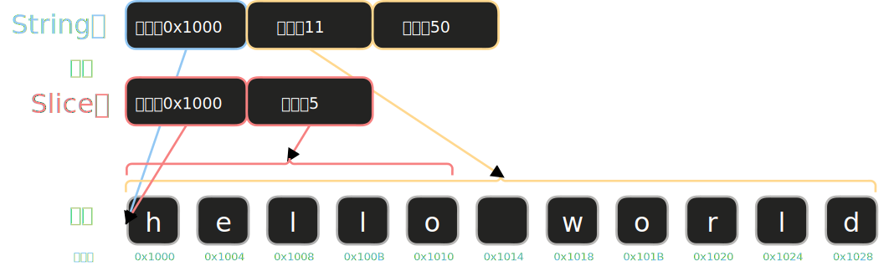
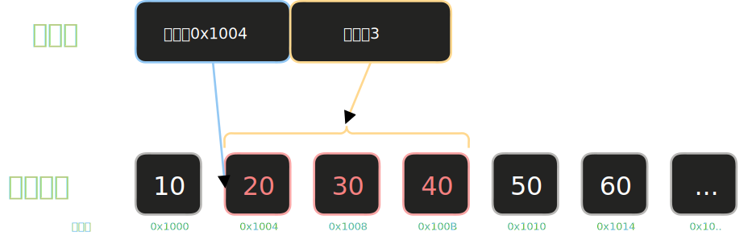

# 字符串切片

**切片**（slice）是对集合中一段**连续元素序列**的引用，它不拥有所有权。切片用一种让编译器帮你检查边界安全性的方式，取代了手动管理索引。



## 问题引入：返回索引有什么不好

假设我们要写一个函数，找出字符串中第一个单词的结束位置。不用切片时，最直接的想法是返回一个索引：

<div class="code-runner" data-full-code="fn%20first_word(s%3A%20%26String)%20-%3E%20usize%20%7B%0A%20%20%20%20let%20bytes%20%3D%20s.as_bytes()%3B%20%2F%2F%20%E6%8A%8A%E5%AD%97%E7%AC%A6%E4%B8%B2%E8%BD%AC%E6%88%90%E5%AD%97%E8%8A%82%E6%95%B0%E7%BB%84%0A%0A%20%20%20%20%2F%2F%20%E9%80%90%E5%AD%97%E8%8A%82%E9%81%8D%E5%8E%86%EF%BC%8C%E6%89%BE%E5%88%B0%E7%AC%AC%E4%B8%80%E4%B8%AA%E7%A9%BA%E6%A0%BC%0A%20%20%20%20for%20(i%2C%20%26item)%20in%20bytes.iter().enumerate()%20%7B%0A%20%20%20%20%20%20%20%20if%20item%20%3D%3D%20b'%20'%20%7B%20%2F%2F%20b'%20'%20%E6%98%AF%E7%A9%BA%E6%A0%BC%E5%AD%97%E8%8A%82%E7%9A%84%E5%AD%97%E9%9D%A2%E9%87%8F%0A%20%20%20%20%20%20%20%20%20%20%20%20return%20i%3B%0A%20%20%20%20%20%20%20%20%7D%0A%20%20%20%20%7D%0A%0A%20%20%20%20s.len()%20%2F%2F%20%E6%B2%A1%E6%9C%89%E7%A9%BA%E6%A0%BC%EF%BC%8C%E6%95%B4%E4%B8%AA%E5%AD%97%E7%AC%A6%E4%B8%B2%E5%B0%B1%E6%98%AF%E4%B8%80%E4%B8%AA%E5%8D%95%E8%AF%8D%0A%7D%0A%0Afn%20main()%20%7B%0A%20%20%20%20let%20s%20%3D%20String%3A%3Afrom(%22hello%20world%22)%3B%0A%20%20%20%20let%20word_end%20%3D%20first_word(%26s)%3B%0A%20%20%20%20println!(%22%E7%AC%AC%E4%B8%80%E4%B8%AA%E5%8D%95%E8%AF%8D%E7%BB%93%E6%9D%9F%E4%BA%8E%E7%B4%A2%E5%BC%95%20%7B%7D%22%2C%20word_end)%3B%20%2F%2F%205%0A%7D" data-mode="run"><pre class="code-runner-pre"><code class="language-rust"><span class="line"><span style="color:#F97583">fn</span><span style="color:#B392F0"> first_word</span><span style="color:#E1E4E8">(s</span><span style="color:#F97583">:</span><span style="color:#F97583"> &amp;</span><span style="color:#B392F0">String</span><span style="color:#E1E4E8">) </span><span style="color:#F97583">-&gt;</span><span style="color:#B392F0"> usize</span><span style="color:#E1E4E8"> {</span></span>
<span class="line"><span style="color:#F97583">    let</span><span style="color:#E1E4E8"> bytes </span><span style="color:#F97583">=</span><span style="color:#E1E4E8"> s</span><span style="color:#F97583">.</span><span style="color:#B392F0">as_bytes</span><span style="color:#E1E4E8">(); </span><span style="color:#6A737D">// 把字符串转成字节数组</span></span>
<span class="line"></span>
<span class="line"><span style="color:#6A737D">    // 逐字节遍历，找到第一个空格</span></span>
<span class="line"><span style="color:#F97583">    for</span><span style="color:#E1E4E8"> (i, </span><span style="color:#F97583">&amp;</span><span style="color:#E1E4E8">item) </span><span style="color:#F97583">in</span><span style="color:#E1E4E8"> bytes</span><span style="color:#F97583">.</span><span style="color:#B392F0">iter</span><span style="color:#E1E4E8">()</span><span style="color:#F97583">.</span><span style="color:#B392F0">enumerate</span><span style="color:#E1E4E8">() {</span></span>
<span class="line"><span style="color:#F97583">        if</span><span style="color:#E1E4E8"> item </span><span style="color:#F97583">==</span><span style="color:#9ECBFF"> b' '</span><span style="color:#E1E4E8"> { </span><span style="color:#6A737D">// b' ' 是空格字节的字面量</span></span>
<span class="line"><span style="color:#F97583">            return</span><span style="color:#E1E4E8"> i;</span></span>
<span class="line"><span style="color:#E1E4E8">        }</span></span>
<span class="line"><span style="color:#E1E4E8">    }</span></span>
<span class="line"></span>
<span class="line"><span style="color:#E1E4E8">    s</span><span style="color:#F97583">.</span><span style="color:#B392F0">len</span><span style="color:#E1E4E8">() </span><span style="color:#6A737D">// 没有空格，整个字符串就是一个单词</span></span>
<span class="line"><span style="color:#E1E4E8">}</span></span>
<span class="line"></span>
<span class="line"><span style="color:#F97583">fn</span><span style="color:#B392F0"> main</span><span style="color:#E1E4E8">() {</span></span>
<span class="line"><span style="color:#F97583">    let</span><span style="color:#E1E4E8"> s </span><span style="color:#F97583">=</span><span style="color:#B392F0"> String</span><span style="color:#F97583">::</span><span style="color:#B392F0">from</span><span style="color:#E1E4E8">(</span><span style="color:#9ECBFF">"hello world"</span><span style="color:#E1E4E8">);</span></span>
<span class="line"><span style="color:#F97583">    let</span><span style="color:#E1E4E8"> word_end </span><span style="color:#F97583">=</span><span style="color:#B392F0"> first_word</span><span style="color:#E1E4E8">(</span><span style="color:#F97583">&amp;</span><span style="color:#E1E4E8">s);</span></span>
<span class="line"><span style="color:#B392F0">    println!</span><span style="color:#E1E4E8">(</span><span style="color:#9ECBFF">"第一个单词结束于索引 {}"</span><span style="color:#E1E4E8">, word_end); </span><span style="color:#6A737D">// 5</span></span>
<span class="line"><span style="color:#E1E4E8">}</span></span></code></pre></div>

这能工作，但有一个隐患——`word_end` 只是一个普通的 `usize` 整数，它和字符串 `s` 完全没有绑定关系：

<div class="code-runner" data-full-code="fn%20first_word(s%3A%20%26String)%20-%3E%20usize%20%7B%0A%20%20%20%20let%20bytes%20%3D%20s.as_bytes()%3B%0A%20%20%20%20for%20(i%2C%20%26item)%20in%20bytes.iter().enumerate()%20%7B%0A%20%20%20%20%20%20%20%20if%20item%20%3D%3D%20b'%20'%20%7B%20return%20i%3B%20%7D%0A%20%20%20%20%7D%0A%20%20%20%20s.len()%0A%7D%0A%0Afn%20main()%20%7B%0A%20%20%20%20let%20mut%20s%20%3D%20String%3A%3Afrom(%22hello%20world%22)%3B%0A%20%20%20%20let%20word_end%20%3D%20first_word(%26s)%3B%20%2F%2F%20%E8%BF%94%E5%9B%9E%205%0A%0A%20%20%20%20s.clear()%3B%20%2F%2F%20%E6%8A%8A%E5%AD%97%E7%AC%A6%E4%B8%B2%E6%B8%85%E7%A9%BA%E4%BA%86%EF%BC%81%0A%0A%20%20%20%20%2F%2F%20word_end%20%E4%BB%8D%E7%84%B6%E6%98%AF%205%EF%BC%8C%E4%BD%86%20s%20%E5%B7%B2%E7%BB%8F%E7%A9%BA%E4%BA%86%0A%20%20%20%20%2F%2F%20%E7%94%A8%20word_end%20%E5%8E%BB%E5%88%87%E5%88%86%20s%20%E4%BC%9A%E5%BE%97%E5%88%B0%E9%94%99%E8%AF%AF%E7%BB%93%E6%9E%9C%EF%BC%8C%E4%BD%86%E7%BC%96%E8%AF%91%E5%99%A8%E4%B8%8D%E7%9F%A5%E9%81%93%0A%20%20%20%20println!(%22word_end%20%3D%20%7B%7D%22%2C%20word_end)%3B%20%2F%2F%20%E7%A8%8B%E5%BA%8F%E4%B8%8D%E6%8A%A5%E9%94%99%EF%BC%8C%E4%BD%86%E8%BF%99%E6%98%AF%20bug%EF%BC%81%0A%7D" data-mode="run"><pre class="code-runner-pre"><code class="language-rust"><span class="line"><span style="color:#F97583">fn</span><span style="color:#B392F0"> first_word</span><span style="color:#E1E4E8">(s</span><span style="color:#F97583">:</span><span style="color:#F97583"> &amp;</span><span style="color:#B392F0">String</span><span style="color:#E1E4E8">) </span><span style="color:#F97583">-&gt;</span><span style="color:#B392F0"> usize</span><span style="color:#E1E4E8"> {</span></span>
<span class="line"><span style="color:#F97583">    let</span><span style="color:#E1E4E8"> bytes </span><span style="color:#F97583">=</span><span style="color:#E1E4E8"> s</span><span style="color:#F97583">.</span><span style="color:#B392F0">as_bytes</span><span style="color:#E1E4E8">();</span></span>
<span class="line"><span style="color:#F97583">    for</span><span style="color:#E1E4E8"> (i, </span><span style="color:#F97583">&amp;</span><span style="color:#E1E4E8">item) </span><span style="color:#F97583">in</span><span style="color:#E1E4E8"> bytes</span><span style="color:#F97583">.</span><span style="color:#B392F0">iter</span><span style="color:#E1E4E8">()</span><span style="color:#F97583">.</span><span style="color:#B392F0">enumerate</span><span style="color:#E1E4E8">() {</span></span>
<span class="line"><span style="color:#F97583">        if</span><span style="color:#E1E4E8"> item </span><span style="color:#F97583">==</span><span style="color:#9ECBFF"> b' '</span><span style="color:#E1E4E8"> { </span><span style="color:#F97583">return</span><span style="color:#E1E4E8"> i; }</span></span>
<span class="line"><span style="color:#E1E4E8">    }</span></span>
<span class="line"><span style="color:#E1E4E8">    s</span><span style="color:#F97583">.</span><span style="color:#B392F0">len</span><span style="color:#E1E4E8">()</span></span>
<span class="line"><span style="color:#E1E4E8">}</span></span>
<span class="line"></span>
<span class="line"><span style="color:#F97583">fn</span><span style="color:#B392F0"> main</span><span style="color:#E1E4E8">() {</span></span>
<span class="line"><span style="color:#F97583">    let</span><span style="color:#F97583"> mut</span><span style="color:#E1E4E8"> s </span><span style="color:#F97583">=</span><span style="color:#B392F0"> String</span><span style="color:#F97583">::</span><span style="color:#B392F0">from</span><span style="color:#E1E4E8">(</span><span style="color:#9ECBFF">"hello world"</span><span style="color:#E1E4E8">);</span></span>
<span class="line"><span style="color:#F97583">    let</span><span style="color:#E1E4E8"> word_end </span><span style="color:#F97583">=</span><span style="color:#B392F0"> first_word</span><span style="color:#E1E4E8">(</span><span style="color:#F97583">&amp;</span><span style="color:#E1E4E8">s); </span><span style="color:#6A737D">// 返回 5</span></span>
<span class="line"></span>
<span class="line"><span style="color:#E1E4E8">    s</span><span style="color:#F97583">.</span><span style="color:#B392F0">clear</span><span style="color:#E1E4E8">(); </span><span style="color:#6A737D">// 把字符串清空了！</span></span>
<span class="line"></span>
<span class="line"><span style="color:#6A737D">    // word_end 仍然是 5，但 s 已经空了</span></span>
<span class="line"><span style="color:#6A737D">    // 用 word_end 去切分 s 会得到错误结果，但编译器不知道</span></span>
<span class="line"><span style="color:#B392F0">    println!</span><span style="color:#E1E4E8">(</span><span style="color:#9ECBFF">"word_end = {}"</span><span style="color:#E1E4E8">, word_end); </span><span style="color:#6A737D">// 程序不报错，但这是 bug！</span></span>
<span class="line"><span style="color:#E1E4E8">}</span></span></code></pre></div>

索引 `5` 变成了无效的信息——它描述的那个字符串已经不存在了，而编译器对此一无所知。如果再写一个 `second_word` 返回 `(usize, usize)`，情况会更难维护。

**切片解决的正是这个问题：让引用和数据永远绑定在一起。**

## 字符串切片语法

字符串切片（string slice）是对 `String` 中一段内容的引用，类型写作 `&str`：

<div class="code-runner" data-full-code="fn%20main()%20%7B%0A%20%20%20%20let%20s%20%3D%20String%3A%3Afrom(%22hello%20world%22)%3B%0A%0A%20%20%20%20let%20hello%20%3D%20%26s%5B0..5%5D%3B%20%20%20%2F%2F%20%E7%B4%A2%E5%BC%95%200%20%E5%88%B0%204%EF%BC%88%E4%B8%8D%E5%90%AB%205%EF%BC%89%0A%20%20%20%20let%20world%20%3D%20%26s%5B6..11%5D%3B%20%20%2F%2F%20%E7%B4%A2%E5%BC%95%206%20%E5%88%B0%2010%EF%BC%88%E4%B8%8D%E5%90%AB%2011%EF%BC%89%0A%0A%20%20%20%20println!(%22%7B%7D%20%7B%7D%22%2C%20hello%2C%20world)%3B%0A%7D" data-mode="run"><pre class="code-runner-pre"><code class="language-rust"><span class="line"><span style="color:#F97583">fn</span><span style="color:#B392F0"> main</span><span style="color:#E1E4E8">() {</span></span>
<span class="line"><span style="color:#F97583">    let</span><span style="color:#E1E4E8"> s </span><span style="color:#F97583">=</span><span style="color:#B392F0"> String</span><span style="color:#F97583">::</span><span style="color:#B392F0">from</span><span style="color:#E1E4E8">(</span><span style="color:#9ECBFF">"hello world"</span><span style="color:#E1E4E8">);</span></span>
<span class="line"></span>
<span class="line"><span style="color:#F97583">    let</span><span style="color:#E1E4E8"> hello </span><span style="color:#F97583">=</span><span style="color:#F97583"> &amp;</span><span style="color:#E1E4E8">s[</span><span style="color:#79B8FF">0</span><span style="color:#F97583">..</span><span style="color:#79B8FF">5</span><span style="color:#E1E4E8">];   </span><span style="color:#6A737D">// 索引 0 到 4（不含 5）</span></span>
<span class="line"><span style="color:#F97583">    let</span><span style="color:#E1E4E8"> world </span><span style="color:#F97583">=</span><span style="color:#F97583"> &amp;</span><span style="color:#E1E4E8">s[</span><span style="color:#79B8FF">6</span><span style="color:#F97583">..</span><span style="color:#79B8FF">11</span><span style="color:#E1E4E8">];  </span><span style="color:#6A737D">// 索引 6 到 10（不含 11）</span></span>
<span class="line"></span>
<span class="line"><span style="color:#B392F0">    println!</span><span style="color:#E1E4E8">(</span><span style="color:#9ECBFF">"{} {}"</span><span style="color:#E1E4E8">, hello, world);</span></span>
<span class="line"><span style="color:#E1E4E8">}</span></span></code></pre></div>

语法是 `&s[start..end]`，其中：

- start 是切片的 起始索引 （包含）
- end 是切片的 结束索引 （不含，即”开区间”）

> 索引是按**字节**计算的，不是按字符。对于全 ASCII 的字符串没有问题；如果字符串包含中文等多字节字符，必须在字符边界处切分，否则程序会 panic。

## Range 的各种简写

Rust 的 `..` 语法有几种简写形式：

<div class="code-runner" data-full-code="fn%20main()%20%7B%0A%20%20%20%20let%20s%20%3D%20String%3A%3Afrom(%22hello%22)%3B%0A%0A%20%20%20%20%2F%2F%20%E4%BB%8E%E5%A4%B4%E5%BC%80%E5%A7%8B%EF%BC%8C%E5%8F%AF%E4%BB%A5%E7%9C%81%E7%95%A5%E8%B5%B7%E5%A7%8B%E7%B4%A2%E5%BC%95%0A%20%20%20%20let%20s1%20%3D%20%26s%5B0..3%5D%3B%20%2F%2F%20%22hel%22%0A%20%20%20%20let%20s2%20%3D%20%26s%5B..3%5D%3B%20%20%2F%2F%20%E7%AD%89%E5%90%8C%E4%BA%8E%E4%B8%8A%E9%9D%A2%0A%0A%20%20%20%20%2F%2F%20%E5%88%B0%E6%9C%AB%E5%B0%BE%E7%BB%93%E6%9D%9F%EF%BC%8C%E5%8F%AF%E4%BB%A5%E7%9C%81%E7%95%A5%E7%BB%93%E6%9D%9F%E7%B4%A2%E5%BC%95%0A%20%20%20%20let%20s3%20%3D%20%26s%5B2..s.len()%5D%3B%20%2F%2F%20%22llo%22%0A%20%20%20%20let%20s4%20%3D%20%26s%5B2..%5D%3B%20%20%20%20%20%20%20%20%2F%2F%20%E7%AD%89%E5%90%8C%E4%BA%8E%E4%B8%8A%E9%9D%A2%0A%0A%20%20%20%20%2F%2F%20%E6%95%B4%E4%B8%AA%E5%AD%97%E7%AC%A6%E4%B8%B2%0A%20%20%20%20let%20s5%20%3D%20%26s%5B0..s.len()%5D%3B%20%2F%2F%20%22hello%22%0A%20%20%20%20let%20s6%20%3D%20%26s%5B..%5D%3B%20%20%20%20%20%20%20%20%20%2F%2F%20%E7%AD%89%E5%90%8C%E4%BA%8E%E4%B8%8A%E9%9D%A2%0A%0A%20%20%20%20println!(%22%7B%7D%20%7B%7D%20%7B%7D%20%7B%7D%20%7B%7D%20%7B%7D%22%2C%20s1%2C%20s2%2C%20s3%2C%20s4%2C%20s5%2C%20s6)%3B%0A%7D" data-mode="run"><pre class="code-runner-pre"><code class="language-rust"><span class="line"><span style="color:#F97583">fn</span><span style="color:#B392F0"> main</span><span style="color:#E1E4E8">() {</span></span>
<span class="line"><span style="color:#F97583">    let</span><span style="color:#E1E4E8"> s </span><span style="color:#F97583">=</span><span style="color:#B392F0"> String</span><span style="color:#F97583">::</span><span style="color:#B392F0">from</span><span style="color:#E1E4E8">(</span><span style="color:#9ECBFF">"hello"</span><span style="color:#E1E4E8">);</span></span>
<span class="line"></span>
<span class="line"><span style="color:#6A737D">    // 从头开始，可以省略起始索引</span></span>
<span class="line"><span style="color:#F97583">    let</span><span style="color:#E1E4E8"> s1 </span><span style="color:#F97583">=</span><span style="color:#F97583"> &amp;</span><span style="color:#E1E4E8">s[</span><span style="color:#79B8FF">0</span><span style="color:#F97583">..</span><span style="color:#79B8FF">3</span><span style="color:#E1E4E8">]; </span><span style="color:#6A737D">// "hel"</span></span>
<span class="line"><span style="color:#F97583">    let</span><span style="color:#E1E4E8"> s2 </span><span style="color:#F97583">=</span><span style="color:#F97583"> &amp;</span><span style="color:#E1E4E8">s[</span><span style="color:#F97583">..</span><span style="color:#79B8FF">3</span><span style="color:#E1E4E8">];  </span><span style="color:#6A737D">// 等同于上面</span></span>
<span class="line"></span>
<span class="line"><span style="color:#6A737D">    // 到末尾结束，可以省略结束索引</span></span>
<span class="line"><span style="color:#F97583">    let</span><span style="color:#E1E4E8"> s3 </span><span style="color:#F97583">=</span><span style="color:#F97583"> &amp;</span><span style="color:#E1E4E8">s[</span><span style="color:#79B8FF">2</span><span style="color:#F97583">..</span><span style="color:#E1E4E8">s</span><span style="color:#F97583">.</span><span style="color:#B392F0">len</span><span style="color:#E1E4E8">()]; </span><span style="color:#6A737D">// "llo"</span></span>
<span class="line"><span style="color:#F97583">    let</span><span style="color:#E1E4E8"> s4 </span><span style="color:#F97583">=</span><span style="color:#F97583"> &amp;</span><span style="color:#E1E4E8">s[</span><span style="color:#79B8FF">2</span><span style="color:#F97583">..</span><span style="color:#E1E4E8">];        </span><span style="color:#6A737D">// 等同于上面</span></span>
<span class="line"></span>
<span class="line"><span style="color:#6A737D">    // 整个字符串</span></span>
<span class="line"><span style="color:#F97583">    let</span><span style="color:#E1E4E8"> s5 </span><span style="color:#F97583">=</span><span style="color:#F97583"> &amp;</span><span style="color:#E1E4E8">s[</span><span style="color:#79B8FF">0</span><span style="color:#F97583">..</span><span style="color:#E1E4E8">s</span><span style="color:#F97583">.</span><span style="color:#B392F0">len</span><span style="color:#E1E4E8">()]; </span><span style="color:#6A737D">// "hello"</span></span>
<span class="line"><span style="color:#F97583">    let</span><span style="color:#E1E4E8"> s6 </span><span style="color:#F97583">=</span><span style="color:#F97583"> &amp;</span><span style="color:#E1E4E8">s[</span><span style="color:#F97583">..</span><span style="color:#E1E4E8">];         </span><span style="color:#6A737D">// 等同于上面</span></span>
<span class="line"></span>
<span class="line"><span style="color:#B392F0">    println!</span><span style="color:#E1E4E8">(</span><span style="color:#9ECBFF">"{} {} {} {} {} {}"</span><span style="color:#E1E4E8">, s1, s2, s3, s4, s5, s6);</span></span>
<span class="line"><span style="color:#E1E4E8">}</span></span></code></pre></div>

## 用切片重写 first_word

返回 `&str` 而不是 `usize`，让切片与原始字符串绑定在一起：

<div class="code-runner" data-full-code="fn%20first_word(s%3A%20%26String)%20-%3E%20%26str%20%7B%0A%20%20%20%20let%20bytes%20%3D%20s.as_bytes()%3B%0A%0A%20%20%20%20for%20(i%2C%20%26item)%20in%20bytes.iter().enumerate()%20%7B%0A%20%20%20%20%20%20%20%20if%20item%20%3D%3D%20b'%20'%20%7B%0A%20%20%20%20%20%20%20%20%20%20%20%20return%20%26s%5B0..i%5D%3B%20%2F%2F%20%E8%BF%94%E5%9B%9E%E5%88%87%E7%89%87%EF%BC%8C%E8%80%8C%E4%B8%8D%E6%98%AF%E7%B4%A2%E5%BC%95%0A%20%20%20%20%20%20%20%20%7D%0A%20%20%20%20%7D%0A%0A%20%20%20%20%26s%5B..%5D%20%2F%2F%20%E6%B2%A1%E6%9C%89%E7%A9%BA%E6%A0%BC%EF%BC%8C%E8%BF%94%E5%9B%9E%E6%95%B4%E4%B8%AA%E5%AD%97%E7%AC%A6%E4%B8%B2%E7%9A%84%E5%88%87%E7%89%87%0A%7D%0A%0Afn%20main()%20%7B%0A%20%20%20%20let%20s%20%3D%20String%3A%3Afrom(%22hello%20world%22)%3B%0A%20%20%20%20let%20word%20%3D%20first_word(%26s)%3B%0A%20%20%20%20println!(%22%E7%AC%AC%E4%B8%80%E4%B8%AA%E5%8D%95%E8%AF%8D%E6%98%AF%EF%BC%9A%7B%7D%22%2C%20word)%3B%20%2F%2F%20%22hello%22%0A%7D" data-mode="run"><pre class="code-runner-pre"><code class="language-rust"><span class="line"><span style="color:#F97583">fn</span><span style="color:#B392F0"> first_word</span><span style="color:#E1E4E8">(s</span><span style="color:#F97583">:</span><span style="color:#F97583"> &amp;</span><span style="color:#B392F0">String</span><span style="color:#E1E4E8">) </span><span style="color:#F97583">-&gt;</span><span style="color:#F97583"> &amp;</span><span style="color:#B392F0">str</span><span style="color:#E1E4E8"> {</span></span>
<span class="line"><span style="color:#F97583">    let</span><span style="color:#E1E4E8"> bytes </span><span style="color:#F97583">=</span><span style="color:#E1E4E8"> s</span><span style="color:#F97583">.</span><span style="color:#B392F0">as_bytes</span><span style="color:#E1E4E8">();</span></span>
<span class="line"></span>
<span class="line"><span style="color:#F97583">    for</span><span style="color:#E1E4E8"> (i, </span><span style="color:#F97583">&amp;</span><span style="color:#E1E4E8">item) </span><span style="color:#F97583">in</span><span style="color:#E1E4E8"> bytes</span><span style="color:#F97583">.</span><span style="color:#B392F0">iter</span><span style="color:#E1E4E8">()</span><span style="color:#F97583">.</span><span style="color:#B392F0">enumerate</span><span style="color:#E1E4E8">() {</span></span>
<span class="line"><span style="color:#F97583">        if</span><span style="color:#E1E4E8"> item </span><span style="color:#F97583">==</span><span style="color:#9ECBFF"> b' '</span><span style="color:#E1E4E8"> {</span></span>
<span class="line"><span style="color:#F97583">            return</span><span style="color:#F97583"> &amp;</span><span style="color:#E1E4E8">s[</span><span style="color:#79B8FF">0</span><span style="color:#F97583">..</span><span style="color:#E1E4E8">i]; </span><span style="color:#6A737D">// 返回切片，而不是索引</span></span>
<span class="line"><span style="color:#E1E4E8">        }</span></span>
<span class="line"><span style="color:#E1E4E8">    }</span></span>
<span class="line"></span>
<span class="line"><span style="color:#F97583">    &amp;</span><span style="color:#E1E4E8">s[</span><span style="color:#F97583">..</span><span style="color:#E1E4E8">] </span><span style="color:#6A737D">// 没有空格，返回整个字符串的切片</span></span>
<span class="line"><span style="color:#E1E4E8">}</span></span>
<span class="line"></span>
<span class="line"><span style="color:#F97583">fn</span><span style="color:#B392F0"> main</span><span style="color:#E1E4E8">() {</span></span>
<span class="line"><span style="color:#F97583">    let</span><span style="color:#E1E4E8"> s </span><span style="color:#F97583">=</span><span style="color:#B392F0"> String</span><span style="color:#F97583">::</span><span style="color:#B392F0">from</span><span style="color:#E1E4E8">(</span><span style="color:#9ECBFF">"hello world"</span><span style="color:#E1E4E8">);</span></span>
<span class="line"><span style="color:#F97583">    let</span><span style="color:#E1E4E8"> word </span><span style="color:#F97583">=</span><span style="color:#B392F0"> first_word</span><span style="color:#E1E4E8">(</span><span style="color:#F97583">&amp;</span><span style="color:#E1E4E8">s);</span></span>
<span class="line"><span style="color:#B392F0">    println!</span><span style="color:#E1E4E8">(</span><span style="color:#9ECBFF">"第一个单词是：{}"</span><span style="color:#E1E4E8">, word); </span><span style="color:#6A737D">// "hello"</span></span>
<span class="line"><span style="color:#E1E4E8">}</span></span></code></pre></div>

现在如果我们尝试在切片还存活时清空字符串，借用检查器会直接报错：

<div class="code-runner" data-full-code="fn%20first_word(s%3A%20%26String)%20-%3E%20%26str%20%7B%0A%20%20%20%20let%20bytes%20%3D%20s.as_bytes()%3B%0A%20%20%20%20for%20(i%2C%20%26item)%20in%20bytes.iter().enumerate()%20%7B%0A%20%20%20%20%20%20%20%20if%20item%20%3D%3D%20b'%20'%20%7B%20return%20%26s%5B0..i%5D%3B%20%7D%0A%20%20%20%20%7D%0A%20%20%20%20%26s%5B..%5D%0A%7D%0A%0Afn%20main()%20%7B%0A%20%20%20%20let%20mut%20s%20%3D%20String%3A%3Afrom(%22hello%20world%22)%3B%0A%20%20%20%20let%20word%20%3D%20first_word(%26s)%3B%20%2F%2F%20word%20%E6%98%AF%E5%AF%B9%20s%20%E7%9A%84%E4%B8%8D%E5%8F%AF%E5%8F%98%E5%BC%95%E7%94%A8%0A%0A%20%20%20%20s.clear()%3B%20%2F%2F%20%E9%94%99%E8%AF%AF%EF%BC%81clear()%20%E9%9C%80%E8%A6%81%E5%8F%AF%E5%8F%98%E5%BC%95%E7%94%A8%EF%BC%8C%E4%BD%86%20word%20%E8%BF%98%E6%8C%81%E6%9C%89%E4%B8%8D%E5%8F%AF%E5%8F%98%E5%BC%95%E7%94%A8%0A%0A%20%20%20%20println!(%22%7B%7D%22%2C%20word)%3B%0A%7D" data-mode="expect-error"><pre class="code-runner-pre"><code class="language-rust"><span class="line"><span style="color:#F97583">fn</span><span style="color:#B392F0"> first_word</span><span style="color:#E1E4E8">(s</span><span style="color:#F97583">:</span><span style="color:#F97583"> &amp;</span><span style="color:#B392F0">String</span><span style="color:#E1E4E8">) </span><span style="color:#F97583">-&gt;</span><span style="color:#F97583"> &amp;</span><span style="color:#B392F0">str</span><span style="color:#E1E4E8"> {</span></span>
<span class="line"><span style="color:#F97583">    let</span><span style="color:#E1E4E8"> bytes </span><span style="color:#F97583">=</span><span style="color:#E1E4E8"> s</span><span style="color:#F97583">.</span><span style="color:#B392F0">as_bytes</span><span style="color:#E1E4E8">();</span></span>
<span class="line"><span style="color:#F97583">    for</span><span style="color:#E1E4E8"> (i, </span><span style="color:#F97583">&amp;</span><span style="color:#E1E4E8">item) </span><span style="color:#F97583">in</span><span style="color:#E1E4E8"> bytes</span><span style="color:#F97583">.</span><span style="color:#B392F0">iter</span><span style="color:#E1E4E8">()</span><span style="color:#F97583">.</span><span style="color:#B392F0">enumerate</span><span style="color:#E1E4E8">() {</span></span>
<span class="line"><span style="color:#F97583">        if</span><span style="color:#E1E4E8"> item </span><span style="color:#F97583">==</span><span style="color:#9ECBFF"> b' '</span><span style="color:#E1E4E8"> { </span><span style="color:#F97583">return</span><span style="color:#F97583"> &amp;</span><span style="color:#E1E4E8">s[</span><span style="color:#79B8FF">0</span><span style="color:#F97583">..</span><span style="color:#E1E4E8">i]; }</span></span>
<span class="line"><span style="color:#E1E4E8">    }</span></span>
<span class="line"><span style="color:#F97583">    &amp;</span><span style="color:#E1E4E8">s[</span><span style="color:#F97583">..</span><span style="color:#E1E4E8">]</span></span>
<span class="line"><span style="color:#E1E4E8">}</span></span>
<span class="line"></span>
<span class="line"><span style="color:#F97583">fn</span><span style="color:#B392F0"> main</span><span style="color:#E1E4E8">() {</span></span>
<span class="line"><span style="color:#F97583">    let</span><span style="color:#F97583"> mut</span><span style="color:#E1E4E8"> s </span><span style="color:#F97583">=</span><span style="color:#B392F0"> String</span><span style="color:#F97583">::</span><span style="color:#B392F0">from</span><span style="color:#E1E4E8">(</span><span style="color:#9ECBFF">"hello world"</span><span style="color:#E1E4E8">);</span></span>
<span class="line"><span style="color:#F97583">    let</span><span style="color:#E1E4E8"> word </span><span style="color:#F97583">=</span><span style="color:#B392F0"> first_word</span><span style="color:#E1E4E8">(</span><span style="color:#F97583">&amp;</span><span style="color:#E1E4E8">s); </span><span style="color:#6A737D">// word 是对 s 的不可变引用</span></span>
<span class="line"></span>
<span class="line"><span style="color:#E1E4E8">    s</span><span style="color:#F97583">.</span><span style="color:#B392F0">clear</span><span style="color:#E1E4E8">(); </span><span style="color:#6A737D">// 错误！clear() 需要可变引用，但 word 还持有不可变引用</span></span>
<span class="line"></span>
<span class="line"><span style="color:#B392F0">    println!</span><span style="color:#E1E4E8">(</span><span style="color:#9ECBFF">"{}"</span><span style="color:#E1E4E8">, word);</span></span>
<span class="line"><span style="color:#E1E4E8">}</span></span></code></pre></div>

同样的 bug，现在在编译期就被发现了，而不是在运行时悄悄出错。这正是切片的核心价值：**把”数据从哪里来”的信息编码进类型，让编译器帮你检查。**

## 字符串字面量就是切片

我们一直在用的字符串字面量，它的类型其实就是 `&str`：

<div class="code-runner" data-full-code="fn%20main()%20%7B%0A%20%20%20%20let%20s%3A%20%26str%20%3D%20%22hello%2C%20world!%22%3B%20%2F%2F%20%26str%20%E7%B1%BB%E5%9E%8B%0A%20%20%20%20println!(%22%7B%7D%22%2C%20s)%3B%0A%7D" data-mode="run"><pre class="code-runner-pre"><code class="language-rust"><span class="line"><span style="color:#F97583">fn</span><span style="color:#B392F0"> main</span><span style="color:#E1E4E8">() {</span></span>
<span class="line"><span style="color:#F97583">    let</span><span style="color:#E1E4E8"> s</span><span style="color:#F97583">:</span><span style="color:#F97583"> &amp;</span><span style="color:#B392F0">str</span><span style="color:#F97583"> =</span><span style="color:#9ECBFF"> "hello, world!"</span><span style="color:#E1E4E8">; </span><span style="color:#6A737D">// &amp;str 类型</span></span>
<span class="line"><span style="color:#B392F0">    println!</span><span style="color:#E1E4E8">(</span><span style="color:#9ECBFF">"{}"</span><span style="color:#E1E4E8">, s);</span></span>
<span class="line"><span style="color:#E1E4E8">}</span></span></code></pre></div>

`"hello, world!"` 是程序二进制文件中只读区域的一段数据，`s` 是指向它的切片引用。这就是为什么字符串字面量永远是不可变的——它是对只读数据的不可变引用。

# &str vs &String

写函数时，参数应该用 `&String` 还是 `&str`？这是一个非常实用但容易搞混的问题：

## 问题背景：为什么会纠结

假设你要写一个函数来找出字符串中第一个单词。新手可能会这样写：

```rust
fn first_word(s: &String) -> &str {
    let bytes = s.as_bytes();
    for (i, &item) in bytes.iter().enumerate() {
        if item == b' ' { return &s[0..i]; }
    }
    &s[..]
}

fn main() {
    let owned = String::from("hello world");
    let w1 = first_word(&owned);           // ✓ 可以

    let w2 = first_word("hello world");    // ✗ 错误！参数是 &str，不是 &String
}
```

你会发现，用 `&String` 作参数后，**无法直接传入字符串字面量**。这很不方便。

## 解决方案：用 &str 代替 &String

如果函数只需要**读取**字符串内容（不需要转移所有权），应该用 `&str` 而不是 `&String`：

<div class="code-runner" data-full-code="fn%20first_word(s%3A%20%26str)%20-%3E%20%26str%20%7B%20%20%2F%2F%20%E6%94%B9%E4%B8%BA%20%26str%0A%20%20%20%20let%20bytes%20%3D%20s.as_bytes()%3B%0A%20%20%20%20for%20(i%2C%20%26item)%20in%20bytes.iter().enumerate()%20%7B%0A%20%20%20%20%20%20%20%20if%20item%20%3D%3D%20b'%20'%20%7B%20return%20%26s%5B0..i%5D%3B%20%7D%0A%20%20%20%20%7D%0A%20%20%20%20%26s%5B..%5D%0A%7D%0A%0Afn%20main()%20%7B%0A%20%20%20%20let%20owned%20%3D%20String%3A%3Afrom(%22hello%20world%22)%3B%0A%0A%20%20%20%20%2F%2F%20%E4%BC%A0%20%26String%EF%BC%9A%E8%87%AA%E5%8A%A8%E8%BD%AC%E6%8D%A2%E4%B8%BA%20%26str%EF%BC%88%E8%A7%A3%E5%BC%95%E7%94%A8%E5%BC%BA%E5%88%B6%E8%BD%AC%E6%8D%A2%EF%BC%89%0A%20%20%20%20let%20w1%20%3D%20first_word(%26owned)%3B%0A%0A%20%20%20%20%2F%2F%20%E4%BC%A0%20%26str%20%E5%88%87%E7%89%87%0A%20%20%20%20let%20w2%20%3D%20first_word(%26owned%5B..%5D)%3B%0A%0A%20%20%20%20%2F%2F%20%E4%BC%A0%E5%AD%97%E7%AC%A6%E4%B8%B2%E5%AD%97%E9%9D%A2%E9%87%8F%EF%BC%88%E5%AD%97%E9%9D%A2%E9%87%8F%E6%9C%AC%E8%BA%AB%E5%B0%B1%E6%98%AF%20%26str%EF%BC%89%0A%20%20%20%20let%20w3%20%3D%20first_word(%22hello%20world%22)%3B%0A%0A%20%20%20%20println!(%22%7B%7D%20%7B%7D%20%7B%7D%22%2C%20w1%2C%20w2%2C%20w3)%3B%0A%7D" data-mode="run"><pre class="code-runner-pre"><code class="language-rust"><span class="line"><span style="color:#F97583">fn</span><span style="color:#B392F0"> first_word</span><span style="color:#E1E4E8">(s</span><span style="color:#F97583">:</span><span style="color:#F97583"> &amp;</span><span style="color:#B392F0">str</span><span style="color:#E1E4E8">) </span><span style="color:#F97583">-&gt;</span><span style="color:#F97583"> &amp;</span><span style="color:#B392F0">str</span><span style="color:#E1E4E8"> {  </span><span style="color:#6A737D">// 改为 &amp;str</span></span>
<span class="line"><span style="color:#F97583">    let</span><span style="color:#E1E4E8"> bytes </span><span style="color:#F97583">=</span><span style="color:#E1E4E8"> s</span><span style="color:#F97583">.</span><span style="color:#B392F0">as_bytes</span><span style="color:#E1E4E8">();</span></span>
<span class="line"><span style="color:#F97583">    for</span><span style="color:#E1E4E8"> (i, </span><span style="color:#F97583">&amp;</span><span style="color:#E1E4E8">item) </span><span style="color:#F97583">in</span><span style="color:#E1E4E8"> bytes</span><span style="color:#F97583">.</span><span style="color:#B392F0">iter</span><span style="color:#E1E4E8">()</span><span style="color:#F97583">.</span><span style="color:#B392F0">enumerate</span><span style="color:#E1E4E8">() {</span></span>
<span class="line"><span style="color:#F97583">        if</span><span style="color:#E1E4E8"> item </span><span style="color:#F97583">==</span><span style="color:#9ECBFF"> b' '</span><span style="color:#E1E4E8"> { </span><span style="color:#F97583">return</span><span style="color:#F97583"> &amp;</span><span style="color:#E1E4E8">s[</span><span style="color:#79B8FF">0</span><span style="color:#F97583">..</span><span style="color:#E1E4E8">i]; }</span></span>
<span class="line"><span style="color:#E1E4E8">    }</span></span>
<span class="line"><span style="color:#F97583">    &amp;</span><span style="color:#E1E4E8">s[</span><span style="color:#F97583">..</span><span style="color:#E1E4E8">]</span></span>
<span class="line"><span style="color:#E1E4E8">}</span></span>
<span class="line"></span>
<span class="line"><span style="color:#F97583">fn</span><span style="color:#B392F0"> main</span><span style="color:#E1E4E8">() {</span></span>
<span class="line"><span style="color:#F97583">    let</span><span style="color:#E1E4E8"> owned </span><span style="color:#F97583">=</span><span style="color:#B392F0"> String</span><span style="color:#F97583">::</span><span style="color:#B392F0">from</span><span style="color:#E1E4E8">(</span><span style="color:#9ECBFF">"hello world"</span><span style="color:#E1E4E8">);</span></span>
<span class="line"></span>
<span class="line"><span style="color:#6A737D">    // 传 &amp;String：自动转换为 &amp;str（解引用强制转换）</span></span>
<span class="line"><span style="color:#F97583">    let</span><span style="color:#E1E4E8"> w1 </span><span style="color:#F97583">=</span><span style="color:#B392F0"> first_word</span><span style="color:#E1E4E8">(</span><span style="color:#F97583">&amp;</span><span style="color:#E1E4E8">owned);</span></span>
<span class="line"></span>
<span class="line"><span style="color:#6A737D">    // 传 &amp;str 切片</span></span>
<span class="line"><span style="color:#F97583">    let</span><span style="color:#E1E4E8"> w2 </span><span style="color:#F97583">=</span><span style="color:#B392F0"> first_word</span><span style="color:#E1E4E8">(</span><span style="color:#F97583">&amp;</span><span style="color:#E1E4E8">owned[</span><span style="color:#F97583">..</span><span style="color:#E1E4E8">]);</span></span>
<span class="line"></span>
<span class="line"><span style="color:#6A737D">    // 传字符串字面量（字面量本身就是 &amp;str）</span></span>
<span class="line"><span style="color:#F97583">    let</span><span style="color:#E1E4E8"> w3 </span><span style="color:#F97583">=</span><span style="color:#B392F0"> first_word</span><span style="color:#E1E4E8">(</span><span style="color:#9ECBFF">"hello world"</span><span style="color:#E1E4E8">);</span></span>
<span class="line"></span>
<span class="line"><span style="color:#B392F0">    println!</span><span style="color:#E1E4E8">(</span><span style="color:#9ECBFF">"{} {} {}"</span><span style="color:#E1E4E8">, w1, w2, w3);</span></span>
<span class="line"><span style="color:#E1E4E8">}</span></span></code></pre></div>

现在**三种调用方式都工作了**！

## 原理：解引用强制转换

为什么 `&String` 可以自动转换为 `&str`？这叫**解引用强制转换**（deref coercion）。

- &String 的本质是”指向 String 数据的引用”
- &str 的本质是”对字符串数据某一段的切片引用”
- Rust 编译器足够聪明，知道当你传 &String 给期望 &str 的函数时，可以自动将其转换为”整个字符串的 &str 切片”

## 最佳实践

**规则很简单**：

| 函数需要… | 参数类型 | 原因 |
| --- | --- | --- |
| 只读字符串 | `&str` | 可以接受 `&String`、字面量、切片，最灵活 |
| 可能修改字符串 | `&mut String` | 需要可变访问权限，只能传 `&mut String` |
| 拥有字符串 | `String` | 需要完全所有权，会转移所有权 |

**类比其他切片**：数组切片也遵循同样逻辑——函数参数用 `&[T]` 比 `&Vec<T>` 更通用，因为 `&[T]` 可以接受任何数组或 `Vec` 的切片。

# 数组与其他切片

字符串切片只是切片的一种特殊形式。Rust 的切片机制适用于任何数组和序列类型。

## 数组切片语法

对数组取切片，就像对字符串取切片一样：

<div class="code-runner" data-full-code="fn%20main()%20%7B%0A%20%20%20%20let%20a%20%3D%20%5B1%2C%202%2C%203%2C%204%2C%205%5D%3B%0A%0A%20%20%20%20let%20slice%20%3D%20%26a%5B1..3%5D%3B%20%2F%2F%20%E5%8F%96%E7%B4%A2%E5%BC%95%201%20%E5%88%B0%202%20%E7%9A%84%E5%85%83%E7%B4%A0%0A%20%20%20%20println!(%22%7B%3A%3F%7D%22%2C%20slice)%3B%20%2F%2F%20%5B2%2C%203%5D%0A%0A%20%20%20%20%2F%2F%20%E7%9C%81%E7%95%A5%E5%86%99%E6%B3%95%E5%90%8C%E6%A0%B7%E9%80%82%E7%94%A8%0A%20%20%20%20let%20first_three%20%3D%20%26a%5B..3%5D%3B%20%2F%2F%20%5B1%2C%202%2C%203%5D%0A%20%20%20%20let%20last_two%20%3D%20%26a%5B3..%5D%3B%20%20%20%20%2F%2F%20%5B4%2C%205%5D%0A%20%20%20%20let%20all%20%3D%20%26a%5B..%5D%3B%20%20%20%20%20%20%20%20%20%20%2F%2F%20%5B1%2C%202%2C%203%2C%204%2C%205%5D%0A%0A%20%20%20%20println!(%22%7B%3A%3F%7D%20%7B%3A%3F%7D%20%7B%3A%3F%7D%22%2C%20first_three%2C%20last_two%2C%20all)%3B%0A%7D" data-mode="run"><pre class="code-runner-pre"><code class="language-rust"><span class="line"><span style="color:#F97583">fn</span><span style="color:#B392F0"> main</span><span style="color:#E1E4E8">() {</span></span>
<span class="line"><span style="color:#F97583">    let</span><span style="color:#E1E4E8"> a </span><span style="color:#F97583">=</span><span style="color:#E1E4E8"> [</span><span style="color:#79B8FF">1</span><span style="color:#E1E4E8">, </span><span style="color:#79B8FF">2</span><span style="color:#E1E4E8">, </span><span style="color:#79B8FF">3</span><span style="color:#E1E4E8">, </span><span style="color:#79B8FF">4</span><span style="color:#E1E4E8">, </span><span style="color:#79B8FF">5</span><span style="color:#E1E4E8">];</span></span>
<span class="line"></span>
<span class="line"><span style="color:#F97583">    let</span><span style="color:#E1E4E8"> slice </span><span style="color:#F97583">=</span><span style="color:#F97583"> &amp;</span><span style="color:#E1E4E8">a[</span><span style="color:#79B8FF">1</span><span style="color:#F97583">..</span><span style="color:#79B8FF">3</span><span style="color:#E1E4E8">]; </span><span style="color:#6A737D">// 取索引 1 到 2 的元素</span></span>
<span class="line"><span style="color:#B392F0">    println!</span><span style="color:#E1E4E8">(</span><span style="color:#9ECBFF">"{:?}"</span><span style="color:#E1E4E8">, slice); </span><span style="color:#6A737D">// [2, 3]</span></span>
<span class="line"></span>
<span class="line"><span style="color:#6A737D">    // 省略写法同样适用</span></span>
<span class="line"><span style="color:#F97583">    let</span><span style="color:#E1E4E8"> first_three </span><span style="color:#F97583">=</span><span style="color:#F97583"> &amp;</span><span style="color:#E1E4E8">a[</span><span style="color:#F97583">..</span><span style="color:#79B8FF">3</span><span style="color:#E1E4E8">]; </span><span style="color:#6A737D">// [1, 2, 3]</span></span>
<span class="line"><span style="color:#F97583">    let</span><span style="color:#E1E4E8"> last_two </span><span style="color:#F97583">=</span><span style="color:#F97583"> &amp;</span><span style="color:#E1E4E8">a[</span><span style="color:#79B8FF">3</span><span style="color:#F97583">..</span><span style="color:#E1E4E8">];    </span><span style="color:#6A737D">// [4, 5]</span></span>
<span class="line"><span style="color:#F97583">    let</span><span style="color:#E1E4E8"> all </span><span style="color:#F97583">=</span><span style="color:#F97583"> &amp;</span><span style="color:#E1E4E8">a[</span><span style="color:#F97583">..</span><span style="color:#E1E4E8">];          </span><span style="color:#6A737D">// [1, 2, 3, 4, 5]</span></span>
<span class="line"></span>
<span class="line"><span style="color:#B392F0">    println!</span><span style="color:#E1E4E8">(</span><span style="color:#9ECBFF">"{:?} {:?} {:?}"</span><span style="color:#E1E4E8">, first_three, last_two, all);</span></span>
<span class="line"><span style="color:#E1E4E8">}</span></span></code></pre></div>

数组切片的类型是 `&[T]`，其中 `T` 是数组元素的类型。比如 `[i32; 5]` 的切片类型是 `&[i32]`，`[bool; 3]` 的切片类型是 `&[bool]`。

## 切片的内部结构



字符串切片和数组切片在内部结构上是一样的：存储**指向序列起始位置的指针**和**切片的长度**。切片本身存在栈上（两个 `usize` 大小），真正的数据仍然在原始集合里。

<div class="code-runner" data-full-code="fn%20main()%20%7B%0A%20%20%20%20let%20a%20%3D%20%5B10%2C%2020%2C%2030%2C%2040%2C%2050%5D%3B%0A%20%20%20%20let%20slice%20%3D%20%26a%5B1..4%5D%3B%20%2F%2F%20%E6%8C%87%E5%90%91%20a%5B1%5D%EF%BC%8C%E9%95%BF%E5%BA%A6%E4%B8%BA%203%0A%0A%20%20%20%20println!(%22%E5%88%87%E7%89%87%E5%86%85%E5%AE%B9%EF%BC%9A%7B%3A%3F%7D%22%2C%20slice)%3B%0A%20%20%20%20println!(%22%E5%88%87%E7%89%87%E9%95%BF%E5%BA%A6%EF%BC%9A%7B%7D%22%2C%20slice.len())%3B%20%2F%2F%203%0A%7D" data-mode="run"><pre class="code-runner-pre"><code class="language-rust"><span class="line"><span style="color:#F97583">fn</span><span style="color:#B392F0"> main</span><span style="color:#E1E4E8">() {</span></span>
<span class="line"><span style="color:#F97583">    let</span><span style="color:#E1E4E8"> a </span><span style="color:#F97583">=</span><span style="color:#E1E4E8"> [</span><span style="color:#79B8FF">10</span><span style="color:#E1E4E8">, </span><span style="color:#79B8FF">20</span><span style="color:#E1E4E8">, </span><span style="color:#79B8FF">30</span><span style="color:#E1E4E8">, </span><span style="color:#79B8FF">40</span><span style="color:#E1E4E8">, </span><span style="color:#79B8FF">50</span><span style="color:#E1E4E8">];</span></span>
<span class="line"><span style="color:#F97583">    let</span><span style="color:#E1E4E8"> slice </span><span style="color:#F97583">=</span><span style="color:#F97583"> &amp;</span><span style="color:#E1E4E8">a[</span><span style="color:#79B8FF">1</span><span style="color:#F97583">..</span><span style="color:#79B8FF">4</span><span style="color:#E1E4E8">]; </span><span style="color:#6A737D">// 指向 a[1]，长度为 3</span></span>
<span class="line"></span>
<span class="line"><span style="color:#B392F0">    println!</span><span style="color:#E1E4E8">(</span><span style="color:#9ECBFF">"切片内容：{:?}"</span><span style="color:#E1E4E8">, slice);</span></span>
<span class="line"><span style="color:#B392F0">    println!</span><span style="color:#E1E4E8">(</span><span style="color:#9ECBFF">"切片长度：{}"</span><span style="color:#E1E4E8">, slice</span><span style="color:#F97583">.</span><span style="color:#B392F0">len</span><span style="color:#E1E4E8">()); </span><span style="color:#6A737D">// 3</span></span>
<span class="line"><span style="color:#E1E4E8">}</span></span></code></pre></div>

这也意味着切片不复制数据，只是创建了一个”窗口”，从已有数据中截取一段来观察。

## 函数中使用数组切片

把 `&[T]` 作为函数参数，是 Rust 中处理序列数据的惯用方式。函数可以接受数组的任意一段，而不需要知道数组的具体大小：

<div class="code-runner" data-full-code="fn%20sum(numbers%3A%20%26%5Bi32%5D)%20-%3E%20i32%20%7B%0A%20%20%20%20let%20mut%20total%20%3D%200%3B%0A%20%20%20%20for%20n%20in%20numbers%20%7B%0A%20%20%20%20%20%20%20%20total%20%2B%3D%20n%3B%0A%20%20%20%20%7D%0A%20%20%20%20total%0A%7D%0A%0Afn%20main()%20%7B%0A%20%20%20%20let%20arr%20%3D%20%5B1%2C%202%2C%203%2C%204%2C%205%5D%3B%0A%0A%20%20%20%20println!(%22%E5%85%A8%E9%83%A8%E4%B9%8B%E5%92%8C%EF%BC%9A%7B%7D%22%2C%20sum(%26arr))%3B%20%20%20%20%20%20%20%20%2F%2F%2015%0A%20%20%20%20println!(%22%E5%89%8D%E4%B8%89%E9%A1%B9%E4%B9%8B%E5%92%8C%EF%BC%9A%7B%7D%22%2C%20sum(%26arr%5B..3%5D))%3B%20%2F%2F%206%0A%20%20%20%20println!(%22%E5%90%8E%E4%B8%A4%E9%A1%B9%E4%B9%8B%E5%92%8C%EF%BC%9A%7B%7D%22%2C%20sum(%26arr%5B3..%5D))%3B%20%2F%2F%209%0A%7D" data-mode="run"><pre class="code-runner-pre"><code class="language-rust"><span class="line"><span style="color:#F97583">fn</span><span style="color:#B392F0"> sum</span><span style="color:#E1E4E8">(numbers</span><span style="color:#F97583">:</span><span style="color:#F97583"> &amp;</span><span style="color:#E1E4E8">[</span><span style="color:#B392F0">i32</span><span style="color:#E1E4E8">]) </span><span style="color:#F97583">-&gt;</span><span style="color:#B392F0"> i32</span><span style="color:#E1E4E8"> {</span></span>
<span class="line"><span style="color:#F97583">    let</span><span style="color:#F97583"> mut</span><span style="color:#E1E4E8"> total </span><span style="color:#F97583">=</span><span style="color:#79B8FF"> 0</span><span style="color:#E1E4E8">;</span></span>
<span class="line"><span style="color:#F97583">    for</span><span style="color:#E1E4E8"> n </span><span style="color:#F97583">in</span><span style="color:#E1E4E8"> numbers {</span></span>
<span class="line"><span style="color:#E1E4E8">        total </span><span style="color:#F97583">+=</span><span style="color:#E1E4E8"> n;</span></span>
<span class="line"><span style="color:#E1E4E8">    }</span></span>
<span class="line"><span style="color:#E1E4E8">    total</span></span>
<span class="line"><span style="color:#E1E4E8">}</span></span>
<span class="line"></span>
<span class="line"><span style="color:#F97583">fn</span><span style="color:#B392F0"> main</span><span style="color:#E1E4E8">() {</span></span>
<span class="line"><span style="color:#F97583">    let</span><span style="color:#E1E4E8"> arr </span><span style="color:#F97583">=</span><span style="color:#E1E4E8"> [</span><span style="color:#79B8FF">1</span><span style="color:#E1E4E8">, </span><span style="color:#79B8FF">2</span><span style="color:#E1E4E8">, </span><span style="color:#79B8FF">3</span><span style="color:#E1E4E8">, </span><span style="color:#79B8FF">4</span><span style="color:#E1E4E8">, </span><span style="color:#79B8FF">5</span><span style="color:#E1E4E8">];</span></span>
<span class="line"></span>
<span class="line"><span style="color:#B392F0">    println!</span><span style="color:#E1E4E8">(</span><span style="color:#9ECBFF">"全部之和：{}"</span><span style="color:#E1E4E8">, </span><span style="color:#B392F0">sum</span><span style="color:#E1E4E8">(</span><span style="color:#F97583">&amp;</span><span style="color:#E1E4E8">arr));        </span><span style="color:#6A737D">// 15</span></span>
<span class="line"><span style="color:#B392F0">    println!</span><span style="color:#E1E4E8">(</span><span style="color:#9ECBFF">"前三项之和：{}"</span><span style="color:#E1E4E8">, </span><span style="color:#B392F0">sum</span><span style="color:#E1E4E8">(</span><span style="color:#F97583">&amp;</span><span style="color:#E1E4E8">arr[</span><span style="color:#F97583">..</span><span style="color:#79B8FF">3</span><span style="color:#E1E4E8">])); </span><span style="color:#6A737D">// 6</span></span>
<span class="line"><span style="color:#B392F0">    println!</span><span style="color:#E1E4E8">(</span><span style="color:#9ECBFF">"后两项之和：{}"</span><span style="color:#E1E4E8">, </span><span style="color:#B392F0">sum</span><span style="color:#E1E4E8">(</span><span style="color:#F97583">&amp;</span><span style="color:#E1E4E8">arr[</span><span style="color:#79B8FF">3</span><span style="color:#F97583">..</span><span style="color:#E1E4E8">])); </span><span style="color:#6A737D">// 9</span></span>
<span class="line"><span style="color:#E1E4E8">}</span></span></code></pre></div>

> 这个 `sum` 函数接受 `&[i32]`，因此同一个函数既可以接受完整数组的引用，也可以接受任意长度的子切片——灵活又安全。

## 切片与所有权

切片不拥有数据，它是对原始集合的**借用**。

### 不可变切片

<div class="code-runner" data-full-code="fn%20main()%20%7B%0A%20%20%20%20let%20mut%20v%20%3D%20%5B1%2C%202%2C%203%2C%204%2C%205%5D%3B%0A%20%20%20%20let%20s%20%3D%20%26v%5B1..3%5D%3B%20%2F%2F%20%E4%B8%8D%E5%8F%AF%E5%8F%98%E5%88%87%E7%89%87%0A%0A%20%20%20%20v%5B0%5D%20%3D%2099%3B%20%2F%2F%20%E9%94%99%E8%AF%AF%EF%BC%81v%20%E8%A2%AB%E4%B8%8D%E5%8F%AF%E5%8F%98%E5%80%9F%E7%94%A8%E4%B8%AD%0A%0A%20%20%20%20println!(%22%7B%3A%3F%7D%22%2C%20s)%3B%0A%7D" data-mode="expect-error"><pre class="code-runner-pre"><code class="language-rust"><span class="line"><span style="color:#F97583">fn</span><span style="color:#B392F0"> main</span><span style="color:#E1E4E8">() {</span></span>
<span class="line"><span style="color:#F97583">    let</span><span style="color:#F97583"> mut</span><span style="color:#E1E4E8"> v </span><span style="color:#F97583">=</span><span style="color:#E1E4E8"> [</span><span style="color:#79B8FF">1</span><span style="color:#E1E4E8">, </span><span style="color:#79B8FF">2</span><span style="color:#E1E4E8">, </span><span style="color:#79B8FF">3</span><span style="color:#E1E4E8">, </span><span style="color:#79B8FF">4</span><span style="color:#E1E4E8">, </span><span style="color:#79B8FF">5</span><span style="color:#E1E4E8">];</span></span>
<span class="line"><span style="color:#F97583">    let</span><span style="color:#E1E4E8"> s </span><span style="color:#F97583">=</span><span style="color:#F97583"> &amp;</span><span style="color:#E1E4E8">v[</span><span style="color:#79B8FF">1</span><span style="color:#F97583">..</span><span style="color:#79B8FF">3</span><span style="color:#E1E4E8">]; </span><span style="color:#6A737D">// 不可变切片</span></span>
<span class="line"></span>
<span class="line"><span style="color:#E1E4E8">    v[</span><span style="color:#79B8FF">0</span><span style="color:#E1E4E8">] </span><span style="color:#F97583">=</span><span style="color:#79B8FF"> 99</span><span style="color:#E1E4E8">; </span><span style="color:#6A737D">// 错误！v 被不可变借用中</span></span>
<span class="line"></span>
<span class="line"><span style="color:#B392F0">    println!</span><span style="color:#E1E4E8">(</span><span style="color:#9ECBFF">"{:?}"</span><span style="color:#E1E4E8">, s);</span></span>
<span class="line"><span style="color:#E1E4E8">}</span></span></code></pre></div>

### 可变切片

<div class="code-runner" data-full-code="fn%20main()%20%7B%0A%20%20%20%20let%20mut%20v%20%3D%20vec!%5B1%2C%202%2C%203%2C%204%2C%205%5D%3B%0A%20%20%20%20let%20s%20%3D%20%26mut%20v%5B1..3%5D%3B%20%2F%2F%20%E5%8F%AF%E5%8F%98%E5%88%87%E7%89%87%0A%0A%20%20%20%20s%5B0%5D%20%3D%2020%3B%20%20%2F%2F%20%E2%9C%93%20%E5%8F%AF%E4%BB%A5%E4%BF%AE%E6%94%B9%0A%20%20%20%20println!(%22%7B%3A%3F%7D%22%2C%20v)%3B%0A%7D" data-mode="run"><pre class="code-runner-pre"><code class="language-rust"><span class="line"><span style="color:#F97583">fn</span><span style="color:#B392F0"> main</span><span style="color:#E1E4E8">() {</span></span>
<span class="line"><span style="color:#F97583">    let</span><span style="color:#F97583"> mut</span><span style="color:#E1E4E8"> v </span><span style="color:#F97583">=</span><span style="color:#B392F0"> vec!</span><span style="color:#E1E4E8">[</span><span style="color:#79B8FF">1</span><span style="color:#E1E4E8">, </span><span style="color:#79B8FF">2</span><span style="color:#E1E4E8">, </span><span style="color:#79B8FF">3</span><span style="color:#E1E4E8">, </span><span style="color:#79B8FF">4</span><span style="color:#E1E4E8">, </span><span style="color:#79B8FF">5</span><span style="color:#E1E4E8">];</span></span>
<span class="line"><span style="color:#F97583">    let</span><span style="color:#E1E4E8"> s </span><span style="color:#F97583">=</span><span style="color:#F97583"> &amp;mut</span><span style="color:#E1E4E8"> v[</span><span style="color:#79B8FF">1</span><span style="color:#F97583">..</span><span style="color:#79B8FF">3</span><span style="color:#E1E4E8">]; </span><span style="color:#6A737D">// 可变切片</span></span>
<span class="line"></span>
<span class="line"><span style="color:#E1E4E8">    s[</span><span style="color:#79B8FF">0</span><span style="color:#E1E4E8">] </span><span style="color:#F97583">=</span><span style="color:#79B8FF"> 20</span><span style="color:#E1E4E8">;  </span><span style="color:#6A737D">// ✓ 可以修改</span></span>
<span class="line"><span style="color:#B392F0">    println!</span><span style="color:#E1E4E8">(</span><span style="color:#9ECBFF">"{:?}"</span><span style="color:#E1E4E8">, v);</span></span>
<span class="line"><span style="color:#E1E4E8">}</span></span></code></pre></div>

切片遵循和引用完全相同的借用规则——不可变切片可以多个共存，可变切片同一时间只能有一个，两者不能同时存在。

# 练习题

## 字符串切片测验

加载题目中…

```rust
fn main() {
    let s = String::from("hello world");
    let hello = &s[..5];
    let world = &s[6..];
    println!("{} {}", hello, world);
}
```

加载题目中…

加载题目中…

```rust
fn first_word(s: &String) -> &str {
    let bytes = s.as_bytes();
    for (i, &item) in bytes.iter().enumerate() {
        if item == b' ' { return &s[0..i]; }
    }
    &s[..]
}

fn main() {
    let mut s = String::from("hello world");
    let word = first_word(&s);
    s.clear();
    println!("{}", word);
}
```

加载题目中…

## 数组切片测验

```rust
fn main() {
    let a = [10, 20, 30, 40, 50];
    let s = &a[1..4];
    println!("{}", s.len());
}
```

加载题目中…

加载题目中…

## 编程练习

下面的函数返回第一个单词结束位置的**索引**，请将其改写为返回**字符串切片**（`&str`）：

```rust
fn first_word(s: &str) -> usize {
    let bytes = s.as_bytes();
    for (i, &item) in bytes.iter().enumerate() {
        if item == b' ' {
            return i;
        }
    }
    s.len()
}

fn main() {
    let s = String::from("hello world");
    let word = first_word(&s);
    println!("{}", word);
}
```

---

下面的代码有借用冲突错误。找出问题并修复：

```rust
fn double_first(arr: &mut [i32]) {
    arr[0] *= 2;
}

fn main() {
    let mut v = vec![1, 2, 3];
    let first = &v[0];           // 创建不可变切片
    
    double_first(&mut v[..]);    // 错误！试图创建可变引用
    
    println!("first: {}, v[0]: {}", first, v[0]);
}
```

**问题分析**：

1. **为什么会报错**？ `first` 是什么类型的引用？ `double_first` 的参数需要什么类型的引用？
1. **如何修复**？有几种修复方式，请思考至少两种。
1. **借用规则**：这体现了之前学过的什么规则？（不可变引用与可变引用不能同时活跃）