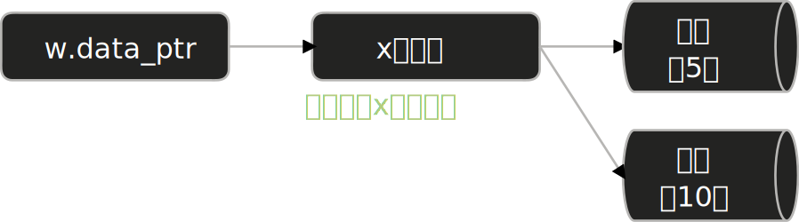
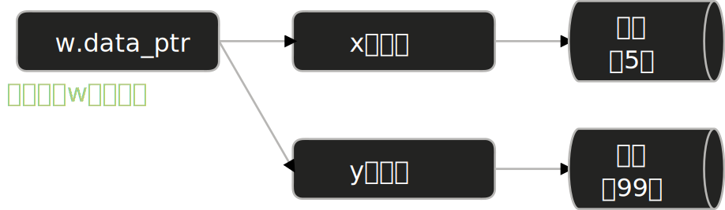

# 什么是结构体

**结构体**（struct）是 Rust 中最常用的自定义类型，允许你将多个相关的数据组织在一起，并给每个数据片段起一个有意义的名字。

想象你要存储一个矩形的尺寸。用普通变量，你可能这样写：

<div class="code-runner" data-full-code="fn%20main()%20%7B%0A%20%20%20%20let%20width%20%3D%2030%3B%0A%20%20%20%20let%20height%20%3D%2050%3B%0A%0A%20%20%20%20println!(%22%E7%9F%A9%E5%BD%A2%E5%B0%BA%E5%AF%B8%EF%BC%9A%E5%AE%BD%20%7B%7D%2C%20%E9%AB%98%20%7B%7D%22%2C%20width%2C%20height)%3B%0A%7D" data-mode="run"><pre class="code-runner-pre"><code class="language-rust"><span class="line"><span style="color:#F97583">fn</span><span style="color:#B392F0"> main</span><span style="color:#E1E4E8">() {</span></span>
<span class="line"><span style="color:#F97583">    let</span><span style="color:#E1E4E8"> width </span><span style="color:#F97583">=</span><span style="color:#79B8FF"> 30</span><span style="color:#E1E4E8">;</span></span>
<span class="line"><span style="color:#F97583">    let</span><span style="color:#E1E4E8"> height </span><span style="color:#F97583">=</span><span style="color:#79B8FF"> 50</span><span style="color:#E1E4E8">;</span></span>
<span class="line"></span>
<span class="line"><span style="color:#B392F0">    println!</span><span style="color:#E1E4E8">(</span><span style="color:#9ECBFF">"矩形尺寸：宽 {}, 高 {}"</span><span style="color:#E1E4E8">, width, height);</span></span>
<span class="line"><span style="color:#E1E4E8">}</span></span></code></pre></div>

这样做的问题是：没有清晰表现出这两个数字是相关的（都属于同一个矩形）。用**元组**能改进一点：

<div class="code-runner" data-full-code="fn%20main()%20%7B%0A%20%20%20%20let%20rect%20%3D%20(30%2C%2050)%3B%0A%0A%20%20%20%20println!(%22%E7%9F%A9%E5%BD%A2%E5%B0%BA%E5%AF%B8%EF%BC%9A%E5%AE%BD%20%7B%7D%2C%20%E9%AB%98%20%7B%7D%22%2C%20rect.0%2C%20rect.1)%3B%0A%7D" data-mode="run"><pre class="code-runner-pre"><code class="language-rust"><span class="line"><span style="color:#F97583">fn</span><span style="color:#B392F0"> main</span><span style="color:#E1E4E8">() {</span></span>
<span class="line"><span style="color:#F97583">    let</span><span style="color:#E1E4E8"> rect </span><span style="color:#F97583">=</span><span style="color:#E1E4E8"> (</span><span style="color:#79B8FF">30</span><span style="color:#E1E4E8">, </span><span style="color:#79B8FF">50</span><span style="color:#E1E4E8">);</span></span>
<span class="line"></span>
<span class="line"><span style="color:#B392F0">    println!</span><span style="color:#E1E4E8">(</span><span style="color:#9ECBFF">"矩形尺寸：宽 {}, 高 {}"</span><span style="color:#E1E4E8">, rect</span><span style="color:#F97583">.</span><span style="color:#79B8FF">0</span><span style="color:#E1E4E8">, rect</span><span style="color:#F97583">.</span><span style="color:#79B8FF">1</span><span style="color:#E1E4E8">);</span></span>
<span class="line"><span style="color:#E1E4E8">}</span></span></code></pre></div>

但是代码读者仍然需要记住”第一个字段是宽，第二个是高”。如果用结构体：

<div class="code-runner" data-full-code="struct%20Rectangle%20%7B%0A%20%20%20%20width%3A%20u32%2C%0A%20%20%20%20height%3A%20u32%2C%0A%7D%0A%0Afn%20main()%20%7B%0A%20%20%20%20let%20rect%20%3D%20Rectangle%20%7B%0A%20%20%20%20%20%20%20%20width%3A%2030%2C%0A%20%20%20%20%20%20%20%20height%3A%2050%2C%0A%20%20%20%20%7D%3B%0A%0A%20%20%20%20println!(%22%E7%9F%A9%E5%BD%A2%E5%B0%BA%E5%AF%B8%EF%BC%9A%E5%AE%BD%20%7B%7D%2C%20%E9%AB%98%20%7B%7D%22%2C%20rect.width%2C%20rect.height)%3B%0A%7D" data-mode="run"><pre class="code-runner-pre"><code class="language-rust"><span class="line"><span style="color:#F97583">struct</span><span style="color:#B392F0"> Rectangle</span><span style="color:#E1E4E8"> {</span></span>
<span class="line"><span style="color:#E1E4E8">    width</span><span style="color:#F97583">:</span><span style="color:#B392F0"> u32</span><span style="color:#E1E4E8">,</span></span>
<span class="line"><span style="color:#E1E4E8">    height</span><span style="color:#F97583">:</span><span style="color:#B392F0"> u32</span><span style="color:#E1E4E8">,</span></span>
<span class="line"><span style="color:#E1E4E8">}</span></span>
<span class="line"></span>
<span class="line"><span style="color:#F97583">fn</span><span style="color:#B392F0"> main</span><span style="color:#E1E4E8">() {</span></span>
<span class="line"><span style="color:#F97583">    let</span><span style="color:#E1E4E8"> rect </span><span style="color:#F97583">=</span><span style="color:#B392F0"> Rectangle</span><span style="color:#E1E4E8"> {</span></span>
<span class="line"><span style="color:#E1E4E8">        width</span><span style="color:#F97583">:</span><span style="color:#79B8FF"> 30</span><span style="color:#E1E4E8">,</span></span>
<span class="line"><span style="color:#E1E4E8">        height</span><span style="color:#F97583">:</span><span style="color:#79B8FF"> 50</span><span style="color:#E1E4E8">,</span></span>
<span class="line"><span style="color:#E1E4E8">    };</span></span>
<span class="line"></span>
<span class="line"><span style="color:#B392F0">    println!</span><span style="color:#E1E4E8">(</span><span style="color:#9ECBFF">"矩形尺寸：宽 {}, 高 {}"</span><span style="color:#E1E4E8">, rect</span><span style="color:#F97583">.</span><span style="color:#E1E4E8">width, rect</span><span style="color:#F97583">.</span><span style="color:#E1E4E8">height);</span></span>
<span class="line"><span style="color:#E1E4E8">}</span></span></code></pre></div>

现在一切都清晰了：字段有名字，代码自解释。**这就是结构体的核心价值**——用有意义的名字让代码更易维护。

# 定义和实例化结构体

## 基本语法

定义结构体使用 `struct` 关键字，后跟结构体名和一对大括号，括号内列出**字段**（field）及其类型：

<div class="code-runner" data-full-code="struct%20User%20%7B%0A%20%20%20%20name%3A%20String%2C%0A%20%20%20%20email%3A%20String%2C%0A%20%20%20%20age%3A%20u32%2C%0A%20%20%20%20active%3A%20bool%2C%0A%7D%0A%0Afn%20main()%20%7B%0A%20%20%20%20%2F%2F%20%E5%88%9B%E5%BB%BA%E4%B8%80%E4%B8%AA%E5%AE%9E%E4%BE%8B%0A%20%20%20%20let%20user1%20%3D%20User%20%7B%0A%20%20%20%20%20%20%20%20name%3A%20String%3A%3Afrom(%22Alice%22)%2C%0A%20%20%20%20%20%20%20%20email%3A%20String%3A%3Afrom(%22alice%40example.com%22)%2C%0A%20%20%20%20%20%20%20%20age%3A%2030%2C%0A%20%20%20%20%20%20%20%20active%3A%20true%2C%0A%20%20%20%20%7D%3B%0A%0A%20%20%20%20println!(%22%E7%94%A8%E6%88%B7%EF%BC%9A%7B%7D%2C%20%E9%82%AE%E7%AE%B1%EF%BC%9A%7B%7D%22%2C%20user1.name%2C%20user1.email)%3B%0A%7D" data-mode="run"><pre class="code-runner-pre"><code class="language-rust"><span class="line"><span style="color:#F97583">struct</span><span style="color:#B392F0"> User</span><span style="color:#E1E4E8"> {</span></span>
<span class="line"><span style="color:#E1E4E8">    name</span><span style="color:#F97583">:</span><span style="color:#B392F0"> String</span><span style="color:#E1E4E8">,</span></span>
<span class="line"><span style="color:#E1E4E8">    email</span><span style="color:#F97583">:</span><span style="color:#B392F0"> String</span><span style="color:#E1E4E8">,</span></span>
<span class="line"><span style="color:#E1E4E8">    age</span><span style="color:#F97583">:</span><span style="color:#B392F0"> u32</span><span style="color:#E1E4E8">,</span></span>
<span class="line"><span style="color:#E1E4E8">    active</span><span style="color:#F97583">:</span><span style="color:#B392F0"> bool</span><span style="color:#E1E4E8">,</span></span>
<span class="line"><span style="color:#E1E4E8">}</span></span>
<span class="line"></span>
<span class="line"><span style="color:#F97583">fn</span><span style="color:#B392F0"> main</span><span style="color:#E1E4E8">() {</span></span>
<span class="line"><span style="color:#6A737D">    // 创建一个实例</span></span>
<span class="line"><span style="color:#F97583">    let</span><span style="color:#E1E4E8"> user1 </span><span style="color:#F97583">=</span><span style="color:#B392F0"> User</span><span style="color:#E1E4E8"> {</span></span>
<span class="line"><span style="color:#E1E4E8">        name</span><span style="color:#F97583">:</span><span style="color:#B392F0"> String</span><span style="color:#F97583">::</span><span style="color:#B392F0">from</span><span style="color:#E1E4E8">(</span><span style="color:#9ECBFF">"Alice"</span><span style="color:#E1E4E8">),</span></span>
<span class="line"><span style="color:#E1E4E8">        email</span><span style="color:#F97583">:</span><span style="color:#B392F0"> String</span><span style="color:#F97583">::</span><span style="color:#B392F0">from</span><span style="color:#E1E4E8">(</span><span style="color:#9ECBFF">"alice@example.com"</span><span style="color:#E1E4E8">),</span></span>
<span class="line"><span style="color:#E1E4E8">        age</span><span style="color:#F97583">:</span><span style="color:#79B8FF"> 30</span><span style="color:#E1E4E8">,</span></span>
<span class="line"><span style="color:#E1E4E8">        active</span><span style="color:#F97583">:</span><span style="color:#79B8FF"> true</span><span style="color:#E1E4E8">,</span></span>
<span class="line"><span style="color:#E1E4E8">    };</span></span>
<span class="line"></span>
<span class="line"><span style="color:#B392F0">    println!</span><span style="color:#E1E4E8">(</span><span style="color:#9ECBFF">"用户：{}, 邮箱：{}"</span><span style="color:#E1E4E8">, user1</span><span style="color:#F97583">.</span><span style="color:#E1E4E8">name, user1</span><span style="color:#F97583">.</span><span style="color:#E1E4E8">email);</span></span>
<span class="line"><span style="color:#E1E4E8">}</span></span></code></pre></div>

**几个要点：**

- 结构体名按惯例使用 大驼峰 （CapitalCase）
- 字段名按惯例使用 蛇形命名 （snake_case）
- 字段顺序在实例化时 可以不同 ，因为用的是名字而不是位置
- 访问字段用 点号 （ . ）

## 修改字段值

只有当结构体实例是 `mut` 时，才能修改它的字段：

<div class="code-runner" data-full-code="struct%20User%20%7B%0A%20%20%20%20name%3A%20String%2C%0A%20%20%20%20email%3A%20String%2C%0A%7D%0A%0Afn%20main()%20%7B%0A%20%20%20%20let%20mut%20user1%20%3D%20User%20%7B%0A%20%20%20%20%20%20%20%20name%3A%20String%3A%3Afrom(%22Alice%22)%2C%0A%20%20%20%20%20%20%20%20email%3A%20String%3A%3Afrom(%22alice%40example.com%22)%2C%0A%20%20%20%20%7D%3B%0A%0A%20%20%20%20user1.email%20%3D%20String%3A%3Afrom(%22newemail%40example.com%22)%3B%20%2F%2F%20%E2%9C%93%20%E5%8F%AF%E4%BB%A5%E4%BF%AE%E6%94%B9%0A%20%20%20%20println!(%22%E6%96%B0%E9%82%AE%E7%AE%B1%EF%BC%9A%7B%7D%22%2C%20user1.email)%3B%0A%7D" data-mode="run"><pre class="code-runner-pre"><code class="language-rust"><span class="line"><span style="color:#F97583">struct</span><span style="color:#B392F0"> User</span><span style="color:#E1E4E8"> {</span></span>
<span class="line"><span style="color:#E1E4E8">    name</span><span style="color:#F97583">:</span><span style="color:#B392F0"> String</span><span style="color:#E1E4E8">,</span></span>
<span class="line"><span style="color:#E1E4E8">    email</span><span style="color:#F97583">:</span><span style="color:#B392F0"> String</span><span style="color:#E1E4E8">,</span></span>
<span class="line"><span style="color:#E1E4E8">}</span></span>
<span class="line"></span>
<span class="line"><span style="color:#F97583">fn</span><span style="color:#B392F0"> main</span><span style="color:#E1E4E8">() {</span></span>
<span class="line"><span style="color:#F97583">    let</span><span style="color:#F97583"> mut</span><span style="color:#E1E4E8"> user1 </span><span style="color:#F97583">=</span><span style="color:#B392F0"> User</span><span style="color:#E1E4E8"> {</span></span>
<span class="line"><span style="color:#E1E4E8">        name</span><span style="color:#F97583">:</span><span style="color:#B392F0"> String</span><span style="color:#F97583">::</span><span style="color:#B392F0">from</span><span style="color:#E1E4E8">(</span><span style="color:#9ECBFF">"Alice"</span><span style="color:#E1E4E8">),</span></span>
<span class="line"><span style="color:#E1E4E8">        email</span><span style="color:#F97583">:</span><span style="color:#B392F0"> String</span><span style="color:#F97583">::</span><span style="color:#B392F0">from</span><span style="color:#E1E4E8">(</span><span style="color:#9ECBFF">"alice@example.com"</span><span style="color:#E1E4E8">),</span></span>
<span class="line"><span style="color:#E1E4E8">    };</span></span>
<span class="line"></span>
<span class="line"><span style="color:#E1E4E8">    user1</span><span style="color:#F97583">.</span><span style="color:#E1E4E8">email </span><span style="color:#F97583">=</span><span style="color:#B392F0"> String</span><span style="color:#F97583">::</span><span style="color:#B392F0">from</span><span style="color:#E1E4E8">(</span><span style="color:#9ECBFF">"newemail@example.com"</span><span style="color:#E1E4E8">); </span><span style="color:#6A737D">// ✓ 可以修改</span></span>
<span class="line"><span style="color:#B392F0">    println!</span><span style="color:#E1E4E8">(</span><span style="color:#9ECBFF">"新邮箱：{}"</span><span style="color:#E1E4E8">, user1</span><span style="color:#F97583">.</span><span style="color:#E1E4E8">email);</span></span>
<span class="line"><span style="color:#E1E4E8">}</span></span></code></pre></div>

**重要：** Rust 不支持让结构体的部分字段可变，部分字段不可变。要么整个实例是 `mut`，要么都是不可变的。

### 嵌套结构体的可变性

`mut` 会沿路径**向下传递**，嵌套的字段也全部变为可变：

<div class="code-runner" data-full-code="struct%20Inner%20%7B%0A%20%20%20%20value%3A%20i32%2C%0A%7D%0A%0Astruct%20Outer%20%7B%0A%20%20%20%20inner%3A%20Inner%2C%0A%20%20%20%20name%3A%20String%2C%0A%7D%0A%0Afn%20main()%20%7B%0A%20%20%20%20let%20mut%20outer%20%3D%20Outer%20%7B%0A%20%20%20%20%20%20%20%20inner%3A%20Inner%20%7B%20value%3A%201%20%7D%2C%0A%20%20%20%20%20%20%20%20name%3A%20String%3A%3Afrom(%22test%22)%2C%0A%20%20%20%20%7D%3B%0A%0A%20%20%20%20outer.inner.value%20%3D%2042%3B%20%20%2F%2F%20%E2%9C%93%20outer%20%E6%98%AF%20mut%EF%BC%8C%E5%B5%8C%E5%A5%97%E5%AD%97%E6%AE%B5%E4%B9%9F%E5%8F%AF%E4%BB%A5%E6%94%B9%0A%20%20%20%20println!(%22inner.value%20%3D%20%7B%7D%22%2C%20outer.inner.value)%3B%0A%7D" data-mode="run"><pre class="code-runner-pre"><code class="language-rust"><span class="line"><span style="color:#F97583">struct</span><span style="color:#B392F0"> Inner</span><span style="color:#E1E4E8"> {</span></span>
<span class="line"><span style="color:#E1E4E8">    value</span><span style="color:#F97583">:</span><span style="color:#B392F0"> i32</span><span style="color:#E1E4E8">,</span></span>
<span class="line"><span style="color:#E1E4E8">}</span></span>
<span class="line"></span>
<span class="line"><span style="color:#F97583">struct</span><span style="color:#B392F0"> Outer</span><span style="color:#E1E4E8"> {</span></span>
<span class="line"><span style="color:#E1E4E8">    inner</span><span style="color:#F97583">:</span><span style="color:#B392F0"> Inner</span><span style="color:#E1E4E8">,</span></span>
<span class="line"><span style="color:#E1E4E8">    name</span><span style="color:#F97583">:</span><span style="color:#B392F0"> String</span><span style="color:#E1E4E8">,</span></span>
<span class="line"><span style="color:#E1E4E8">}</span></span>
<span class="line"></span>
<span class="line"><span style="color:#F97583">fn</span><span style="color:#B392F0"> main</span><span style="color:#E1E4E8">() {</span></span>
<span class="line"><span style="color:#F97583">    let</span><span style="color:#F97583"> mut</span><span style="color:#E1E4E8"> outer </span><span style="color:#F97583">=</span><span style="color:#B392F0"> Outer</span><span style="color:#E1E4E8"> {</span></span>
<span class="line"><span style="color:#E1E4E8">        inner</span><span style="color:#F97583">:</span><span style="color:#B392F0"> Inner</span><span style="color:#E1E4E8"> { value</span><span style="color:#F97583">:</span><span style="color:#79B8FF"> 1</span><span style="color:#E1E4E8"> },</span></span>
<span class="line"><span style="color:#E1E4E8">        name</span><span style="color:#F97583">:</span><span style="color:#B392F0"> String</span><span style="color:#F97583">::</span><span style="color:#B392F0">from</span><span style="color:#E1E4E8">(</span><span style="color:#9ECBFF">"test"</span><span style="color:#E1E4E8">),</span></span>
<span class="line"><span style="color:#E1E4E8">    };</span></span>
<span class="line"></span>
<span class="line"><span style="color:#E1E4E8">    outer</span><span style="color:#F97583">.</span><span style="color:#E1E4E8">inner</span><span style="color:#F97583">.</span><span style="color:#E1E4E8">value </span><span style="color:#F97583">=</span><span style="color:#79B8FF"> 42</span><span style="color:#E1E4E8">;  </span><span style="color:#6A737D">// ✓ outer 是 mut，嵌套字段也可以改</span></span>
<span class="line"><span style="color:#B392F0">    println!</span><span style="color:#E1E4E8">(</span><span style="color:#9ECBFF">"inner.value = {}"</span><span style="color:#E1E4E8">, outer</span><span style="color:#F97583">.</span><span style="color:#E1E4E8">inner</span><span style="color:#F97583">.</span><span style="color:#E1E4E8">value);</span></span>
<span class="line"><span style="color:#E1E4E8">}</span></span></code></pre></div>

### 字段是 &mut 引用时

当字段本身是 `&mut T` 引用时，有一个微妙的区别——**通过引用修改数据**和**替换引用字段本身**是两回事：
（以下有一个’a 的语法，现在还没有学习过，这里可以暂时不用管它，后面会讲解，和现在讲解的内容无关）



<div class="code-runner" data-full-code="struct%20Wrapper%3C'a%3E%20%7B%0A%20%20%20%20data_ptr%3A%20%26'a%20mut%20i32%2C%0A%7D%0A%0Afn%20main()%20%7B%0A%20%20%20%20let%20mut%20x%20%3D%205%3B%0A%20%20%20%20let%20w%20%3D%20Wrapper%20%7B%20data_ptr%3A%20%26mut%20x%20%7D%3B%20%20%2F%2F%20w%20%E6%9C%AC%E8%BA%AB%E4%B8%8D%E6%98%AF%20mut%0A%0A%20%20%20%20*(w.data_ptr)%20%3D%2010%3B%20%20%2F%2F%20%E2%9C%93%20%E9%80%9A%E8%BF%87%20%26mut%20%E5%BC%95%E7%94%A8%E4%BF%AE%E6%94%B9%E6%95%B0%E6%8D%AE%EF%BC%8C%E4%B8%8D%E9%9C%80%E8%A6%81%20w%20%E6%98%AF%20mut%0A%20%20%20%20println!(%22x%20%3D%20%7B%7D%22%2C%20x)%3B%0A%7D" data-mode="run"><pre class="code-runner-pre"><code class="language-rust"><span class="line"><span style="color:#F97583">struct</span><span style="color:#B392F0"> Wrapper</span><span style="color:#E1E4E8">&lt;'</span><span style="color:#B392F0">a</span><span style="color:#E1E4E8">&gt; {</span></span>
<span class="line"><span style="color:#E1E4E8">    data_ptr</span><span style="color:#F97583">:</span><span style="color:#F97583"> &amp;</span><span style="color:#E1E4E8">'</span><span style="color:#B392F0">a</span><span style="color:#F97583"> mut</span><span style="color:#B392F0"> i32</span><span style="color:#E1E4E8">,</span></span>
<span class="line"><span style="color:#E1E4E8">}</span></span>
<span class="line"></span>
<span class="line"><span style="color:#F97583">fn</span><span style="color:#B392F0"> main</span><span style="color:#E1E4E8">() {</span></span>
<span class="line"><span style="color:#F97583">    let</span><span style="color:#F97583"> mut</span><span style="color:#E1E4E8"> x </span><span style="color:#F97583">=</span><span style="color:#79B8FF"> 5</span><span style="color:#E1E4E8">;</span></span>
<span class="line"><span style="color:#F97583">    let</span><span style="color:#E1E4E8"> w </span><span style="color:#F97583">=</span><span style="color:#B392F0"> Wrapper</span><span style="color:#E1E4E8"> { data_ptr</span><span style="color:#F97583">:</span><span style="color:#F97583"> &amp;mut</span><span style="color:#E1E4E8"> x };  </span><span style="color:#6A737D">// w 本身不是 mut</span></span>
<span class="line"></span>
<span class="line"><span style="color:#F97583">    *</span><span style="color:#E1E4E8">(w</span><span style="color:#F97583">.</span><span style="color:#E1E4E8">data_ptr) </span><span style="color:#F97583">=</span><span style="color:#79B8FF"> 10</span><span style="color:#E1E4E8">;  </span><span style="color:#6A737D">// ✓ 通过 &amp;mut 引用修改数据，不需要 w 是 mut</span></span>
<span class="line"><span style="color:#B392F0">    println!</span><span style="color:#E1E4E8">(</span><span style="color:#9ECBFF">"x = {}"</span><span style="color:#E1E4E8">, x);</span></span>
<span class="line"><span style="color:#E1E4E8">}</span></span></code></pre></div>



<div class="code-runner" data-full-code="struct%20Wrapper%3C'a%3E%20%7B%0A%20%20%20%20data_ptr%3A%20%26'a%20mut%20i32%2C%0A%7D%0A%0Afn%20main()%20%7B%0A%20%20%20%20let%20mut%20x%20%3D%205%3B%0A%20%20%20%20let%20mut%20y%20%3D%2099%3B%0A%20%20%20%20let%20w%20%3D%20Wrapper%20%7B%20data_ptr%3A%20%26mut%20x%20%7D%3B%20%20%2F%2F%20w%20%E4%B8%8D%E6%98%AF%20mut%0A%0A%20%20%20%20w.data_ptr%20%3D%20%26mut%20y%3B%20%20%2F%2F%20%E9%94%99%E8%AF%AF%EF%BC%81%E6%9B%BF%E6%8D%A2%E5%AD%97%E6%AE%B5%E6%9C%AC%E8%BA%AB%E9%9C%80%E8%A6%81%20w%20%E6%98%AF%20mut%0A%7D" data-mode="expect-error"><pre class="code-runner-pre"><code class="language-rust"><span class="line"><span style="color:#F97583">struct</span><span style="color:#B392F0"> Wrapper</span><span style="color:#E1E4E8">&lt;'</span><span style="color:#B392F0">a</span><span style="color:#E1E4E8">&gt; {</span></span>
<span class="line"><span style="color:#E1E4E8">    data_ptr</span><span style="color:#F97583">:</span><span style="color:#F97583"> &amp;</span><span style="color:#E1E4E8">'</span><span style="color:#B392F0">a</span><span style="color:#F97583"> mut</span><span style="color:#B392F0"> i32</span><span style="color:#E1E4E8">,</span></span>
<span class="line"><span style="color:#E1E4E8">}</span></span>
<span class="line"></span>
<span class="line"><span style="color:#F97583">fn</span><span style="color:#B392F0"> main</span><span style="color:#E1E4E8">() {</span></span>
<span class="line"><span style="color:#F97583">    let</span><span style="color:#F97583"> mut</span><span style="color:#E1E4E8"> x </span><span style="color:#F97583">=</span><span style="color:#79B8FF"> 5</span><span style="color:#E1E4E8">;</span></span>
<span class="line"><span style="color:#F97583">    let</span><span style="color:#F97583"> mut</span><span style="color:#E1E4E8"> y </span><span style="color:#F97583">=</span><span style="color:#79B8FF"> 99</span><span style="color:#E1E4E8">;</span></span>
<span class="line"><span style="color:#F97583">    let</span><span style="color:#E1E4E8"> w </span><span style="color:#F97583">=</span><span style="color:#B392F0"> Wrapper</span><span style="color:#E1E4E8"> { data_ptr</span><span style="color:#F97583">:</span><span style="color:#F97583"> &amp;mut</span><span style="color:#E1E4E8"> x };  </span><span style="color:#6A737D">// w 不是 mut</span></span>
<span class="line"></span>
<span class="line"><span style="color:#E1E4E8">    w</span><span style="color:#F97583">.</span><span style="color:#E1E4E8">data_ptr </span><span style="color:#F97583">=</span><span style="color:#F97583"> &amp;mut</span><span style="color:#E1E4E8"> y;  </span><span style="color:#6A737D">// 错误！替换字段本身需要 w 是 mut</span></span>
<span class="line"><span style="color:#E1E4E8">}</span></span></code></pre></div>

规律：

- w实例的 mut 控制 能不能改这个字段引用的自身地址
- data_ptr的 mut 控制 能不能改这个字段引用指向的数据的值

> 另外，这里 data_ptr 和 x、y 的可变性必须一致，也就是 data_ptr 如果是 mut，那么 x、y 也必须申请为 mut，不然会编译拦截

## 从函数返回结构体实例

结构体可以作为函数的返回值：

<div class="code-runner" data-full-code="struct%20User%20%7B%0A%20%20%20%20name%3A%20String%2C%0A%20%20%20%20email%3A%20String%2C%0A%7D%0A%0Afn%20create_user(name%3A%20String%2C%20email%3A%20String)%20-%3E%20User%20%7B%0A%20%20%20%20User%20%7B%0A%20%20%20%20%20%20%20%20name%3A%20name%2C%0A%20%20%20%20%20%20%20%20email%3A%20email%2C%0A%20%20%20%20%7D%0A%7D%0A%0Afn%20main()%20%7B%0A%20%20%20%20let%20user%20%3D%20create_user(%0A%20%20%20%20%20%20%20%20String%3A%3Afrom(%22Bob%22)%2C%0A%20%20%20%20%20%20%20%20String%3A%3Afrom(%22bob%40example.com%22)%2C%0A%20%20%20%20)%3B%0A%20%20%20%20println!(%22%E7%94%A8%E6%88%B7%20%7B%7D%20%E5%B7%B2%E5%88%9B%E5%BB%BA%22%2C%20user.name)%3B%0A%7D" data-mode="run"><pre class="code-runner-pre"><code class="language-rust"><span class="line"><span style="color:#F97583">struct</span><span style="color:#B392F0"> User</span><span style="color:#E1E4E8"> {</span></span>
<span class="line"><span style="color:#E1E4E8">    name</span><span style="color:#F97583">:</span><span style="color:#B392F0"> String</span><span style="color:#E1E4E8">,</span></span>
<span class="line"><span style="color:#E1E4E8">    email</span><span style="color:#F97583">:</span><span style="color:#B392F0"> String</span><span style="color:#E1E4E8">,</span></span>
<span class="line"><span style="color:#E1E4E8">}</span></span>
<span class="line"></span>
<span class="line"><span style="color:#F97583">fn</span><span style="color:#B392F0"> create_user</span><span style="color:#E1E4E8">(name</span><span style="color:#F97583">:</span><span style="color:#B392F0"> String</span><span style="color:#E1E4E8">, email</span><span style="color:#F97583">:</span><span style="color:#B392F0"> String</span><span style="color:#E1E4E8">) </span><span style="color:#F97583">-&gt;</span><span style="color:#B392F0"> User</span><span style="color:#E1E4E8"> {</span></span>
<span class="line"><span style="color:#B392F0">    User</span><span style="color:#E1E4E8"> {</span></span>
<span class="line"><span style="color:#E1E4E8">        name</span><span style="color:#F97583">:</span><span style="color:#E1E4E8"> name,</span></span>
<span class="line"><span style="color:#E1E4E8">        email</span><span style="color:#F97583">:</span><span style="color:#E1E4E8"> email,</span></span>
<span class="line"><span style="color:#E1E4E8">    }</span></span>
<span class="line"><span style="color:#E1E4E8">}</span></span>
<span class="line"></span>
<span class="line"><span style="color:#F97583">fn</span><span style="color:#B392F0"> main</span><span style="color:#E1E4E8">() {</span></span>
<span class="line"><span style="color:#F97583">    let</span><span style="color:#E1E4E8"> user </span><span style="color:#F97583">=</span><span style="color:#B392F0"> create_user</span><span style="color:#E1E4E8">(</span></span>
<span class="line"><span style="color:#B392F0">        String</span><span style="color:#F97583">::</span><span style="color:#B392F0">from</span><span style="color:#E1E4E8">(</span><span style="color:#9ECBFF">"Bob"</span><span style="color:#E1E4E8">),</span></span>
<span class="line"><span style="color:#B392F0">        String</span><span style="color:#F97583">::</span><span style="color:#B392F0">from</span><span style="color:#E1E4E8">(</span><span style="color:#9ECBFF">"bob@example.com"</span><span style="color:#E1E4E8">),</span></span>
<span class="line"><span style="color:#E1E4E8">    );</span></span>
<span class="line"><span style="color:#B392F0">    println!</span><span style="color:#E1E4E8">(</span><span style="color:#9ECBFF">"用户 {} 已创建"</span><span style="color:#E1E4E8">, user</span><span style="color:#F97583">.</span><span style="color:#E1E4E8">name);</span></span>
<span class="line"><span style="color:#E1E4E8">}</span></span></code></pre></div>

# 结构体的语法糖

## 字段初始化简写语法

当**函数参数名与结构体字段名相同**时，可以省略重复的 `field: field`：

<div class="code-runner" data-full-code="struct%20User%20%7B%0A%20%20%20%20name%3A%20String%2C%0A%20%20%20%20email%3A%20String%2C%0A%7D%0A%0A%2F%2F%20%E6%99%AE%E9%80%9A%E5%86%99%E6%B3%95%0Afn%20create_user_verbose(name%3A%20String%2C%20email%3A%20String)%20-%3E%20User%20%7B%0A%20%20%20%20User%20%7B%0A%20%20%20%20%20%20%20%20name%3A%20name%2C%0A%20%20%20%20%20%20%20%20email%3A%20email%2C%0A%20%20%20%20%7D%0A%7D%0A%0A%2F%2F%20%E7%AE%80%E5%86%99%E5%86%99%E6%B3%95%0Afn%20create_user(name%3A%20String%2C%20email%3A%20String)%20-%3E%20User%20%7B%0A%20%20%20%20User%20%7B%0A%20%20%20%20%20%20%20%20name%2C%20%20%20%20%20%2F%2F%20%E7%9B%B8%E5%BD%93%E4%BA%8E%20name%3A%20name%0A%20%20%20%20%20%20%20%20email%2C%20%20%20%20%2F%2F%20%E7%9B%B8%E5%BD%93%E4%BA%8E%20email%3A%20email%0A%20%20%20%20%7D%0A%7D%0A%0Afn%20main()%20%7B%0A%20%20%20%20let%20user%20%3D%20create_user(%0A%20%20%20%20%20%20%20%20String%3A%3Afrom(%22Charlie%22)%2C%0A%20%20%20%20%20%20%20%20String%3A%3Afrom(%22charlie%40example.com%22)%2C%0A%20%20%20%20)%3B%0A%20%20%20%20println!(%22%E9%82%AE%E7%AE%B1%EF%BC%9A%7B%7D%22%2C%20user.email)%3B%0A%7D" data-mode="run"><pre class="code-runner-pre"><code class="language-rust"><span class="line"><span style="color:#F97583">struct</span><span style="color:#B392F0"> User</span><span style="color:#E1E4E8"> {</span></span>
<span class="line"><span style="color:#E1E4E8">    name</span><span style="color:#F97583">:</span><span style="color:#B392F0"> String</span><span style="color:#E1E4E8">,</span></span>
<span class="line"><span style="color:#E1E4E8">    email</span><span style="color:#F97583">:</span><span style="color:#B392F0"> String</span><span style="color:#E1E4E8">,</span></span>
<span class="line"><span style="color:#E1E4E8">}</span></span>
<span class="line"></span>
<span class="line"><span style="color:#6A737D">// 普通写法</span></span>
<span class="line"><span style="color:#F97583">fn</span><span style="color:#B392F0"> create_user_verbose</span><span style="color:#E1E4E8">(name</span><span style="color:#F97583">:</span><span style="color:#B392F0"> String</span><span style="color:#E1E4E8">, email</span><span style="color:#F97583">:</span><span style="color:#B392F0"> String</span><span style="color:#E1E4E8">) </span><span style="color:#F97583">-&gt;</span><span style="color:#B392F0"> User</span><span style="color:#E1E4E8"> {</span></span>
<span class="line"><span style="color:#B392F0">    User</span><span style="color:#E1E4E8"> {</span></span>
<span class="line"><span style="color:#E1E4E8">        name</span><span style="color:#F97583">:</span><span style="color:#E1E4E8"> name,</span></span>
<span class="line"><span style="color:#E1E4E8">        email</span><span style="color:#F97583">:</span><span style="color:#E1E4E8"> email,</span></span>
<span class="line"><span style="color:#E1E4E8">    }</span></span>
<span class="line"><span style="color:#E1E4E8">}</span></span>
<span class="line"></span>
<span class="line"><span style="color:#6A737D">// 简写写法</span></span>
<span class="line"><span style="color:#F97583">fn</span><span style="color:#B392F0"> create_user</span><span style="color:#E1E4E8">(name</span><span style="color:#F97583">:</span><span style="color:#B392F0"> String</span><span style="color:#E1E4E8">, email</span><span style="color:#F97583">:</span><span style="color:#B392F0"> String</span><span style="color:#E1E4E8">) </span><span style="color:#F97583">-&gt;</span><span style="color:#B392F0"> User</span><span style="color:#E1E4E8"> {</span></span>
<span class="line"><span style="color:#B392F0">    User</span><span style="color:#E1E4E8"> {</span></span>
<span class="line"><span style="color:#E1E4E8">        name,     </span><span style="color:#6A737D">// 相当于 name: name</span></span>
<span class="line"><span style="color:#E1E4E8">        email,    </span><span style="color:#6A737D">// 相当于 email: email</span></span>
<span class="line"><span style="color:#E1E4E8">    }</span></span>
<span class="line"><span style="color:#E1E4E8">}</span></span>
<span class="line"></span>
<span class="line"><span style="color:#F97583">fn</span><span style="color:#B392F0"> main</span><span style="color:#E1E4E8">() {</span></span>
<span class="line"><span style="color:#F97583">    let</span><span style="color:#E1E4E8"> user </span><span style="color:#F97583">=</span><span style="color:#B392F0"> create_user</span><span style="color:#E1E4E8">(</span></span>
<span class="line"><span style="color:#B392F0">        String</span><span style="color:#F97583">::</span><span style="color:#B392F0">from</span><span style="color:#E1E4E8">(</span><span style="color:#9ECBFF">"Charlie"</span><span style="color:#E1E4E8">),</span></span>
<span class="line"><span style="color:#B392F0">        String</span><span style="color:#F97583">::</span><span style="color:#B392F0">from</span><span style="color:#E1E4E8">(</span><span style="color:#9ECBFF">"charlie@example.com"</span><span style="color:#E1E4E8">),</span></span>
<span class="line"><span style="color:#E1E4E8">    );</span></span>
<span class="line"><span style="color:#B392F0">    println!</span><span style="color:#E1E4E8">(</span><span style="color:#9ECBFF">"邮箱：{}"</span><span style="color:#E1E4E8">, user</span><span style="color:#F97583">.</span><span style="color:#E1E4E8">email);</span></span>
<span class="line"><span style="color:#E1E4E8">}</span></span></code></pre></div>

这个简写在实际代码中非常常用。

## 结构体更新语法

有时你想基于一个已有的实例，创建一个新实例，但修改其中某些字段。**结构体更新语法**（`..`）让这个操作很简洁：

<div class="code-runner" data-full-code="struct%20User%20%7B%0A%20%20%20%20name%3A%20String%2C%0A%20%20%20%20email%3A%20String%2C%0A%20%20%20%20age%3A%20u32%2C%0A%7D%0A%0Afn%20main()%20%7B%0A%20%20%20%20let%20user1%20%3D%20User%20%7B%0A%20%20%20%20%20%20%20%20name%3A%20String%3A%3Afrom(%22Alice%22)%2C%0A%20%20%20%20%20%20%20%20email%3A%20String%3A%3Afrom(%22alice%40example.com%22)%2C%0A%20%20%20%20%20%20%20%20age%3A%2030%2C%0A%20%20%20%20%7D%3B%0A%0A%20%20%20%20%2F%2F%20%E5%88%9B%E5%BB%BA%20user2%EF%BC%8C%E5%8F%AA%E6%94%B9%E9%82%AE%E7%AE%B1%EF%BC%8C%E5%85%B6%E4%BB%96%E5%AD%97%E6%AE%B5%E5%A4%8D%E7%94%A8%20user1%20%E7%9A%84%E5%80%BC%0A%20%20%20%20let%20user2%20%3D%20User%20%7B%0A%20%20%20%20%20%20%20%20email%3A%20String%3A%3Afrom(%22alice.new%40example.com%22)%2C%0A%20%20%20%20%20%20%20%20..user1%20%20%2F%2F%20%E7%94%A8%20user1%20%E7%9A%84%E5%85%B6%E4%BB%96%E5%AD%97%E6%AE%B5%E5%A1%AB%E5%85%85%0A%20%20%20%20%7D%3B%0A%0A%20%20%20%20println!(%22user2%20%E7%9A%84%E5%90%8D%E5%AD%97%EF%BC%9A%7B%7D%2C%20%E9%82%AE%E7%AE%B1%EF%BC%9A%7B%7D%22%2C%20user2.name%2C%20user2.email)%3B%0A%7D" data-mode="run"><pre class="code-runner-pre"><code class="language-rust"><span class="line"><span style="color:#F97583">struct</span><span style="color:#B392F0"> User</span><span style="color:#E1E4E8"> {</span></span>
<span class="line"><span style="color:#E1E4E8">    name</span><span style="color:#F97583">:</span><span style="color:#B392F0"> String</span><span style="color:#E1E4E8">,</span></span>
<span class="line"><span style="color:#E1E4E8">    email</span><span style="color:#F97583">:</span><span style="color:#B392F0"> String</span><span style="color:#E1E4E8">,</span></span>
<span class="line"><span style="color:#E1E4E8">    age</span><span style="color:#F97583">:</span><span style="color:#B392F0"> u32</span><span style="color:#E1E4E8">,</span></span>
<span class="line"><span style="color:#E1E4E8">}</span></span>
<span class="line"></span>
<span class="line"><span style="color:#F97583">fn</span><span style="color:#B392F0"> main</span><span style="color:#E1E4E8">() {</span></span>
<span class="line"><span style="color:#F97583">    let</span><span style="color:#E1E4E8"> user1 </span><span style="color:#F97583">=</span><span style="color:#B392F0"> User</span><span style="color:#E1E4E8"> {</span></span>
<span class="line"><span style="color:#E1E4E8">        name</span><span style="color:#F97583">:</span><span style="color:#B392F0"> String</span><span style="color:#F97583">::</span><span style="color:#B392F0">from</span><span style="color:#E1E4E8">(</span><span style="color:#9ECBFF">"Alice"</span><span style="color:#E1E4E8">),</span></span>
<span class="line"><span style="color:#E1E4E8">        email</span><span style="color:#F97583">:</span><span style="color:#B392F0"> String</span><span style="color:#F97583">::</span><span style="color:#B392F0">from</span><span style="color:#E1E4E8">(</span><span style="color:#9ECBFF">"alice@example.com"</span><span style="color:#E1E4E8">),</span></span>
<span class="line"><span style="color:#E1E4E8">        age</span><span style="color:#F97583">:</span><span style="color:#79B8FF"> 30</span><span style="color:#E1E4E8">,</span></span>
<span class="line"><span style="color:#E1E4E8">    };</span></span>
<span class="line"></span>
<span class="line"><span style="color:#6A737D">    // 创建 user2，只改邮箱，其他字段复用 user1 的值</span></span>
<span class="line"><span style="color:#F97583">    let</span><span style="color:#E1E4E8"> user2 </span><span style="color:#F97583">=</span><span style="color:#B392F0"> User</span><span style="color:#E1E4E8"> {</span></span>
<span class="line"><span style="color:#E1E4E8">        email</span><span style="color:#F97583">:</span><span style="color:#B392F0"> String</span><span style="color:#F97583">::</span><span style="color:#B392F0">from</span><span style="color:#E1E4E8">(</span><span style="color:#9ECBFF">"alice.new@example.com"</span><span style="color:#E1E4E8">),</span></span>
<span class="line"><span style="color:#F97583">        ..</span><span style="color:#E1E4E8">user1  </span><span style="color:#6A737D">// 用 user1 的其他字段填充</span></span>
<span class="line"><span style="color:#E1E4E8">    };</span></span>
<span class="line"></span>
<span class="line"><span style="color:#B392F0">    println!</span><span style="color:#E1E4E8">(</span><span style="color:#9ECBFF">"user2 的名字：{}, 邮箱：{}"</span><span style="color:#E1E4E8">, user2</span><span style="color:#F97583">.</span><span style="color:#E1E4E8">name, user2</span><span style="color:#F97583">.</span><span style="color:#E1E4E8">email);</span></span>
<span class="line"><span style="color:#E1E4E8">}</span></span></code></pre></div>

**语法要点：**

- .. 必须放在最后，表示”剩余字段用某个实例的对应字段填充”
- 可以显式指定某些字段，用 .. 填充其他字段

> **关于所有权的警告**：结构体更新语法会转移没有被明确赋值的字段的所有权。在上面的例子中，`name` 是 `String`（非 Copy 类型），所以 `user1.name` 的所有权被转移到了 `user2`，之后不能再用 `user1.name`：
> `struct User {
> name: String,
> email: String,
> }
> fn main() {
> let user1 = User {
> name: String::from("Alice"),
> email: String::from("alice@example.com"),
> };
> let user2 = User {
> email: String::from("new@example.com"),
> ..user1
> };
> println!("{}", user1.name);  // 错误！user1.name 已被转移
> }`

有三种情况下，`user1` 的字段在更新语法后**仍然可用**：

<div class="code-runner" data-full-code="struct%20User%20%7B%0A%20%20%20%20name%3A%20String%2C%0A%20%20%20%20age%3A%20u32%2C%0A%20%20%20%20email%3A%20String%2C%0A%7D%0A%0Afn%20main()%20%7B%0A%20%20%20%20let%20user1%20%3D%20User%20%7B%0A%20%20%20%20%20%20%20%20name%3A%20String%3A%3Afrom(%22Alice%22)%2C%0A%20%20%20%20%20%20%20%20age%3A%2030%2C%0A%20%20%20%20%20%20%20%20email%3A%20String%3A%3Afrom(%22alice%40example.com%22)%2C%0A%20%20%20%20%7D%3B%0A%0A%20%20%20%20%2F%2F%20%E6%83%85%E5%86%B5%E4%B8%80%EF%BC%9A%E5%AD%97%E6%AE%B5%E8%A2%AB%E6%98%BE%E5%BC%8F%E8%B5%8B%E4%BA%86%E6%96%B0%E5%80%BC%EF%BC%8C%E4%B8%8D%E4%BC%9A%E8%A2%AB%E8%BD%AC%E7%A7%BB%0A%20%20%20%20let%20user2%20%3D%20User%20%7B%0A%20%20%20%20%20%20%20%20email%3A%20String%3A%3Afrom(%22new%40example.com%22)%2C%0A%20%20%20%20%20%20%20%20..user1%0A%20%20%20%20%7D%3B%0A%20%20%20%20println!(%22%7B%7D%22%2C%20user1.email)%3B%20%20%2F%2F%20%E2%9C%93%20email%20%E8%A2%AB%E6%98%BE%E5%BC%8F%E8%B5%8B%E5%80%BC%E4%BA%86%EF%BC%8C%E4%B8%8D%E4%BC%9A%E8%BD%AC%E7%A7%BB%0A%0A%20%20%20%20%2F%2F%20%E6%83%85%E5%86%B5%E4%BA%8C%EF%BC%9A%E5%AD%97%E6%AE%B5%E6%98%AF%20Copy%20%E7%B1%BB%E5%9E%8B%EF%BC%8C%E5%A4%8D%E5%88%B6%E8%80%8C%E9%9D%9E%E8%BD%AC%E7%A7%BB%0A%20%20%20%20let%20user3%20%3D%20User%20%7B%0A%20%20%20%20%20%20%20%20name%3A%20String%3A%3Afrom(%22Bob%22)%2C%0A%20%20%20%20%20%20%20%20..user2%0A%20%20%20%20%7D%3B%0A%20%20%20%20println!(%22%7B%7D%22%2C%20user2.age)%3B%20%20%2F%2F%20%E2%9C%93%20age%20%E6%98%AF%20u32%EF%BC%88Copy%20%E7%B1%BB%E5%9E%8B%EF%BC%89%EF%BC%8C%E5%8F%AF%E4%BB%A5%E7%BB%A7%E7%BB%AD%E7%94%A8%0A%0A%20%20%20%20%2F%2F%20%E6%83%85%E5%86%B5%E4%B8%89%EF%BC%9A%E5%AF%B9%E5%AE%9E%E4%BE%8B%E8%B0%83%E7%94%A8%20clone%EF%BC%8C%E9%81%BF%E5%85%8D%E6%89%80%E6%9C%89%E6%9D%83%E8%BD%AC%E7%A7%BB%0A%20%20%20%20let%20user4%20%3D%20User%20%7B%0A%20%20%20%20%20%20%20%20age%3A%2035%2C%0A%20%20%20%20%20%20%20%20..user3.clone()%20%20%2F%2F%20%E5%85%8B%E9%9A%86%E6%95%B4%E4%B8%AA%E5%AE%9E%E4%BE%8B%EF%BC%8C%E9%9D%9E%20Copy%20%E5%AD%97%E6%AE%B5%E4%B9%9F%E8%A2%AB%E5%A4%8D%E5%88%B6%0A%20%20%20%20%7D%3B%0A%20%20%20%20println!(%22%7B%7D%22%2C%20user3.name)%3B%20%20%2F%2F%20%E2%9C%93%20user3%20%E5%B7%B2%E8%A2%AB%20clone%EF%BC%8C%E5%8E%9F%E5%80%BC%E4%BB%8D%E5%8F%AF%E7%94%A8%0A%7D" data-mode="run"><pre class="code-runner-pre"><code class="language-rust"><span class="line"><span style="color:#F97583">struct</span><span style="color:#B392F0"> User</span><span style="color:#E1E4E8"> {</span></span>
<span class="line"><span style="color:#E1E4E8">    name</span><span style="color:#F97583">:</span><span style="color:#B392F0"> String</span><span style="color:#E1E4E8">,</span></span>
<span class="line"><span style="color:#E1E4E8">    age</span><span style="color:#F97583">:</span><span style="color:#B392F0"> u32</span><span style="color:#E1E4E8">,</span></span>
<span class="line"><span style="color:#E1E4E8">    email</span><span style="color:#F97583">:</span><span style="color:#B392F0"> String</span><span style="color:#E1E4E8">,</span></span>
<span class="line"><span style="color:#E1E4E8">}</span></span>
<span class="line"></span>
<span class="line"><span style="color:#F97583">fn</span><span style="color:#B392F0"> main</span><span style="color:#E1E4E8">() {</span></span>
<span class="line"><span style="color:#F97583">    let</span><span style="color:#E1E4E8"> user1 </span><span style="color:#F97583">=</span><span style="color:#B392F0"> User</span><span style="color:#E1E4E8"> {</span></span>
<span class="line"><span style="color:#E1E4E8">        name</span><span style="color:#F97583">:</span><span style="color:#B392F0"> String</span><span style="color:#F97583">::</span><span style="color:#B392F0">from</span><span style="color:#E1E4E8">(</span><span style="color:#9ECBFF">"Alice"</span><span style="color:#E1E4E8">),</span></span>
<span class="line"><span style="color:#E1E4E8">        age</span><span style="color:#F97583">:</span><span style="color:#79B8FF"> 30</span><span style="color:#E1E4E8">,</span></span>
<span class="line"><span style="color:#E1E4E8">        email</span><span style="color:#F97583">:</span><span style="color:#B392F0"> String</span><span style="color:#F97583">::</span><span style="color:#B392F0">from</span><span style="color:#E1E4E8">(</span><span style="color:#9ECBFF">"alice@example.com"</span><span style="color:#E1E4E8">),</span></span>
<span class="line"><span style="color:#E1E4E8">    };</span></span>
<span class="line"></span>
<span class="line"><span style="color:#6A737D">    // 情况一：字段被显式赋了新值，不会被转移</span></span>
<span class="line"><span style="color:#F97583">    let</span><span style="color:#E1E4E8"> user2 </span><span style="color:#F97583">=</span><span style="color:#B392F0"> User</span><span style="color:#E1E4E8"> {</span></span>
<span class="line"><span style="color:#E1E4E8">        email</span><span style="color:#F97583">:</span><span style="color:#B392F0"> String</span><span style="color:#F97583">::</span><span style="color:#B392F0">from</span><span style="color:#E1E4E8">(</span><span style="color:#9ECBFF">"new@example.com"</span><span style="color:#E1E4E8">),</span></span>
<span class="line"><span style="color:#F97583">        ..</span><span style="color:#E1E4E8">user1</span></span>
<span class="line"><span style="color:#E1E4E8">    };</span></span>
<span class="line"><span style="color:#B392F0">    println!</span><span style="color:#E1E4E8">(</span><span style="color:#9ECBFF">"{}"</span><span style="color:#E1E4E8">, user1</span><span style="color:#F97583">.</span><span style="color:#E1E4E8">email);  </span><span style="color:#6A737D">// ✓ email 被显式赋值了，不会转移</span></span>
<span class="line"></span>
<span class="line"><span style="color:#6A737D">    // 情况二：字段是 Copy 类型，复制而非转移</span></span>
<span class="line"><span style="color:#F97583">    let</span><span style="color:#E1E4E8"> user3 </span><span style="color:#F97583">=</span><span style="color:#B392F0"> User</span><span style="color:#E1E4E8"> {</span></span>
<span class="line"><span style="color:#E1E4E8">        name</span><span style="color:#F97583">:</span><span style="color:#B392F0"> String</span><span style="color:#F97583">::</span><span style="color:#B392F0">from</span><span style="color:#E1E4E8">(</span><span style="color:#9ECBFF">"Bob"</span><span style="color:#E1E4E8">),</span></span>
<span class="line"><span style="color:#F97583">        ..</span><span style="color:#E1E4E8">user2</span></span>
<span class="line"><span style="color:#E1E4E8">    };</span></span>
<span class="line"><span style="color:#B392F0">    println!</span><span style="color:#E1E4E8">(</span><span style="color:#9ECBFF">"{}"</span><span style="color:#E1E4E8">, user2</span><span style="color:#F97583">.</span><span style="color:#E1E4E8">age);  </span><span style="color:#6A737D">// ✓ age 是 u32（Copy 类型），可以继续用</span></span>
<span class="line"></span>
<span class="line"><span style="color:#6A737D">    // 情况三：对实例调用 clone，避免所有权转移</span></span>
<span class="line"><span style="color:#F97583">    let</span><span style="color:#E1E4E8"> user4 </span><span style="color:#F97583">=</span><span style="color:#B392F0"> User</span><span style="color:#E1E4E8"> {</span></span>
<span class="line"><span style="color:#E1E4E8">        age</span><span style="color:#F97583">:</span><span style="color:#79B8FF"> 35</span><span style="color:#E1E4E8">,</span></span>
<span class="line"><span style="color:#F97583">        ..</span><span style="color:#E1E4E8">user3</span><span style="color:#F97583">.</span><span style="color:#B392F0">clone</span><span style="color:#E1E4E8">()  </span><span style="color:#6A737D">// 克隆整个实例，非 Copy 字段也被复制</span></span>
<span class="line"><span style="color:#E1E4E8">    };</span></span>
<span class="line"><span style="color:#B392F0">    println!</span><span style="color:#E1E4E8">(</span><span style="color:#9ECBFF">"{}"</span><span style="color:#E1E4E8">, user3</span><span style="color:#F97583">.</span><span style="color:#E1E4E8">name);  </span><span style="color:#6A737D">// ✓ user3 已被 clone，原值仍可用</span></span>
<span class="line"><span style="color:#E1E4E8">}</span></span></code></pre></div>

**关键点：**

1. 显式赋新值 ——该字段不转移
1. Copy 类型 （如 u32 、 bool 等）——自动复制，不转移
1. `..user.clone()` ——克隆整个实例，所有字段都被复制

# 结构体与所有权

结构体是 **Copy** 还是 **Move** 类型，**完全取决于它的字段**：

- 如果 所有字段都是 Copy 类型 （如 u32 、 bool 、 i32 等），那么整个结构体自动是 Copy 类型
- 如果 任何一个字段是 Move 类型 （如 String ），那么整个结构体就是 Move 类型

看一个对比：

<div class="code-runner" data-full-code="struct%20Point%20%7B%0A%20%20%20%20x%3A%20i32%2C%0A%20%20%20%20y%3A%20i32%2C%20%20%2F%2F%20%E9%83%BD%E6%98%AF%20Copy%20%E7%B1%BB%E5%9E%8B%0A%7D%0A%0Astruct%20User%20%7B%0A%20%20%20%20name%3A%20String%2C%20%20%20%2F%2F%20Move%20%E7%B1%BB%E5%9E%8B%0A%20%20%20%20age%3A%20u32%2C%20%20%20%20%20%20%20%2F%2F%20Copy%20%E7%B1%BB%E5%9E%8B%0A%7D%0A%0Afn%20main()%20%7B%0A%20%20%20%20let%20p1%20%3D%20Point%20%7B%20x%3A%2010%2C%20y%3A%2020%20%7D%3B%0A%20%20%20%20let%20p2%20%3D%20p1%3B%20%20%2F%2F%20%E2%9C%93%20Copy%20%E7%BB%93%E6%9E%84%E4%BD%93%EF%BC%8Cp1%20%E4%BB%8D%E5%8F%AF%E7%94%A8%0A%20%20%20%20println!(%22%7B%3A%3F%7D%22%2C%20p1)%3B%0A%0A%20%20%20%20let%20u1%20%3D%20User%20%7B%0A%20%20%20%20%20%20%20%20name%3A%20String%3A%3Afrom(%22Alice%22)%2C%0A%20%20%20%20%20%20%20%20age%3A%2030%2C%0A%20%20%20%20%7D%3B%0A%20%20%20%20let%20u2%20%3D%20u1%3B%20%20%2F%2F%20Move%20%E7%BB%93%E6%9E%84%E4%BD%93%EF%BC%8Cu1%20%E7%9A%84%E6%89%80%E6%9C%89%E6%9D%83%E8%BD%AC%E7%A7%BB%E5%88%B0%20u2%0A%20%20%20%20%2F%2F%20println!(%22%7B%3A%3F%7D%22%2C%20u1)%3B%20%20%2F%2F%20%E2%9C%97%20%E9%94%99%E8%AF%AF%EF%BC%81u1%20%E5%B7%B2%E8%A2%AB%20move%0A%7D" data-mode="run"><pre class="code-runner-pre"><code class="language-rust"><span class="line"><span style="color:#F97583">struct</span><span style="color:#B392F0"> Point</span><span style="color:#E1E4E8"> {</span></span>
<span class="line"><span style="color:#E1E4E8">    x</span><span style="color:#F97583">:</span><span style="color:#B392F0"> i32</span><span style="color:#E1E4E8">,</span></span>
<span class="line"><span style="color:#E1E4E8">    y</span><span style="color:#F97583">:</span><span style="color:#B392F0"> i32</span><span style="color:#E1E4E8">,  </span><span style="color:#6A737D">// 都是 Copy 类型</span></span>
<span class="line"><span style="color:#E1E4E8">}</span></span>
<span class="line"></span>
<span class="line"><span style="color:#F97583">struct</span><span style="color:#B392F0"> User</span><span style="color:#E1E4E8"> {</span></span>
<span class="line"><span style="color:#E1E4E8">    name</span><span style="color:#F97583">:</span><span style="color:#B392F0"> String</span><span style="color:#E1E4E8">,   </span><span style="color:#6A737D">// Move 类型</span></span>
<span class="line"><span style="color:#E1E4E8">    age</span><span style="color:#F97583">:</span><span style="color:#B392F0"> u32</span><span style="color:#E1E4E8">,       </span><span style="color:#6A737D">// Copy 类型</span></span>
<span class="line"><span style="color:#E1E4E8">}</span></span>
<span class="line"></span>
<span class="line"><span style="color:#F97583">fn</span><span style="color:#B392F0"> main</span><span style="color:#E1E4E8">() {</span></span>
<span class="line"><span style="color:#F97583">    let</span><span style="color:#E1E4E8"> p1 </span><span style="color:#F97583">=</span><span style="color:#B392F0"> Point</span><span style="color:#E1E4E8"> { x</span><span style="color:#F97583">:</span><span style="color:#79B8FF"> 10</span><span style="color:#E1E4E8">, y</span><span style="color:#F97583">:</span><span style="color:#79B8FF"> 20</span><span style="color:#E1E4E8"> };</span></span>
<span class="line"><span style="color:#F97583">    let</span><span style="color:#E1E4E8"> p2 </span><span style="color:#F97583">=</span><span style="color:#E1E4E8"> p1;  </span><span style="color:#6A737D">// ✓ Copy 结构体，p1 仍可用</span></span>
<span class="line"><span style="color:#B392F0">    println!</span><span style="color:#E1E4E8">(</span><span style="color:#9ECBFF">"{:?}"</span><span style="color:#E1E4E8">, p1);</span></span>
<span class="line"></span>
<span class="line"><span style="color:#F97583">    let</span><span style="color:#E1E4E8"> u1 </span><span style="color:#F97583">=</span><span style="color:#B392F0"> User</span><span style="color:#E1E4E8"> {</span></span>
<span class="line"><span style="color:#E1E4E8">        name</span><span style="color:#F97583">:</span><span style="color:#B392F0"> String</span><span style="color:#F97583">::</span><span style="color:#B392F0">from</span><span style="color:#E1E4E8">(</span><span style="color:#9ECBFF">"Alice"</span><span style="color:#E1E4E8">),</span></span>
<span class="line"><span style="color:#E1E4E8">        age</span><span style="color:#F97583">:</span><span style="color:#79B8FF"> 30</span><span style="color:#E1E4E8">,</span></span>
<span class="line"><span style="color:#E1E4E8">    };</span></span>
<span class="line"><span style="color:#F97583">    let</span><span style="color:#E1E4E8"> u2 </span><span style="color:#F97583">=</span><span style="color:#E1E4E8"> u1;  </span><span style="color:#6A737D">// Move 结构体，u1 的所有权转移到 u2</span></span>
<span class="line"><span style="color:#6A737D">    // println!("{:?}", u1);  // ✗ 错误！u1 已被 move</span></span>
<span class="line"><span style="color:#E1E4E8">}</span></span></code></pre></div>

**推论**：

- Copy 结构体赋值时复制所有数据，源变量仍可用
- Move 结构体赋值时转移所有权，源变量失效
- 这就是为什么在前面的例子中， user1 通过 ..user 更新语法会失去 name 字段的所有权——因为 User 是 Move 类型（包含 String）

# 三种结构体形式

Rust 支持三种结构体定义方式。

## 1. 具名字段结构体（最常用）

就是我们一直在用的形式，字段都有名字：

<div class="code-runner" data-full-code="struct%20Point%20%7B%0A%20%20%20%20x%3A%20i32%2C%0A%20%20%20%20y%3A%20i32%2C%0A%7D%0A%0Afn%20main()%20%7B%0A%20%20%20%20let%20p%20%3D%20Point%20%7B%20x%3A%2010%2C%20y%3A%2020%20%7D%3B%0A%20%20%20%20println!(%22%E7%82%B9%E5%9D%90%E6%A0%87%EF%BC%9A(%7B%7D%2C%20%7B%7D)%22%2C%20p.x%2C%20p.y)%3B%0A%7D" data-mode="run"><pre class="code-runner-pre"><code class="language-rust"><span class="line"><span style="color:#F97583">struct</span><span style="color:#B392F0"> Point</span><span style="color:#E1E4E8"> {</span></span>
<span class="line"><span style="color:#E1E4E8">    x</span><span style="color:#F97583">:</span><span style="color:#B392F0"> i32</span><span style="color:#E1E4E8">,</span></span>
<span class="line"><span style="color:#E1E4E8">    y</span><span style="color:#F97583">:</span><span style="color:#B392F0"> i32</span><span style="color:#E1E4E8">,</span></span>
<span class="line"><span style="color:#E1E4E8">}</span></span>
<span class="line"></span>
<span class="line"><span style="color:#F97583">fn</span><span style="color:#B392F0"> main</span><span style="color:#E1E4E8">() {</span></span>
<span class="line"><span style="color:#F97583">    let</span><span style="color:#E1E4E8"> p </span><span style="color:#F97583">=</span><span style="color:#B392F0"> Point</span><span style="color:#E1E4E8"> { x</span><span style="color:#F97583">:</span><span style="color:#79B8FF"> 10</span><span style="color:#E1E4E8">, y</span><span style="color:#F97583">:</span><span style="color:#79B8FF"> 20</span><span style="color:#E1E4E8"> };</span></span>
<span class="line"><span style="color:#B392F0">    println!</span><span style="color:#E1E4E8">(</span><span style="color:#9ECBFF">"点坐标：({}, {})"</span><span style="color:#E1E4E8">, p</span><span style="color:#F97583">.</span><span style="color:#E1E4E8">x, p</span><span style="color:#F97583">.</span><span style="color:#E1E4E8">y);</span></span>
<span class="line"><span style="color:#E1E4E8">}</span></span></code></pre></div>

## 2. 元组结构体

当你只关心字段**类型**而不需要给每个字段起名字时，可以用元组结构体。这在为了区分不同类型而创建”包装类型”时很有用：

<div class="code-runner" data-full-code="struct%20Color(u8%2C%20u8%2C%20u8)%3B%0Astruct%20Point(i32%2C%20i32%2C%20i32)%3B%0A%0Afn%20main()%20%7B%0A%20%20%20%20let%20black%20%3D%20Color(0%2C%200%2C%200)%3B%0A%20%20%20%20let%20origin%20%3D%20Point(0%2C%200%2C%200)%3B%0A%0A%20%20%20%20%2F%2F%20%E8%AE%BF%E9%97%AE%E5%AD%97%E6%AE%B5%E7%94%A8%E7%B4%A2%E5%BC%95%EF%BC%88%E4%BB%8E%200%20%E5%BC%80%E5%A7%8B%EF%BC%89%0A%20%20%20%20println!(%22%E9%BB%91%E8%89%B2%E7%9A%84%E7%BA%A2%E9%80%9A%E9%81%93%EF%BC%9A%7B%7D%22%2C%20black.0)%3B%0A%20%20%20%20println!(%22%E5%8E%9F%E7%82%B9%E7%9A%84%20x%20%E5%9D%90%E6%A0%87%EF%BC%9A%7B%7D%22%2C%20origin.0)%3B%0A%7D" data-mode="run"><pre class="code-runner-pre"><code class="language-rust"><span class="line"><span style="color:#F97583">struct</span><span style="color:#B392F0"> Color</span><span style="color:#E1E4E8">(</span><span style="color:#B392F0">u8</span><span style="color:#E1E4E8">, </span><span style="color:#B392F0">u8</span><span style="color:#E1E4E8">, </span><span style="color:#B392F0">u8</span><span style="color:#E1E4E8">);</span></span>
<span class="line"><span style="color:#F97583">struct</span><span style="color:#B392F0"> Point</span><span style="color:#E1E4E8">(</span><span style="color:#B392F0">i32</span><span style="color:#E1E4E8">, </span><span style="color:#B392F0">i32</span><span style="color:#E1E4E8">, </span><span style="color:#B392F0">i32</span><span style="color:#E1E4E8">);</span></span>
<span class="line"></span>
<span class="line"><span style="color:#F97583">fn</span><span style="color:#B392F0"> main</span><span style="color:#E1E4E8">() {</span></span>
<span class="line"><span style="color:#F97583">    let</span><span style="color:#E1E4E8"> black </span><span style="color:#F97583">=</span><span style="color:#B392F0"> Color</span><span style="color:#E1E4E8">(</span><span style="color:#79B8FF">0</span><span style="color:#E1E4E8">, </span><span style="color:#79B8FF">0</span><span style="color:#E1E4E8">, </span><span style="color:#79B8FF">0</span><span style="color:#E1E4E8">);</span></span>
<span class="line"><span style="color:#F97583">    let</span><span style="color:#E1E4E8"> origin </span><span style="color:#F97583">=</span><span style="color:#B392F0"> Point</span><span style="color:#E1E4E8">(</span><span style="color:#79B8FF">0</span><span style="color:#E1E4E8">, </span><span style="color:#79B8FF">0</span><span style="color:#E1E4E8">, </span><span style="color:#79B8FF">0</span><span style="color:#E1E4E8">);</span></span>
<span class="line"></span>
<span class="line"><span style="color:#6A737D">    // 访问字段用索引（从 0 开始）</span></span>
<span class="line"><span style="color:#B392F0">    println!</span><span style="color:#E1E4E8">(</span><span style="color:#9ECBFF">"黑色的红通道：{}"</span><span style="color:#E1E4E8">, black</span><span style="color:#F97583">.</span><span style="color:#79B8FF">0</span><span style="color:#E1E4E8">);</span></span>
<span class="line"><span style="color:#B392F0">    println!</span><span style="color:#E1E4E8">(</span><span style="color:#9ECBFF">"原点的 x 坐标：{}"</span><span style="color:#E1E4E8">, origin</span><span style="color:#F97583">.</span><span style="color:#79B8FF">0</span><span style="color:#E1E4E8">);</span></span>
<span class="line"><span style="color:#E1E4E8">}</span></span></code></pre></div>

**注意**：`Color` 和 `Point` 是**不同的类型**，即使它们的字段都是三个 `i32` 或 `u8`。这正是元组结构体的价值——让编译器区分具有不同语义的数据。

普通元组与元组结构体的区别：

- 普通元组：不用提前定义。属于“数据层面的临时拼凑”，追求的是快捷、高效。
- 元组结构体：必须提前定义。属于“面向对象/强类型的封装”，追求的是业务语义的明确、以及严苛的类型安全防线。

## 3. 类单元结构体（Unit-Like）

没有任何字段的结构体。看起来奇怪，但在与 trait 结合时很有用（后续章节会讲）：

<div class="code-runner" data-full-code="struct%20Marker%3B%0A%0Afn%20main()%20%7B%0A%20%20%20%20let%20m%20%3D%20Marker%3B%0A%20%20%20%20println!(%22%E6%A0%87%E8%AE%B0%E5%88%9B%E5%BB%BA%E6%88%90%E5%8A%9F%22)%3B%0A%7D" data-mode="run"><pre class="code-runner-pre"><code class="language-rust"><span class="line"><span style="color:#F97583">struct</span><span style="color:#B392F0"> Marker</span><span style="color:#E1E4E8">;</span></span>
<span class="line"></span>
<span class="line"><span style="color:#F97583">fn</span><span style="color:#B392F0"> main</span><span style="color:#E1E4E8">() {</span></span>
<span class="line"><span style="color:#F97583">    let</span><span style="color:#E1E4E8"> m </span><span style="color:#F97583">=</span><span style="color:#B392F0"> Marker</span><span style="color:#E1E4E8">;</span></span>
<span class="line"><span style="color:#B392F0">    println!</span><span style="color:#E1E4E8">(</span><span style="color:#9ECBFF">"标记创建成功"</span><span style="color:#E1E4E8">);</span></span>
<span class="line"><span style="color:#E1E4E8">}</span></span></code></pre></div>

# 调试打印

在格式化输出一章我们讲解过自定义类型不能使用 `{}` 进行打印，现在我们再复习一下：默认 `println!` 用 `{}` 格式化器不支持结构体（因为如何显示没有统一的答案）。需要改用 `{:?}` 或 `{:#?}`：

<div class="code-runner" data-full-code="struct%20Rectangle%20%7B%0A%20%20%20%20width%3A%20u32%2C%0A%20%20%20%20height%3A%20u32%2C%0A%7D%0A%0Afn%20main()%20%7B%0A%20%20%20%20let%20rect%20%3D%20Rectangle%20%7B%20width%3A%2030%2C%20height%3A%2050%20%7D%3B%0A%20%20%20%20println!(%22%7B%7D%22%2C%20rect)%3B%20%20%2F%2F%20%E9%94%99%E8%AF%AF%EF%BC%81%E6%97%A0%E6%B3%95%E7%94%A8%20%7B%7D%20%E6%89%93%E5%8D%B0%20Rectangle%0A%7D" data-mode="expect-error"><pre class="code-runner-pre"><code class="language-rust"><span class="line"><span style="color:#F97583">struct</span><span style="color:#B392F0"> Rectangle</span><span style="color:#E1E4E8"> {</span></span>
<span class="line"><span style="color:#E1E4E8">    width</span><span style="color:#F97583">:</span><span style="color:#B392F0"> u32</span><span style="color:#E1E4E8">,</span></span>
<span class="line"><span style="color:#E1E4E8">    height</span><span style="color:#F97583">:</span><span style="color:#B392F0"> u32</span><span style="color:#E1E4E8">,</span></span>
<span class="line"><span style="color:#E1E4E8">}</span></span>
<span class="line"></span>
<span class="line"><span style="color:#F97583">fn</span><span style="color:#B392F0"> main</span><span style="color:#E1E4E8">() {</span></span>
<span class="line"><span style="color:#F97583">    let</span><span style="color:#E1E4E8"> rect </span><span style="color:#F97583">=</span><span style="color:#B392F0"> Rectangle</span><span style="color:#E1E4E8"> { width</span><span style="color:#F97583">:</span><span style="color:#79B8FF"> 30</span><span style="color:#E1E4E8">, height</span><span style="color:#F97583">:</span><span style="color:#79B8FF"> 50</span><span style="color:#E1E4E8"> };</span></span>
<span class="line"><span style="color:#B392F0">    println!</span><span style="color:#E1E4E8">(</span><span style="color:#9ECBFF">"{}"</span><span style="color:#E1E4E8">, rect);  </span><span style="color:#6A737D">// 错误！无法用 {} 打印 Rectangle</span></span>
<span class="line"><span style="color:#E1E4E8">}</span></span></code></pre></div>

解决办法是派生 `Debug` trait（目前你只需知道这个语法）：

<div class="code-runner" data-full-code="%23%5Bderive(Debug)%5D%0Astruct%20Rectangle%20%7B%0A%20%20%20%20width%3A%20u32%2C%0A%20%20%20%20height%3A%20u32%2C%0A%7D%0A%0Afn%20main()%20%7B%0A%20%20%20%20let%20rect%20%3D%20Rectangle%20%7B%20width%3A%2030%2C%20height%3A%2050%20%7D%3B%0A%0A%20%20%20%20%2F%2F%20%E7%B4%A7%E5%87%91%E6%A0%BC%E5%BC%8F%0A%20%20%20%20println!(%22%E7%9F%A9%E5%BD%A2%EF%BC%9A%7B%3A%3F%7D%22%2C%20rect)%3B%0A%0A%20%20%20%20%2F%2F%20%E6%BC%82%E4%BA%AE%E6%89%93%E5%8D%B0%EF%BC%88%E5%A4%9A%E8%A1%8C%EF%BC%89%0A%20%20%20%20println!(%22%E7%9F%A9%E5%BD%A2%EF%BC%9A%7B%3A%23%3F%7D%22%2C%20rect)%3B%0A%7D" data-mode="run"><pre class="code-runner-pre"><code class="language-rust"><span class="line"><span style="color:#E1E4E8">#[derive(</span><span style="color:#B392F0">Debug</span><span style="color:#E1E4E8">)]</span></span>
<span class="line"><span style="color:#F97583">struct</span><span style="color:#B392F0"> Rectangle</span><span style="color:#E1E4E8"> {</span></span>
<span class="line"><span style="color:#E1E4E8">    width</span><span style="color:#F97583">:</span><span style="color:#B392F0"> u32</span><span style="color:#E1E4E8">,</span></span>
<span class="line"><span style="color:#E1E4E8">    height</span><span style="color:#F97583">:</span><span style="color:#B392F0"> u32</span><span style="color:#E1E4E8">,</span></span>
<span class="line"><span style="color:#E1E4E8">}</span></span>
<span class="line"></span>
<span class="line"><span style="color:#F97583">fn</span><span style="color:#B392F0"> main</span><span style="color:#E1E4E8">() {</span></span>
<span class="line"><span style="color:#F97583">    let</span><span style="color:#E1E4E8"> rect </span><span style="color:#F97583">=</span><span style="color:#B392F0"> Rectangle</span><span style="color:#E1E4E8"> { width</span><span style="color:#F97583">:</span><span style="color:#79B8FF"> 30</span><span style="color:#E1E4E8">, height</span><span style="color:#F97583">:</span><span style="color:#79B8FF"> 50</span><span style="color:#E1E4E8"> };</span></span>
<span class="line"></span>
<span class="line"><span style="color:#6A737D">    // 紧凑格式</span></span>
<span class="line"><span style="color:#B392F0">    println!</span><span style="color:#E1E4E8">(</span><span style="color:#9ECBFF">"矩形：{:?}"</span><span style="color:#E1E4E8">, rect);</span></span>
<span class="line"></span>
<span class="line"><span style="color:#6A737D">    // 漂亮打印（多行）</span></span>
<span class="line"><span style="color:#B392F0">    println!</span><span style="color:#E1E4E8">(</span><span style="color:#9ECBFF">"矩形：{:#?}"</span><span style="color:#E1E4E8">, rect);</span></span>
<span class="line"><span style="color:#E1E4E8">}</span></span></code></pre></div>

# 练习题

## 结构体基础测验

```rust
struct Book {
    title: String,
    author: String,
    pages: u32,
}
```

加载题目中…

加载题目中…

```rust
struct User {
    name: String,
    email: String,
}

fn main() {
    let user1 = User {
        name: String::from("Alice"),
        email: String::from("alice@example.com"),
    };
}
```

加载题目中…

## 编程练习

### 练习 1：创建和修改结构体

定义一个 `Person` 结构体，包含 `name`（String）、`age`（u32）、`email`（String）三个字段。创建两个实例，修改其中一个的邮箱并打印两个实例的信息。

```rust
struct Person {
    // TODO: 定义三个字段
}

fn main() {
    // TODO: 创建 person1，name="Alice", age=28, email="alice@example.com"

    // TODO: 创建 person2，name="Bob", age=35, email="bob@example.com"

    // TODO: 修改 person2 的 email 为 "bob.new@example.com"

    // TODO: 打印两个实例（需要使用 {:?} 和 derive Debug）
}
```

### 练习 2：使用结构体更新语法

定义一个 `Config` 结构体，包含 `host`、`port` 和 `debug` 三个字段。创建一个默认配置，然后基于它创建两个变体（只改某个字段）。

```rust
struct Config {
    host: String,
    port: u16,
    debug: bool,
}

fn main() {
    let default_config = Config {
        host: String::from("localhost"),
        port: 8080,
        debug: false,
    };

    // TODO: 创建 dev_config，基于 default_config 但改 port 为 3000

    // TODO: 创建 prod_config，基于 default_config 但改 host 为 "0.0.0.0" 和 debug 为 true

    // TODO: 打印三个配置（需要派生 Debug）
}
```