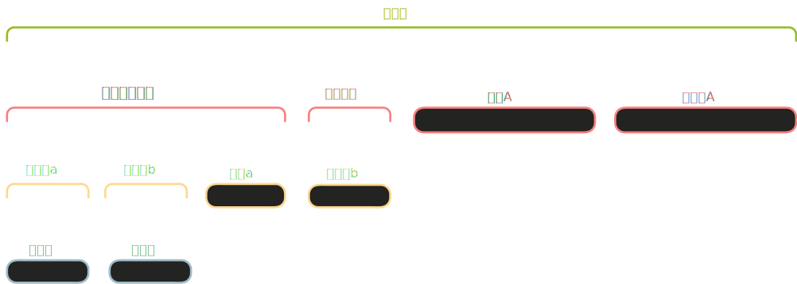

# 模块介绍

## 为什么需要模块

随着代码增长，代码会变得杂乱无序。模块提供了一种**组织和隐藏**代码的方式：

- 组织 ：把相关功能分组到一起，提高可读性
- 隐藏 ：控制哪些代码对外部可见，隐藏内部实现细节（封装）
- 作用域隔离 ：防止名称冲突，同一个名字可以在不同模块中存在

想象一个餐厅：**前台**（公开，客人可见）和**后台**（私有，只有员工可见）。模块就是这样的概念。

## 定义模块：mod 关键字

使用 `mod` 关键字定义一个模块：

<div class="code-runner" data-full-code="mod%20front_of_house%20%7B%0A%20%20%20%20fn%20greet_customer()%20%7B%0A%20%20%20%20%20%20%20%20println!(%22%E6%AC%A2%E8%BF%8E%E6%9D%A5%E5%88%B0%E6%88%91%E4%BB%AC%E7%9A%84%E9%A4%90%E5%8E%85%EF%BC%81%22)%3B%0A%20%20%20%20%7D%0A%7D%0A%0Afn%20main()%20%7B%0A%20%20%20%20%2F%2F%20%E9%94%99%E8%AF%AF%EF%BC%81front_of_house%20%E4%B8%AD%E7%9A%84%E5%87%BD%E6%95%B0%E6%98%AF%E7%A7%81%E6%9C%89%E7%9A%84%EF%BC%8C%E6%97%A0%E6%B3%95%E7%9B%B4%E6%8E%A5%E8%B0%83%E7%94%A8%0A%20%20%20%20%2F%2F%20front_of_house%3A%3Agreet_customer()%3B%0A%20%20%20%20println!(%22%E7%A8%8B%E5%BA%8F%E8%BF%90%E8%A1%8C%22)%3B%0A%7D" data-mode="run"><pre class="code-runner-pre"><code class="language-rust"><span class="line"><span style="color:#F97583">mod</span><span style="color:#B392F0"> front_of_house</span><span style="color:#E1E4E8"> {</span></span>
<span class="line"><span style="color:#F97583">    fn</span><span style="color:#B392F0"> greet_customer</span><span style="color:#E1E4E8">() {</span></span>
<span class="line"><span style="color:#B392F0">        println!</span><span style="color:#E1E4E8">(</span><span style="color:#9ECBFF">"欢迎来到我们的餐厅！"</span><span style="color:#E1E4E8">);</span></span>
<span class="line"><span style="color:#E1E4E8">    }</span></span>
<span class="line"><span style="color:#E1E4E8">}</span></span>
<span class="line"></span>
<span class="line"><span style="color:#F97583">fn</span><span style="color:#B392F0"> main</span><span style="color:#E1E4E8">() {</span></span>
<span class="line"><span style="color:#6A737D">    // 错误！front_of_house 中的函数是私有的，无法直接调用</span></span>
<span class="line"><span style="color:#6A737D">    // front_of_house::greet_customer();</span></span>
<span class="line"><span style="color:#B392F0">    println!</span><span style="color:#E1E4E8">(</span><span style="color:#9ECBFF">"程序运行"</span><span style="color:#E1E4E8">);</span></span>
<span class="line"><span style="color:#E1E4E8">}</span></span></code></pre></div>

模块可以**嵌套**，形成模块树。每个模块里可以包含子模块：

```rust
mod restaurant {
    mod front_of_house {
        mod hosting {
            fn add_to_waitlist() {
                println!("已将您添加到等待列表");
            }
        }
    }
}
```

# 可见性：pub 关键字

默认情况下，模块中的所有项都是**私有的**（private）。私有项只能在本模块和子模块中访问。

要让项对外部可见，需要用 `pub` 修饰：

<div class="code-runner" data-full-code="mod%20restaurant%20%7B%0A%20%20%20%20%2F%2F%20%E7%A7%81%E6%9C%89%E6%A8%A1%E5%9D%97%EF%BC%88%E5%8F%AA%E8%83%BD%E5%9C%A8%20restaurant%20%E5%86%85%E9%83%A8%E4%BD%BF%E7%94%A8%EF%BC%89%0A%20%20%20%20mod%20back_of_house%20%7B%0A%20%20%20%20%20%20%20%20fn%20prepare_order()%20%7B%0A%20%20%20%20%20%20%20%20%20%20%20%20println!(%22%E5%87%86%E5%A4%87%E8%AE%A2%E5%8D%95...%22)%3B%0A%20%20%20%20%20%20%20%20%7D%0A%20%20%20%20%7D%0A%0A%20%20%20%20%2F%2F%20%E5%85%AC%E6%9C%89%E6%A8%A1%E5%9D%97%EF%BC%88%E5%8F%AF%E4%BB%A5%E4%BB%8E%E5%A4%96%E9%83%A8%E8%AE%BF%E9%97%AE%EF%BC%89%0A%20%20%20%20pub%20mod%20front_of_house%20%7B%0A%20%20%20%20%20%20%20%20pub%20fn%20add_to_waitlist()%20%7B%0A%20%20%20%20%20%20%20%20%20%20%20%20println!(%22%E5%B7%B2%E6%B7%BB%E5%8A%A0%E5%88%B0%E7%AD%89%E5%BE%85%E5%88%97%E8%A1%A8%22)%3B%0A%20%20%20%20%20%20%20%20%7D%0A%20%20%20%20%7D%0A%0A%20%20%20%20pub%20fn%20eat_at_restaurant()%20%7B%0A%20%20%20%20%20%20%20%20front_of_house%3A%3Aadd_to_waitlist()%3B%0A%20%20%20%20%7D%0A%7D%0A%0Afn%20main()%20%7B%0A%20%20%20%20%2F%2F%20%E6%AD%A3%E7%A1%AE%EF%BC%81front_of_house%20%E6%98%AF%20pub%EF%BC%8Cadd_to_waitlist%20%E4%B9%9F%E6%98%AF%20pub%0A%20%20%20%20restaurant%3A%3Afront_of_house%3A%3Aadd_to_waitlist()%3B%0A%0A%20%20%20%20%2F%2F%20%E9%94%99%E8%AF%AF%EF%BC%81back_of_house%20%E6%98%AF%E7%A7%81%E6%9C%89%E7%9A%84%0A%20%20%20%20%2F%2F%20restaurant%3A%3Aback_of_house%3A%3Aprepare_order()%3B%0A%7D" data-mode="run"><pre class="code-runner-pre"><code class="language-rust"><span class="line"><span style="color:#F97583">mod</span><span style="color:#B392F0"> restaurant</span><span style="color:#E1E4E8"> {</span></span>
<span class="line"><span style="color:#6A737D">    // 私有模块（只能在 restaurant 内部使用）</span></span>
<span class="line"><span style="color:#F97583">    mod</span><span style="color:#B392F0"> back_of_house</span><span style="color:#E1E4E8"> {</span></span>
<span class="line"><span style="color:#F97583">        fn</span><span style="color:#B392F0"> prepare_order</span><span style="color:#E1E4E8">() {</span></span>
<span class="line"><span style="color:#B392F0">            println!</span><span style="color:#E1E4E8">(</span><span style="color:#9ECBFF">"准备订单..."</span><span style="color:#E1E4E8">);</span></span>
<span class="line"><span style="color:#E1E4E8">        }</span></span>
<span class="line"><span style="color:#E1E4E8">    }</span></span>
<span class="line"></span>
<span class="line"><span style="color:#6A737D">    // 公有模块（可以从外部访问）</span></span>
<span class="line"><span style="color:#F97583">    pub</span><span style="color:#F97583"> mod</span><span style="color:#B392F0"> front_of_house</span><span style="color:#E1E4E8"> {</span></span>
<span class="line"><span style="color:#F97583">        pub</span><span style="color:#F97583"> fn</span><span style="color:#B392F0"> add_to_waitlist</span><span style="color:#E1E4E8">() {</span></span>
<span class="line"><span style="color:#B392F0">            println!</span><span style="color:#E1E4E8">(</span><span style="color:#9ECBFF">"已添加到等待列表"</span><span style="color:#E1E4E8">);</span></span>
<span class="line"><span style="color:#E1E4E8">        }</span></span>
<span class="line"><span style="color:#E1E4E8">    }</span></span>
<span class="line"></span>
<span class="line"><span style="color:#F97583">    pub</span><span style="color:#F97583"> fn</span><span style="color:#B392F0"> eat_at_restaurant</span><span style="color:#E1E4E8">() {</span></span>
<span class="line"><span style="color:#B392F0">        front_of_house</span><span style="color:#F97583">::</span><span style="color:#B392F0">add_to_waitlist</span><span style="color:#E1E4E8">();</span></span>
<span class="line"><span style="color:#E1E4E8">    }</span></span>
<span class="line"><span style="color:#E1E4E8">}</span></span>
<span class="line"></span>
<span class="line"><span style="color:#F97583">fn</span><span style="color:#B392F0"> main</span><span style="color:#E1E4E8">() {</span></span>
<span class="line"><span style="color:#6A737D">    // 正确！front_of_house 是 pub，add_to_waitlist 也是 pub</span></span>
<span class="line"><span style="color:#B392F0">    restaurant</span><span style="color:#F97583">::</span><span style="color:#B392F0">front_of_house</span><span style="color:#F97583">::</span><span style="color:#B392F0">add_to_waitlist</span><span style="color:#E1E4E8">();</span></span>
<span class="line"></span>
<span class="line"><span style="color:#6A737D">    // 错误！back_of_house 是私有的</span></span>
<span class="line"><span style="color:#6A737D">    // restaurant::back_of_house::prepare_order();</span></span>
<span class="line"><span style="color:#E1E4E8">}</span></span></code></pre></div>

## pub 应用规则

- 模块 ：必须标记 pub 才能从外部访问
- 函数 ：必须标记 pub 才能从外部调用
- 结构体字段 ：默认私有，每个字段需要单独标记 pub
- 枚举变体 ：如果枚举是 pub ，所有变体自动是 pub

> **重要**：`pub` 关键字控制的是**可见性**（visibility）——“能否看到和访问”。这是独立于以下两个机制的：
> **所有权**（ownership）— “谁拥有这个值”（由之前的所有权系统控制）
> **可变性**（mutability）— “能否修改这个值”（由 `mut` 关键字控制）
> 一个字段可以既是 `pub`（对外可见）又是不可变的（没有 `mut`）；反之，一个私有字段可以被内部代码通过 `mut` 修改。

## 结构体和枚举的可见性

**结构体的字段需要单独声明为 pub：**

<div class="code-runner" data-full-code="mod%20restaurant%20%7B%0A%20%20%20%20pub%20struct%20Breakfast%20%7B%0A%20%20%20%20%20%20%20%20pub%20toast%3A%20String%2C%20%20%20%20%20%20%2F%2F%20%E5%85%AC%E6%9C%89%0A%20%20%20%20%20%20%20%20seasonal_fruit%3A%20String%2C%20%2F%2F%20%E7%A7%81%E6%9C%89%0A%20%20%20%20%7D%0A%0A%20%20%20%20impl%20Breakfast%20%7B%0A%20%20%20%20%20%20%20%20pub%20fn%20new(toast%3A%20%26str)%20-%3E%20Breakfast%20%7B%0A%20%20%20%20%20%20%20%20%20%20%20%20Breakfast%20%7B%0A%20%20%20%20%20%20%20%20%20%20%20%20%20%20%20%20toast%3A%20toast.to_string()%2C%0A%20%20%20%20%20%20%20%20%20%20%20%20%20%20%20%20seasonal_fruit%3A%20%22%E8%8B%B9%E6%9E%9C%22.to_string()%2C%0A%20%20%20%20%20%20%20%20%20%20%20%20%7D%0A%20%20%20%20%20%20%20%20%7D%0A%20%20%20%20%7D%0A%7D%0A%0Afn%20main()%20%7B%0A%20%20%20%20let%20mut%20meal%20%3D%20restaurant%3A%3ABreakfast%3A%3Anew(%22%E9%BB%91%E9%BA%A6%E9%9D%A2%E5%8C%85%22)%3B%0A%0A%20%20%20%20%2F%2F%20%E6%AD%A3%E7%A1%AE%EF%BC%81toast%20%E6%98%AF%20pub%0A%20%20%20%20println!(%22%E4%BB%8A%E5%A4%A9%E7%9A%84%E9%9D%A2%E5%8C%85%E6%98%AF%20%7B%7D%22%2C%20meal.toast)%3B%0A%0A%20%20%20%20%2F%2F%20%E9%94%99%E8%AF%AF%EF%BC%81seasonal_fruit%20%E6%98%AF%E7%A7%81%E6%9C%89%E7%9A%84%0A%20%20%20%20%2F%2F%20println!(%22%E6%B0%B4%E6%9E%9C%E6%98%AF%20%7B%7D%22%2C%20meal.seasonal_fruit)%3B%0A%7D" data-mode="run"><pre class="code-runner-pre"><code class="language-rust"><span class="line"><span style="color:#F97583">mod</span><span style="color:#B392F0"> restaurant</span><span style="color:#E1E4E8"> {</span></span>
<span class="line"><span style="color:#F97583">    pub</span><span style="color:#F97583"> struct</span><span style="color:#B392F0"> Breakfast</span><span style="color:#E1E4E8"> {</span></span>
<span class="line"><span style="color:#F97583">        pub</span><span style="color:#E1E4E8"> toast</span><span style="color:#F97583">:</span><span style="color:#B392F0"> String</span><span style="color:#E1E4E8">,      </span><span style="color:#6A737D">// 公有</span></span>
<span class="line"><span style="color:#E1E4E8">        seasonal_fruit</span><span style="color:#F97583">:</span><span style="color:#B392F0"> String</span><span style="color:#E1E4E8">, </span><span style="color:#6A737D">// 私有</span></span>
<span class="line"><span style="color:#E1E4E8">    }</span></span>
<span class="line"></span>
<span class="line"><span style="color:#F97583">    impl</span><span style="color:#B392F0"> Breakfast</span><span style="color:#E1E4E8"> {</span></span>
<span class="line"><span style="color:#F97583">        pub</span><span style="color:#F97583"> fn</span><span style="color:#B392F0"> new</span><span style="color:#E1E4E8">(toast</span><span style="color:#F97583">:</span><span style="color:#F97583"> &amp;</span><span style="color:#B392F0">str</span><span style="color:#E1E4E8">) </span><span style="color:#F97583">-&gt;</span><span style="color:#B392F0"> Breakfast</span><span style="color:#E1E4E8"> {</span></span>
<span class="line"><span style="color:#B392F0">            Breakfast</span><span style="color:#E1E4E8"> {</span></span>
<span class="line"><span style="color:#E1E4E8">                toast</span><span style="color:#F97583">:</span><span style="color:#E1E4E8"> toast</span><span style="color:#F97583">.</span><span style="color:#B392F0">to_string</span><span style="color:#E1E4E8">(),</span></span>
<span class="line"><span style="color:#E1E4E8">                seasonal_fruit</span><span style="color:#F97583">:</span><span style="color:#9ECBFF"> "苹果"</span><span style="color:#F97583">.</span><span style="color:#B392F0">to_string</span><span style="color:#E1E4E8">(),</span></span>
<span class="line"><span style="color:#E1E4E8">            }</span></span>
<span class="line"><span style="color:#E1E4E8">        }</span></span>
<span class="line"><span style="color:#E1E4E8">    }</span></span>
<span class="line"><span style="color:#E1E4E8">}</span></span>
<span class="line"></span>
<span class="line"><span style="color:#F97583">fn</span><span style="color:#B392F0"> main</span><span style="color:#E1E4E8">() {</span></span>
<span class="line"><span style="color:#F97583">    let</span><span style="color:#F97583"> mut</span><span style="color:#E1E4E8"> meal </span><span style="color:#F97583">=</span><span style="color:#B392F0"> restaurant</span><span style="color:#F97583">::</span><span style="color:#B392F0">Breakfast</span><span style="color:#F97583">::</span><span style="color:#B392F0">new</span><span style="color:#E1E4E8">(</span><span style="color:#9ECBFF">"黑麦面包"</span><span style="color:#E1E4E8">);</span></span>
<span class="line"></span>
<span class="line"><span style="color:#6A737D">    // 正确！toast 是 pub</span></span>
<span class="line"><span style="color:#B392F0">    println!</span><span style="color:#E1E4E8">(</span><span style="color:#9ECBFF">"今天的面包是 {}"</span><span style="color:#E1E4E8">, meal</span><span style="color:#F97583">.</span><span style="color:#E1E4E8">toast);</span></span>
<span class="line"></span>
<span class="line"><span style="color:#6A737D">    // 错误！seasonal_fruit 是私有的</span></span>
<span class="line"><span style="color:#6A737D">    // println!("水果是 {}", meal.seasonal_fruit);</span></span>
<span class="line"><span style="color:#E1E4E8">}</span></span></code></pre></div>

> 结构体中 impl 里的函数也算是结构体的一部分，因此需要单独的 pub（不需要给 impl 加 pub，impl 的公开性同 struct）

**枚举的所有变体自动是 pub（如果枚举本身是 pub）：**

<div class="code-runner" data-full-code="mod%20pizza%20%7B%0A%20%20%20%20pub%20enum%20PizzaSize%20%7B%0A%20%20%20%20%20%20%20%20Small%2C%0A%20%20%20%20%20%20%20%20Medium%2C%0A%20%20%20%20%20%20%20%20Large%2C%0A%20%20%20%20%7D%0A%7D%0A%0Afn%20main()%20%7B%0A%20%20%20%20%2F%2F%20%E6%89%80%E6%9C%89%E5%8F%98%E4%BD%93%E9%83%BD%E5%8F%AF%E4%BB%A5%E8%AE%BF%E9%97%AE%0A%20%20%20%20let%20_size%20%3D%20pizza%3A%3APizzaSize%3A%3ALarge%3B%0A%7D" data-mode="run"><pre class="code-runner-pre"><code class="language-rust"><span class="line"><span style="color:#F97583">mod</span><span style="color:#B392F0"> pizza</span><span style="color:#E1E4E8"> {</span></span>
<span class="line"><span style="color:#F97583">    pub</span><span style="color:#F97583"> enum</span><span style="color:#B392F0"> PizzaSize</span><span style="color:#E1E4E8"> {</span></span>
<span class="line"><span style="color:#B392F0">        Small</span><span style="color:#E1E4E8">,</span></span>
<span class="line"><span style="color:#B392F0">        Medium</span><span style="color:#E1E4E8">,</span></span>
<span class="line"><span style="color:#B392F0">        Large</span><span style="color:#E1E4E8">,</span></span>
<span class="line"><span style="color:#E1E4E8">    }</span></span>
<span class="line"><span style="color:#E1E4E8">}</span></span>
<span class="line"></span>
<span class="line"><span style="color:#F97583">fn</span><span style="color:#B392F0"> main</span><span style="color:#E1E4E8">() {</span></span>
<span class="line"><span style="color:#6A737D">    // 所有变体都可以访问</span></span>
<span class="line"><span style="color:#F97583">    let</span><span style="color:#E1E4E8"> _size </span><span style="color:#F97583">=</span><span style="color:#B392F0"> pizza</span><span style="color:#F97583">::</span><span style="color:#B392F0">PizzaSize</span><span style="color:#F97583">::</span><span style="color:#B392F0">Large</span><span style="color:#E1E4E8">;</span></span>
<span class="line"><span style="color:#E1E4E8">}</span></span></code></pre></div>

# 可见性与模块层级

## 理论 1：路径可达性原则

Rust 可见性的本质是**路径可达性**。当你要访问 `a::b::c::item` 时，不仅 `item` 要公开，整条路径上的每一步 `a`、`b`、`c` 都必须是可穿过的（即都要标 `pub`），否则整条路径就断裂了。

想象一个办公楼：

- 楼 A（私有）→ 即使楼内的办公室是开放的，外人也进不去
- 楼 A（公开）→ 但对应楼层是私有的 → 外人也进不了那层
- 楼 A（公开）→ 楼层（公开）→ 办公室（私有）→ 外人还是进不了办公室

**结论**：父模块是私有的，就像给整栋楼上了锁，子模块内的任何 `pub` 项都无法从外部访问。

<div class="code-runner" data-full-code="mod%20parent%20%7B%0A%20%20%20%20mod%20child%20%7B%0A%20%20%20%20%20%20%20%20pub%20fn%20public_function()%20%7B%0A%20%20%20%20%20%20%20%20%20%20%20%20println!(%22%E6%88%91%E6%98%AF%20pub%20%E7%9A%84%22)%3B%0A%20%20%20%20%20%20%20%20%7D%0A%20%20%20%20%7D%0A%7D%0A%0Afn%20main()%20%7B%0A%20%20%20%20%2F%2F%20%E2%9D%8C%20%E5%8D%B3%E4%BD%BF%E5%87%BD%E6%95%B0%E6%98%AF%20pub%EF%BC%8C%E4%BD%86%20parent%20%E6%98%AF%E7%A7%81%E6%9C%89%E7%9A%84%EF%BC%8C%E5%A4%96%E9%83%A8%E6%97%A0%E6%B3%95%E7%A9%BF%E8%BF%87%0A%20%20%20%20parent%3A%3Achild%3A%3Apublic_function()%3B%0A%7D" data-mode="expect-error"><pre class="code-runner-pre"><code class="language-rust"><span class="line"><span style="color:#F97583">mod</span><span style="color:#B392F0"> parent</span><span style="color:#E1E4E8"> {</span></span>
<span class="line"><span style="color:#F97583">    mod</span><span style="color:#B392F0"> child</span><span style="color:#E1E4E8"> {</span></span>
<span class="line"><span style="color:#F97583">        pub</span><span style="color:#F97583"> fn</span><span style="color:#B392F0"> public_function</span><span style="color:#E1E4E8">() {</span></span>
<span class="line"><span style="color:#B392F0">            println!</span><span style="color:#E1E4E8">(</span><span style="color:#9ECBFF">"我是 pub 的"</span><span style="color:#E1E4E8">);</span></span>
<span class="line"><span style="color:#E1E4E8">        }</span></span>
<span class="line"><span style="color:#E1E4E8">    }</span></span>
<span class="line"><span style="color:#E1E4E8">}</span></span>
<span class="line"></span>
<span class="line"><span style="color:#F97583">fn</span><span style="color:#B392F0"> main</span><span style="color:#E1E4E8">() {</span></span>
<span class="line"><span style="color:#6A737D">    // ❌ 即使函数是 pub，但 parent 是私有的，外部无法穿过</span></span>
<span class="line"><span style="color:#B392F0">    parent</span><span style="color:#F97583">::</span><span style="color:#B392F0">child</span><span style="color:#F97583">::</span><span style="color:#B392F0">public_function</span><span style="color:#E1E4E8">();</span></span>
<span class="line"><span style="color:#E1E4E8">}</span></span></code></pre></div>

修复：让父模块也标为 `pub`

<div class="code-runner" data-full-code="pub%20mod%20parent%20%7B%0A%20%20%20%20pub%20mod%20child%20%7B%0A%20%20%20%20%20%20%20%20pub%20fn%20public_function()%20%7B%0A%20%20%20%20%20%20%20%20%20%20%20%20println!(%22%E7%8E%B0%E5%9C%A8%E5%8F%AF%E4%BB%A5%E8%AE%BF%E9%97%AE%E4%BA%86%22)%3B%0A%20%20%20%20%20%20%20%20%7D%0A%20%20%20%20%7D%0A%7D%0A%0Afn%20main()%20%7B%0A%20%20%20%20parent%3A%3Achild%3A%3Apublic_function()%3B%20%20%2F%2F%20%E2%9C%85%0A%7D" data-mode="run"><pre class="code-runner-pre"><code class="language-rust"><span class="line"><span style="color:#F97583">pub</span><span style="color:#F97583"> mod</span><span style="color:#B392F0"> parent</span><span style="color:#E1E4E8"> {</span></span>
<span class="line"><span style="color:#F97583">    pub</span><span style="color:#F97583"> mod</span><span style="color:#B392F0"> child</span><span style="color:#E1E4E8"> {</span></span>
<span class="line"><span style="color:#F97583">        pub</span><span style="color:#F97583"> fn</span><span style="color:#B392F0"> public_function</span><span style="color:#E1E4E8">() {</span></span>
<span class="line"><span style="color:#B392F0">            println!</span><span style="color:#E1E4E8">(</span><span style="color:#9ECBFF">"现在可以访问了"</span><span style="color:#E1E4E8">);</span></span>
<span class="line"><span style="color:#E1E4E8">        }</span></span>
<span class="line"><span style="color:#E1E4E8">    }</span></span>
<span class="line"><span style="color:#E1E4E8">}</span></span>
<span class="line"></span>
<span class="line"><span style="color:#F97583">fn</span><span style="color:#B392F0"> main</span><span style="color:#E1E4E8">() {</span></span>
<span class="line"><span style="color:#B392F0">    parent</span><span style="color:#F97583">::</span><span style="color:#B392F0">child</span><span style="color:#F97583">::</span><span style="color:#B392F0">public_function</span><span style="color:#E1E4E8">();  </span><span style="color:#6A737D">// ✅</span></span>
<span class="line"><span style="color:#E1E4E8">}</span></span></code></pre></div>

## 理论 2：访问方向的非对称性

模块树内的访问有一个重要的**不对称性**：同一棵树里，向上可以，向下不行。为什么？

**向上访问**（子访问父）：

- 子模块内可以用 super 关键字访问父模块的 任何内容 ，包括私有项
- 类比 ：楼 A（私有）→ 楼层（私有）→ 办公室（私有），虽然楼 A 和楼层都是私有的，但现在这件办公室的员工必须有访问楼 A 和楼层的权限，不然楼都进不去

**向下访问**（父访问子）：

- 父模块 无法访问 子模块的私有项，只能访问子模块标记为 pub 的东西
- 类比 ：楼 A（公开）→ 楼层（公开）→ 办公室（私有），虽然在公司内，但不能随意进入每个员工的私人办公室。如果员工想让别人进来，必须把门打开（标记为 pub ）

这看起来不对称，但有深层逻辑：**私有性是一种承诺** —— 子模块说”这是我的内部实现，整个树内也不能依赖”。这样才能真正隐藏实现细节，让子模块可以自由改变内部结构而不影响外部（包括父模块）。

<div class="code-runner" data-full-code="mod%20parent%20%7B%0A%20%20%20%20fn%20parent_private()%20%7B%0A%20%20%20%20%20%20%20%20println!(%22%E7%88%B6%E7%9A%84%E7%A7%81%E6%9C%89%E5%87%BD%E6%95%B0%22)%3B%0A%20%20%20%20%7D%0A%0A%20%20%20%20pub%20mod%20child%20%7B%0A%20%20%20%20%20%20%20%20fn%20child_private()%20%7B%0A%20%20%20%20%20%20%20%20%20%20%20%20println!(%22%E5%AD%90%E7%9A%84%E7%A7%81%E6%9C%89%E5%87%BD%E6%95%B0%22)%3B%0A%20%20%20%20%20%20%20%20%7D%0A%0A%20%20%20%20%20%20%20%20pub%20fn%20access_upward()%20%7B%0A%20%20%20%20%20%20%20%20%20%20%20%20%2F%2F%20%E2%9C%85%20%E5%AD%90%E5%8F%AF%E4%BB%A5%E5%90%91%E4%B8%8A%E8%AE%BF%E9%97%AE%E7%88%B6%E7%9A%84%E7%A7%81%E6%9C%89%E9%A1%B9%0A%20%20%20%20%20%20%20%20%20%20%20%20super%3A%3Aparent_private()%3B%0A%20%20%20%20%20%20%20%20%7D%0A%20%20%20%20%7D%0A%0A%20%20%20%20pub%20fn%20access_downward()%20%7B%0A%20%20%20%20%20%20%20%20%2F%2F%20%E2%9D%8C%20%E7%88%B6%E6%97%A0%E6%B3%95%E8%AE%BF%E9%97%AE%E5%AD%90%E7%9A%84%E7%A7%81%E6%9C%89%E9%A1%B9%0A%20%20%20%20%20%20%20%20child%3A%3Achild_private()%3B%0A%20%20%20%20%7D%0A%7D%0A%0Afn%20main()%20%7B%0A%20%20%20%20parent%3A%3Achild%3A%3Aaccess_upward()%3B%0A%7D" data-mode="expect-error"><pre class="code-runner-pre"><code class="language-rust"><span class="line"><span style="color:#F97583">mod</span><span style="color:#B392F0"> parent</span><span style="color:#E1E4E8"> {</span></span>
<span class="line"><span style="color:#F97583">    fn</span><span style="color:#B392F0"> parent_private</span><span style="color:#E1E4E8">() {</span></span>
<span class="line"><span style="color:#B392F0">        println!</span><span style="color:#E1E4E8">(</span><span style="color:#9ECBFF">"父的私有函数"</span><span style="color:#E1E4E8">);</span></span>
<span class="line"><span style="color:#E1E4E8">    }</span></span>
<span class="line"></span>
<span class="line"><span style="color:#F97583">    pub</span><span style="color:#F97583"> mod</span><span style="color:#B392F0"> child</span><span style="color:#E1E4E8"> {</span></span>
<span class="line"><span style="color:#F97583">        fn</span><span style="color:#B392F0"> child_private</span><span style="color:#E1E4E8">() {</span></span>
<span class="line"><span style="color:#B392F0">            println!</span><span style="color:#E1E4E8">(</span><span style="color:#9ECBFF">"子的私有函数"</span><span style="color:#E1E4E8">);</span></span>
<span class="line"><span style="color:#E1E4E8">        }</span></span>
<span class="line"></span>
<span class="line"><span style="color:#F97583">        pub</span><span style="color:#F97583"> fn</span><span style="color:#B392F0"> access_upward</span><span style="color:#E1E4E8">() {</span></span>
<span class="line"><span style="color:#6A737D">            // ✅ 子可以向上访问父的私有项</span></span>
<span class="line"><span style="color:#79B8FF">            super</span><span style="color:#F97583">::</span><span style="color:#B392F0">parent_private</span><span style="color:#E1E4E8">();</span></span>
<span class="line"><span style="color:#E1E4E8">        }</span></span>
<span class="line"><span style="color:#E1E4E8">    }</span></span>
<span class="line"></span>
<span class="line"><span style="color:#F97583">    pub</span><span style="color:#F97583"> fn</span><span style="color:#B392F0"> access_downward</span><span style="color:#E1E4E8">() {</span></span>
<span class="line"><span style="color:#6A737D">        // ❌ 父无法访问子的私有项</span></span>
<span class="line"><span style="color:#B392F0">        child</span><span style="color:#F97583">::</span><span style="color:#B392F0">child_private</span><span style="color:#E1E4E8">();</span></span>
<span class="line"><span style="color:#E1E4E8">    }</span></span>
<span class="line"><span style="color:#E1E4E8">}</span></span>
<span class="line"></span>
<span class="line"><span style="color:#F97583">fn</span><span style="color:#B392F0"> main</span><span style="color:#E1E4E8">() {</span></span>
<span class="line"><span style="color:#B392F0">    parent</span><span style="color:#F97583">::</span><span style="color:#B392F0">child</span><span style="color:#F97583">::</span><span style="color:#B392F0">access_upward</span><span style="color:#E1E4E8">();</span></span>
<span class="line"><span style="color:#E1E4E8">}</span></span></code></pre></div>

## 实战总结



我们来看看这个图，思考几个场景（假设都是非 pub 的）：

1. 「自己」访问「父模块」的私有项：「兄弟模块」、「函数 A」、「结构体 A」 —— 都可以访问（向上访问，树内特权。原因是这四者同属一个父模块，父模块的内容都可以访问）
1. 「自己」访问「子模块 a」或者「子模块 b」—— 不能访问（父访问子）
1. 「自己」访问「兄弟模块」的「结构体 b」 —— 不能访问（向下访问，私有边界保护）
1. 「子模块 a」 访问「自己」（子模块 a 的父级）的「私有项」：「子模块 b」 或者「函数 a」 —— 能访问（向上访问，树内特权）
1. 「子模块 a」 访问「子模块 b」（子模块 a 的兄弟） 的「私有项」 —— 不能访问（私有边界保护）
1. 「子模块 a」 访问「父模块」（子模块 a 的爷级）的私有项：「函数 A」、「结构体 A」 —— 可以访问（向上访问，传递的树内特权）

| 场景 | 是否可以 | 原因 |
| --- | --- | --- |
| 外部代码访问私有模块内的 pub 项 | ❌ | 路径断裂 |
| 外部代码访问完整 pub 路径末端的项 | ✅ | 路径可达 |
| 子模块访问父模块的私有项 | ✅ | 同树内部 |
| 父模块访问子模块的私有项 | ❌ | 要尊重私有边界 |
| 兄弟模块互相访问 pub 项 | ✅ | 通过 `super` 从父导航 |

# 文件模块化

## 模块树

每个 crate 都有一个**模块树**，以 crate root（`src/main.rs` 或 `src/lib.rs`）为根：

```text
crate                          ← 隐式的根模块
 └── restaurant                ← 模块
     └── front_of_house        ← 嵌套模块
         ├── hosting           ← 模块
         │   ├── add_to_waitlist
         │   └── seat_at_table
         └── serving           ← 模块
             ├── take_order
             ├── serve_order
             └── take_payment
```

树中的每一项（函数、结构体、常量等）都有一个**路径**：

- crate::restaurant::front_of_house::hosting::add_to_waitlist
- crate::restaurant::front_of_house::serving::take_order

当模块变得很大时，可以将它们放在单独的文件中。

**项目结构有两种等价的方式：**

方式 1：单文件 + 目录

```text
src/
├── main.rs
├── restaurant.rs          ← 模块文件
└── restaurant/
    └── hosting.rs         ← 嵌套模块文件
```

方式 2：纯目录形式（旧写法，不推荐了）

```text
src/
├── main.rs
└── restaurant/
    ├── mod.rs             ← 模块定义（代替 restaurant.rs）
    └── hosting.rs         ← 嵌套模块文件
```

**src/main.rs：**

```rust
mod restaurant;

fn main() {
    restaurant::eat_at_restaurant();
}
```

**src/restaurant.rs：**

```rust
pub mod hosting;

pub fn eat_at_restaurant() {
    hosting::add_to_waitlist();
}
```

**src/restaurant/hosting.rs：**

> **目录名必须与模块名相同**：如果模块叫 `restaurant`，目录必须叫 `restaurant/`，不能用其他名字

```rust
pub fn add_to_waitlist() {
    println!("已添加到等待列表");
}
```

## 文件模块化的规则

- 声明模块使用 mod 模块名; （注意 分号 ）
- Rust 会在 模块名.rs 文件或 模块名/ 目录中查找模块定义
- 模块树中每个模块只能被声明一次 ：模块的声明权属于它的父模块。例如，如果 main.rs 中声明了 mod c; ，其他文件就不能再声明 mod c;
- 嵌套模块的文件放在对应名称的 目录 中
- 目录内的 mod.rs 文件定义该目录对应模块的内容

# 练习题

## 模块定义测验

```rust
mod restaurant {
    mod kitchen {
        fn cook() {}
    }

    pub fn eat() {
        kitchen::cook();
    }
}
```

加载题目中…

加载题目中…

加载题目中…

加载题目中…

## 编程练习

### 补充 pub 关键字

补充下面代码中缺少的 `pub` 关键字，使得所有调用都能编译通过。

```rust
mod library {
    struct Book {
        title: String,
        isbn: String,  // 私有
    }

    impl Book {
        fn new(title: &str, isbn: &str) -> Self {
            Book {
                title: title.to_string(),
                isbn: isbn.to_string(),
            }
        }
    }

    fn add_book(title: &str) {
        println!("书籍已添加：{}", title);
    }

    mod storage {
        fn store(title: &str) {
            println!("已存储书籍：{}", title);
        }
    }

    fn list_books() {
        println!("列出所有书籍");
    }
}

fn main() {
    let book = library::Book::new("Rust 圣经", "123-456");
    println!("书名：{}", book.title);

    // 调用公开函数
    library::add_book("深入浅出 Rust");
    library::list_books();

    // 这些无法访问（预期）
    // println!("ISBN: {}", book.isbn);
    // library::storage::store("某本书");
}
```