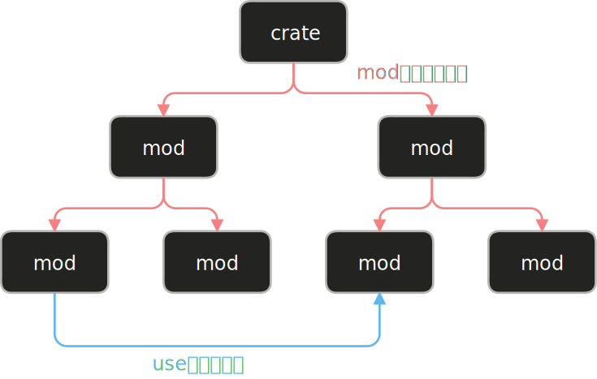

# 为什么需要路径和 use

前面我们讲过，模块在模块树中**只能被声明一次**（声明权属于父模块），但**可以从多处访问**。当你需要在 `a.rs` 和 `b.rs` 中都使用模块 `c` 时，不能重复声明，而要通过**路径**来访问它。



**核心区别**：

- `mod` — 构建 模块树的结构（ mod c; 声明模块 c）
- `路径/use` — 使用 构建好的模块树（ use super::c; 访问模块 c）

# 访问模块中的项：路径

模块中定义的项需要通过**路径**来访问。路径就像文件系统中的路径：`/home/user/file.txt`。

Rust 中有两种路径：

- 绝对路径 ：从 crate root 开始
- 相对路径 ：从当前模块开始

## 绝对路径

绝对路径以 `crate` 关键字或 crate 名开头，表示从 crate 根部开始。

<div class="code-runner" data-full-code="mod%20restaurant%20%7B%0A%20%20%20%20pub%20mod%20front_of_house%20%7B%0A%20%20%20%20%20%20%20%20pub%20mod%20hosting%20%7B%0A%20%20%20%20%20%20%20%20%20%20%20%20pub%20fn%20add_to_waitlist()%20%7B%0A%20%20%20%20%20%20%20%20%20%20%20%20%20%20%20%20println!(%22%E5%B7%B2%E6%B7%BB%E5%8A%A0%E5%88%B0%E7%AD%89%E5%BE%85%E5%88%97%E8%A1%A8%22)%3B%0A%20%20%20%20%20%20%20%20%20%20%20%20%7D%0A%20%20%20%20%20%20%20%20%7D%0A%20%20%20%20%7D%0A%7D%0A%0Afn%20main()%20%7B%0A%20%20%20%20%2F%2F%20%E7%BB%9D%E5%AF%B9%E8%B7%AF%E5%BE%84%EF%BC%9A%E4%BB%8E%20crate%20%E6%A0%B9%E5%BC%80%E5%A7%8B%0A%20%20%20%20crate%3A%3Arestaurant%3A%3Afront_of_house%3A%3Ahosting%3A%3Aadd_to_waitlist()%3B%0A%7D" data-mode="run"><pre class="code-runner-pre"><code class="language-rust"><span class="line"><span style="color:#F97583">mod</span><span style="color:#B392F0"> restaurant</span><span style="color:#E1E4E8"> {</span></span>
<span class="line"><span style="color:#F97583">    pub</span><span style="color:#F97583"> mod</span><span style="color:#B392F0"> front_of_house</span><span style="color:#E1E4E8"> {</span></span>
<span class="line"><span style="color:#F97583">        pub</span><span style="color:#F97583"> mod</span><span style="color:#B392F0"> hosting</span><span style="color:#E1E4E8"> {</span></span>
<span class="line"><span style="color:#F97583">            pub</span><span style="color:#F97583"> fn</span><span style="color:#B392F0"> add_to_waitlist</span><span style="color:#E1E4E8">() {</span></span>
<span class="line"><span style="color:#B392F0">                println!</span><span style="color:#E1E4E8">(</span><span style="color:#9ECBFF">"已添加到等待列表"</span><span style="color:#E1E4E8">);</span></span>
<span class="line"><span style="color:#E1E4E8">            }</span></span>
<span class="line"><span style="color:#E1E4E8">        }</span></span>
<span class="line"><span style="color:#E1E4E8">    }</span></span>
<span class="line"><span style="color:#E1E4E8">}</span></span>
<span class="line"></span>
<span class="line"><span style="color:#F97583">fn</span><span style="color:#B392F0"> main</span><span style="color:#E1E4E8">() {</span></span>
<span class="line"><span style="color:#6A737D">    // 绝对路径：从 crate 根开始</span></span>
<span class="line"><span style="color:#F97583">    crate::</span><span style="color:#B392F0">restaurant</span><span style="color:#F97583">::</span><span style="color:#B392F0">front_of_house</span><span style="color:#F97583">::</span><span style="color:#B392F0">hosting</span><span style="color:#F97583">::</span><span style="color:#B392F0">add_to_waitlist</span><span style="color:#E1E4E8">();</span></span>
<span class="line"><span style="color:#E1E4E8">}</span></span></code></pre></div>

### 为什么用 crate:: 而不是包名？

对于库 crate（lib.rs），使用 `crate::` 代表 crate 根。这样的好处是：

- 如果库被重命名，代码不需要改变
- 跨越 crate 边界时更清晰

```rust
// 库中的绝对路径写法
pub fn some_function() {
    crate::restaurant::eat();  // 总是指向本 crate
}
```

## 相对路径

相对路径以当前模块的标识符、`self`、`super` 开头。

`self` 表示当前模块，`super` 表示父模块（类似文件系统的 `..`）。**通常情况下 `self::` 可以省略**，只有在 `use` 语句中需要显式写出。

<div class="code-runner" data-full-code="fn%20serve_order()%20%7B%0A%20%20%20%20println!(%22%E6%8F%90%E4%BE%9B%E8%AE%A2%E5%8D%95%22)%3B%0A%7D%0A%0Amod%20back_of_house%20%7B%0A%20%20%20%20fn%20cook_order()%20%7B%0A%20%20%20%20%20%20%20%20println!(%22%E5%87%86%E5%A4%87%E8%AE%A2%E5%8D%95%22)%3B%0A%20%20%20%20%7D%0A%0A%20%20%20%20pub%20fn%20fix_incorrect_order()%20%7B%0A%20%20%20%20%20%20%20%20%2F%2F%20%E2%9C%93%20%E4%BD%BF%E7%94%A8%20self%20%E8%AE%BF%E9%97%AE%E5%90%8C%E4%B8%80%E6%A8%A1%E5%9D%97%E7%9A%84%20cook_order%0A%20%20%20%20%20%20%20%20self%3A%3Acook_order()%3B%0A%0A%20%20%20%20%20%20%20%20%2F%2F%20%E2%9C%93%20%E4%BD%BF%E7%94%A8%20super%20%E8%AE%BF%E9%97%AE%E7%88%B6%E6%A8%A1%E5%9D%97%E7%9A%84%20serve_order%0A%20%20%20%20%20%20%20%20super%3A%3Aserve_order()%3B%0A%20%20%20%20%7D%0A%7D%0A%0Afn%20main()%20%7B%0A%20%20%20%20back_of_house%3A%3Afix_incorrect_order()%3B%0A%7D" data-mode="run"><pre class="code-runner-pre"><code class="language-rust"><span class="line"><span style="color:#F97583">fn</span><span style="color:#B392F0"> serve_order</span><span style="color:#E1E4E8">() {</span></span>
<span class="line"><span style="color:#B392F0">    println!</span><span style="color:#E1E4E8">(</span><span style="color:#9ECBFF">"提供订单"</span><span style="color:#E1E4E8">);</span></span>
<span class="line"><span style="color:#E1E4E8">}</span></span>
<span class="line"></span>
<span class="line"><span style="color:#F97583">mod</span><span style="color:#B392F0"> back_of_house</span><span style="color:#E1E4E8"> {</span></span>
<span class="line"><span style="color:#F97583">    fn</span><span style="color:#B392F0"> cook_order</span><span style="color:#E1E4E8">() {</span></span>
<span class="line"><span style="color:#B392F0">        println!</span><span style="color:#E1E4E8">(</span><span style="color:#9ECBFF">"准备订单"</span><span style="color:#E1E4E8">);</span></span>
<span class="line"><span style="color:#E1E4E8">    }</span></span>
<span class="line"></span>
<span class="line"><span style="color:#F97583">    pub</span><span style="color:#F97583"> fn</span><span style="color:#B392F0"> fix_incorrect_order</span><span style="color:#E1E4E8">() {</span></span>
<span class="line"><span style="color:#6A737D">        // ✓ 使用 self 访问同一模块的 cook_order</span></span>
<span class="line"><span style="color:#79B8FF">        self</span><span style="color:#F97583">::</span><span style="color:#B392F0">cook_order</span><span style="color:#E1E4E8">();</span></span>
<span class="line"></span>
<span class="line"><span style="color:#6A737D">        // ✓ 使用 super 访问父模块的 serve_order</span></span>
<span class="line"><span style="color:#79B8FF">        super</span><span style="color:#F97583">::</span><span style="color:#B392F0">serve_order</span><span style="color:#E1E4E8">();</span></span>
<span class="line"><span style="color:#E1E4E8">    }</span></span>
<span class="line"><span style="color:#E1E4E8">}</span></span>
<span class="line"></span>
<span class="line"><span style="color:#F97583">fn</span><span style="color:#B392F0"> main</span><span style="color:#E1E4E8">() {</span></span>
<span class="line"><span style="color:#B392F0">    back_of_house</span><span style="color:#F97583">::</span><span style="color:#B392F0">fix_incorrect_order</span><span style="color:#E1E4E8">();</span></span>
<span class="line"><span style="color:#E1E4E8">}</span></span></code></pre></div>

## 绝对路径 vs 相对路径

| 场景 | 推荐 | 原因 |
| --- | --- | --- |
| 定义项和使用项位置距离远 | 绝对路径 | 移动时只需改变一个位置 |
| 项在嵌套较深的模块中 | 相对路径 + super | 避免写太长的路径 |
| 同时移动定义和使用 | 相对路径 | 整体迁移更方便 |

# use 关键字

`use` 的作用是**将项引入当前作用域**，使你可以用更短的路径来访问它，而不用每次都写完整的模块路径。这是对路径的补充和简化。

## 简化路径

每次都写完整路径会很冗长。`use` 关键字可以将项引入作用域，之后就可以使用短路径。

<div class="code-runner" data-full-code="mod%20restaurant%20%7B%0A%20%20%20%20pub%20mod%20hosting%20%7B%0A%20%20%20%20%20%20%20%20pub%20fn%20add_to_waitlist()%20%7B%0A%20%20%20%20%20%20%20%20%20%20%20%20println!(%22%E5%B7%B2%E6%B7%BB%E5%8A%A0%22)%3B%0A%20%20%20%20%20%20%20%20%7D%0A%20%20%20%20%7D%0A%7D%0A%0Afn%20main()%20%7B%0A%20%20%20%20%2F%2F%20%E2%9D%8C%20%E4%B8%8D%E7%94%A8%20use%20%E6%97%B6%EF%BC%8C%E6%AF%8F%E6%AC%A1%E9%83%BD%E8%A6%81%E5%86%99%E5%AE%8C%E6%95%B4%E8%B7%AF%E5%BE%84%0A%20%20%20%20restaurant%3A%3Ahosting%3A%3Aadd_to_waitlist()%3B%0A%20%20%20%20restaurant%3A%3Ahosting%3A%3Aadd_to_waitlist()%3B%0A%0A%20%20%20%20%2F%2F%20%E2%9C%93%20%E4%BD%BF%E7%94%A8%20use%20%E5%BC%95%E5%85%A5%E5%90%8E%EF%BC%8C%E5%8F%AF%E4%BB%A5%E7%94%A8%E7%9F%AD%E8%B7%AF%E5%BE%84%0A%20%20%20%20use%20restaurant%3A%3Ahosting%3B%0A%20%20%20%20hosting%3A%3Aadd_to_waitlist()%3B%0A%20%20%20%20hosting%3A%3Aadd_to_waitlist()%3B%0A%7D" data-mode="run"><pre class="code-runner-pre"><code class="language-rust"><span class="line"><span style="color:#F97583">mod</span><span style="color:#B392F0"> restaurant</span><span style="color:#E1E4E8"> {</span></span>
<span class="line"><span style="color:#F97583">    pub</span><span style="color:#F97583"> mod</span><span style="color:#B392F0"> hosting</span><span style="color:#E1E4E8"> {</span></span>
<span class="line"><span style="color:#F97583">        pub</span><span style="color:#F97583"> fn</span><span style="color:#B392F0"> add_to_waitlist</span><span style="color:#E1E4E8">() {</span></span>
<span class="line"><span style="color:#B392F0">            println!</span><span style="color:#E1E4E8">(</span><span style="color:#9ECBFF">"已添加"</span><span style="color:#E1E4E8">);</span></span>
<span class="line"><span style="color:#E1E4E8">        }</span></span>
<span class="line"><span style="color:#E1E4E8">    }</span></span>
<span class="line"><span style="color:#E1E4E8">}</span></span>
<span class="line"></span>
<span class="line"><span style="color:#F97583">fn</span><span style="color:#B392F0"> main</span><span style="color:#E1E4E8">() {</span></span>
<span class="line"><span style="color:#6A737D">    // ❌ 不用 use 时，每次都要写完整路径</span></span>
<span class="line"><span style="color:#B392F0">    restaurant</span><span style="color:#F97583">::</span><span style="color:#B392F0">hosting</span><span style="color:#F97583">::</span><span style="color:#B392F0">add_to_waitlist</span><span style="color:#E1E4E8">();</span></span>
<span class="line"><span style="color:#B392F0">    restaurant</span><span style="color:#F97583">::</span><span style="color:#B392F0">hosting</span><span style="color:#F97583">::</span><span style="color:#B392F0">add_to_waitlist</span><span style="color:#E1E4E8">();</span></span>
<span class="line"></span>
<span class="line"><span style="color:#6A737D">    // ✓ 使用 use 引入后，可以用短路径</span></span>
<span class="line"><span style="color:#F97583">    use</span><span style="color:#B392F0"> restaurant</span><span style="color:#F97583">::</span><span style="color:#E1E4E8">hosting;</span></span>
<span class="line"><span style="color:#B392F0">    hosting</span><span style="color:#F97583">::</span><span style="color:#B392F0">add_to_waitlist</span><span style="color:#E1E4E8">();</span></span>
<span class="line"><span style="color:#B392F0">    hosting</span><span style="color:#F97583">::</span><span style="color:#B392F0">add_to_waitlist</span><span style="color:#E1E4E8">();</span></span>
<span class="line"><span style="color:#E1E4E8">}</span></span></code></pre></div>

### use 的惯例

#### **函数**：导入到父模块，调用时指定完整路径

<div class="code-runner" data-full-code="use%20std%3A%3Acollections%3A%3AHashMap%3B%0A%0Afn%20main()%20%7B%0A%20%20%20%20let%20mut%20map%20%3D%20HashMap%3A%3Anew()%3B%20%20%2F%2F%20%E2%9C%93%20%E8%BF%99%E6%98%AF%E6%83%AF%E4%BE%8B%E7%94%A8%E6%B3%95%0A%20%20%20%20map.insert(1%2C%202)%3B%0A%7D" data-mode="run"><pre class="code-runner-pre"><code class="language-rust"><span class="line"><span style="color:#F97583">use</span><span style="color:#B392F0"> std</span><span style="color:#F97583">::</span><span style="color:#B392F0">collections</span><span style="color:#F97583">::</span><span style="color:#B392F0">HashMap</span><span style="color:#E1E4E8">;</span></span>
<span class="line"></span>
<span class="line"><span style="color:#F97583">fn</span><span style="color:#B392F0"> main</span><span style="color:#E1E4E8">() {</span></span>
<span class="line"><span style="color:#F97583">    let</span><span style="color:#F97583"> mut</span><span style="color:#E1E4E8"> map </span><span style="color:#F97583">=</span><span style="color:#B392F0"> HashMap</span><span style="color:#F97583">::</span><span style="color:#B392F0">new</span><span style="color:#E1E4E8">();  </span><span style="color:#6A737D">// ✓ 这是惯例用法</span></span>
<span class="line"><span style="color:#E1E4E8">    map</span><span style="color:#F97583">.</span><span style="color:#B392F0">insert</span><span style="color:#E1E4E8">(</span><span style="color:#79B8FF">1</span><span style="color:#E1E4E8">, </span><span style="color:#79B8FF">2</span><span style="color:#E1E4E8">);</span></span>
<span class="line"><span style="color:#E1E4E8">}</span></span></code></pre></div>

不好的做法：直接导入函数

<div class="code-runner" data-full-code="use%20std%3A%3Acollections%3A%3Ahash_map%3A%3AHashMap%3A%3Anew%3B%20%20%2F%2F%20%E2%9C%97%20%E4%B8%8D%E6%8E%A8%E8%8D%90%0A%0A%2F%2F%20%E5%BA%94%E8%AF%A5%E8%BF%99%E6%A0%B7%EF%BC%9A%0Ause%20std%3A%3Acollections%3A%3AHashMap%3B%0A%0Afn%20main()%20%7B%0A%20%20%20%20let%20map%20%3D%20HashMap%3A%3Anew()%3B%0A%7D" data-mode="run"><pre class="code-runner-pre"><code class="language-rust"><span class="line"><span style="color:#F97583">use</span><span style="color:#B392F0"> std</span><span style="color:#F97583">::</span><span style="color:#B392F0">collections</span><span style="color:#F97583">::</span><span style="color:#B392F0">hash_map</span><span style="color:#F97583">::</span><span style="color:#B392F0">HashMap</span><span style="color:#F97583">::</span><span style="color:#E1E4E8">new;  </span><span style="color:#6A737D">// ✗ 不推荐</span></span>
<span class="line"></span>
<span class="line"><span style="color:#6A737D">// 应该这样：</span></span>
<span class="line"><span style="color:#F97583">use</span><span style="color:#B392F0"> std</span><span style="color:#F97583">::</span><span style="color:#B392F0">collections</span><span style="color:#F97583">::</span><span style="color:#B392F0">HashMap</span><span style="color:#E1E4E8">;</span></span>
<span class="line"></span>
<span class="line"><span style="color:#F97583">fn</span><span style="color:#B392F0"> main</span><span style="color:#E1E4E8">() {</span></span>
<span class="line"><span style="color:#F97583">    let</span><span style="color:#E1E4E8"> map </span><span style="color:#F97583">=</span><span style="color:#B392F0"> HashMap</span><span style="color:#F97583">::</span><span style="color:#B392F0">new</span><span style="color:#E1E4E8">();</span></span>
<span class="line"><span style="color:#E1E4E8">}</span></span></code></pre></div>

#### **结构体、枚举**：导入完整路径

<div class="code-runner" data-full-code="use%20std%3A%3Acollections%3A%3AHashMap%3B%0Ause%20std%3A%3Aresult%3A%3AResult%3B%0A%0Afn%20main()%20%7B%0A%20%20%20%20let%20_map%20%3D%20HashMap%3A%3Anew()%3B%0A%20%20%20%20let%20_result%3A%20Result%3Ci32%2C%20String%3E%20%3D%20Ok(42)%3B%0A%7D" data-mode="run"><pre class="code-runner-pre"><code class="language-rust"><span class="line"><span style="color:#F97583">use</span><span style="color:#B392F0"> std</span><span style="color:#F97583">::</span><span style="color:#B392F0">collections</span><span style="color:#F97583">::</span><span style="color:#B392F0">HashMap</span><span style="color:#E1E4E8">;</span></span>
<span class="line"><span style="color:#F97583">use</span><span style="color:#B392F0"> std</span><span style="color:#F97583">::</span><span style="color:#B392F0">result</span><span style="color:#F97583">::</span><span style="color:#B392F0">Result</span><span style="color:#E1E4E8">;</span></span>
<span class="line"></span>
<span class="line"><span style="color:#F97583">fn</span><span style="color:#B392F0"> main</span><span style="color:#E1E4E8">() {</span></span>
<span class="line"><span style="color:#F97583">    let</span><span style="color:#E1E4E8"> _map </span><span style="color:#F97583">=</span><span style="color:#B392F0"> HashMap</span><span style="color:#F97583">::</span><span style="color:#B392F0">new</span><span style="color:#E1E4E8">();</span></span>
<span class="line"><span style="color:#F97583">    let</span><span style="color:#E1E4E8"> _result</span><span style="color:#F97583">:</span><span style="color:#B392F0"> Result</span><span style="color:#E1E4E8">&lt;</span><span style="color:#B392F0">i32</span><span style="color:#E1E4E8">, </span><span style="color:#B392F0">String</span><span style="color:#E1E4E8">&gt; </span><span style="color:#F97583">=</span><span style="color:#B392F0"> Ok</span><span style="color:#E1E4E8">(</span><span style="color:#79B8FF">42</span><span style="color:#E1E4E8">);</span></span>
<span class="line"><span style="color:#E1E4E8">}</span></span></code></pre></div>

## 处理名称冲突

当导入两个同名的项时，需要用父模块来区分，或用 `as` 起别名。

### 方式 1：用父模块区分

<div class="code-runner" data-full-code="use%20std%3A%3Afmt%3B%0Ause%20std%3A%3Aio%3B%0A%0Afn%20function1()%20-%3E%20fmt%3A%3AResult%20%7B%0A%20%20%20%20Ok(())%0A%7D%0A%0Afn%20function2()%20-%3E%20io%3A%3AResult%3C()%3E%20%7B%0A%20%20%20%20Ok(())%0A%7D%0A%0Afn%20main()%20%7B%0A%20%20%20%20let%20_r1%3A%20fmt%3A%3AResult%20%3D%20function1()%3B%0A%20%20%20%20let%20_r2%3A%20io%3A%3AResult%3C()%3E%20%3D%20function2()%3B%0A%7D" data-mode="run"><pre class="code-runner-pre"><code class="language-rust"><span class="line"><span style="color:#F97583">use</span><span style="color:#B392F0"> std</span><span style="color:#F97583">::</span><span style="color:#E1E4E8">fmt;</span></span>
<span class="line"><span style="color:#F97583">use</span><span style="color:#B392F0"> std</span><span style="color:#F97583">::</span><span style="color:#E1E4E8">io;</span></span>
<span class="line"></span>
<span class="line"><span style="color:#F97583">fn</span><span style="color:#B392F0"> function1</span><span style="color:#E1E4E8">() </span><span style="color:#F97583">-&gt;</span><span style="color:#B392F0"> fmt</span><span style="color:#F97583">::</span><span style="color:#B392F0">Result</span><span style="color:#E1E4E8"> {</span></span>
<span class="line"><span style="color:#B392F0">    Ok</span><span style="color:#E1E4E8">(())</span></span>
<span class="line"><span style="color:#E1E4E8">}</span></span>
<span class="line"></span>
<span class="line"><span style="color:#F97583">fn</span><span style="color:#B392F0"> function2</span><span style="color:#E1E4E8">() </span><span style="color:#F97583">-&gt;</span><span style="color:#B392F0"> io</span><span style="color:#F97583">::</span><span style="color:#B392F0">Result</span><span style="color:#E1E4E8">&lt;()&gt; {</span></span>
<span class="line"><span style="color:#B392F0">    Ok</span><span style="color:#E1E4E8">(())</span></span>
<span class="line"><span style="color:#E1E4E8">}</span></span>
<span class="line"></span>
<span class="line"><span style="color:#F97583">fn</span><span style="color:#B392F0"> main</span><span style="color:#E1E4E8">() {</span></span>
<span class="line"><span style="color:#F97583">    let</span><span style="color:#E1E4E8"> _r1</span><span style="color:#F97583">:</span><span style="color:#B392F0"> fmt</span><span style="color:#F97583">::</span><span style="color:#B392F0">Result</span><span style="color:#F97583"> =</span><span style="color:#B392F0"> function1</span><span style="color:#E1E4E8">();</span></span>
<span class="line"><span style="color:#F97583">    let</span><span style="color:#E1E4E8"> _r2</span><span style="color:#F97583">:</span><span style="color:#B392F0"> io</span><span style="color:#F97583">::</span><span style="color:#B392F0">Result</span><span style="color:#E1E4E8">&lt;()&gt; </span><span style="color:#F97583">=</span><span style="color:#B392F0"> function2</span><span style="color:#E1E4E8">();</span></span>
<span class="line"><span style="color:#E1E4E8">}</span></span></code></pre></div>

### 方式 2：用 as 重命名

<div class="code-runner" data-full-code="use%20std%3A%3Afmt%3A%3AResult%3B%0Ause%20std%3A%3Aio%3A%3AResult%20as%20IoResult%3B%0A%0Afn%20function1()%20-%3E%20Result%20%7B%0A%20%20%20%20Ok(())%0A%7D%0A%0Afn%20function2()%20-%3E%20IoResult%3C()%3E%20%7B%0A%20%20%20%20Ok(())%0A%7D%0A%0Afn%20main()%20%7B%0A%20%20%20%20let%20_r1%3A%20Result%20%3D%20function1()%3B%0A%20%20%20%20let%20_r2%3A%20IoResult%3C()%3E%20%3D%20function2()%3B%0A%7D" data-mode="run"><pre class="code-runner-pre"><code class="language-rust"><span class="line"><span style="color:#F97583">use</span><span style="color:#B392F0"> std</span><span style="color:#F97583">::</span><span style="color:#B392F0">fmt</span><span style="color:#F97583">::</span><span style="color:#B392F0">Result</span><span style="color:#E1E4E8">;</span></span>
<span class="line"><span style="color:#F97583">use</span><span style="color:#B392F0"> std</span><span style="color:#F97583">::</span><span style="color:#B392F0">io</span><span style="color:#F97583">::</span><span style="color:#B392F0">Result</span><span style="color:#F97583"> as</span><span style="color:#B392F0"> IoResult</span><span style="color:#E1E4E8">;</span></span>
<span class="line"></span>
<span class="line"><span style="color:#F97583">fn</span><span style="color:#B392F0"> function1</span><span style="color:#E1E4E8">() </span><span style="color:#F97583">-&gt;</span><span style="color:#B392F0"> Result</span><span style="color:#E1E4E8"> {</span></span>
<span class="line"><span style="color:#B392F0">    Ok</span><span style="color:#E1E4E8">(())</span></span>
<span class="line"><span style="color:#E1E4E8">}</span></span>
<span class="line"></span>
<span class="line"><span style="color:#F97583">fn</span><span style="color:#B392F0"> function2</span><span style="color:#E1E4E8">() </span><span style="color:#F97583">-&gt;</span><span style="color:#B392F0"> IoResult</span><span style="color:#E1E4E8">&lt;()&gt; {</span></span>
<span class="line"><span style="color:#B392F0">    Ok</span><span style="color:#E1E4E8">(())</span></span>
<span class="line"><span style="color:#E1E4E8">}</span></span>
<span class="line"></span>
<span class="line"><span style="color:#F97583">fn</span><span style="color:#B392F0"> main</span><span style="color:#E1E4E8">() {</span></span>
<span class="line"><span style="color:#F97583">    let</span><span style="color:#E1E4E8"> _r1</span><span style="color:#F97583">:</span><span style="color:#B392F0"> Result</span><span style="color:#F97583"> =</span><span style="color:#B392F0"> function1</span><span style="color:#E1E4E8">();</span></span>
<span class="line"><span style="color:#F97583">    let</span><span style="color:#E1E4E8"> _r2</span><span style="color:#F97583">:</span><span style="color:#B392F0"> IoResult</span><span style="color:#E1E4E8">&lt;()&gt; </span><span style="color:#F97583">=</span><span style="color:#B392F0"> function2</span><span style="color:#E1E4E8">();</span></span>
<span class="line"><span style="color:#E1E4E8">}</span></span></code></pre></div>

## 嵌套 use 路径

导入多个项时，可以合并相同的前缀。

<div class="code-runner" data-full-code="%2F%2F%20%E4%BC%A0%E7%BB%9F%E5%86%99%E6%B3%95%0Ause%20std%3A%3Acmp%3A%3AOrdering%3B%0Ause%20std%3A%3Aio%3B%0A%0A%2F%2F%20%E5%B5%8C%E5%A5%97%E5%86%99%E6%B3%95%EF%BC%88%E6%9B%B4%E7%AE%80%E6%B4%81%EF%BC%89%0Ause%20std%3A%3A%7Bcmp%3A%3AOrdering%2C%20io%7D%3B%0A%0Afn%20main()%20%7B%0A%20%20%20%20let%20_order%20%3D%20Ordering%3A%3ALess%3B%0A%7D" data-mode="run"><pre class="code-runner-pre"><code class="language-rust"><span class="line"><span style="color:#6A737D">// 传统写法</span></span>
<span class="line"><span style="color:#F97583">use</span><span style="color:#B392F0"> std</span><span style="color:#F97583">::</span><span style="color:#B392F0">cmp</span><span style="color:#F97583">::</span><span style="color:#B392F0">Ordering</span><span style="color:#E1E4E8">;</span></span>
<span class="line"><span style="color:#F97583">use</span><span style="color:#B392F0"> std</span><span style="color:#F97583">::</span><span style="color:#E1E4E8">io;</span></span>
<span class="line"></span>
<span class="line"><span style="color:#6A737D">// 嵌套写法（更简洁）</span></span>
<span class="line"><span style="color:#F97583">use</span><span style="color:#B392F0"> std</span><span style="color:#F97583">::</span><span style="color:#E1E4E8">{</span><span style="color:#B392F0">cmp</span><span style="color:#F97583">::</span><span style="color:#B392F0">Ordering</span><span style="color:#E1E4E8">, io};</span></span>
<span class="line"></span>
<span class="line"><span style="color:#F97583">fn</span><span style="color:#B392F0"> main</span><span style="color:#E1E4E8">() {</span></span>
<span class="line"><span style="color:#F97583">    let</span><span style="color:#E1E4E8"> _order </span><span style="color:#F97583">=</span><span style="color:#B392F0"> Ordering</span><span style="color:#F97583">::</span><span style="color:#B392F0">Less</span><span style="color:#E1E4E8">;</span></span>
<span class="line"><span style="color:#E1E4E8">}</span></span></code></pre></div>

### 包括 self 的嵌套

<div class="code-runner" data-full-code="use%20std%3A%3Aio%3A%3A%7Bself%2C%20Write%7D%3B%20%20%2F%2F%20%E5%AF%BC%E5%85%A5%20io%20%E5%92%8C%20io%3A%3AWrite%0A%0Afn%20main()%20%7B%0A%20%20%20%20%2F%2F%20%E5%8F%AF%E4%BB%A5%E4%BD%BF%E7%94%A8%20io%3A%3A%20%E5%92%8C%20io%3A%3AWrite%3A%3A%0A%7D" data-mode="run"><pre class="code-runner-pre"><code class="language-rust"><span class="line"><span style="color:#F97583">use</span><span style="color:#B392F0"> std</span><span style="color:#F97583">::</span><span style="color:#B392F0">io</span><span style="color:#F97583">::</span><span style="color:#E1E4E8">{</span><span style="color:#79B8FF">self</span><span style="color:#E1E4E8">, </span><span style="color:#B392F0">Write</span><span style="color:#E1E4E8">};  </span><span style="color:#6A737D">// 导入 io 和 io::Write</span></span>
<span class="line"></span>
<span class="line"><span style="color:#F97583">fn</span><span style="color:#B392F0"> main</span><span style="color:#E1E4E8">() {</span></span>
<span class="line"><span style="color:#6A737D">    // 可以使用 io:: 和 io::Write::</span></span>
<span class="line"><span style="color:#E1E4E8">}</span></span></code></pre></div>

## glob 运算符

用 `*` 导入模块中的所有公有项（谨慎使用）。

<div class="code-runner" data-full-code="use%20std%3A%3Acollections%3A%3A*%3B%0A%0Afn%20main()%20%7B%0A%20%20%20%20%2F%2F%20%E6%89%80%E6%9C%89%20collections%20%E4%B8%AD%E7%9A%84%E5%85%AC%E6%9C%89%E9%A1%B9%E9%83%BD%E5%8F%AF%E4%BB%A5%E4%BD%BF%E7%94%A8%0A%20%20%20%20let%20_vec%20%3D%20Vec%3A%3Anew()%3B%0A%20%20%20%20let%20_map%20%3D%20HashMap%3A%3Anew()%3B%0A%7D" data-mode="run"><pre class="code-runner-pre"><code class="language-rust"><span class="line"><span style="color:#F97583">use</span><span style="color:#B392F0"> std</span><span style="color:#F97583">::</span><span style="color:#B392F0">collections</span><span style="color:#F97583">::*</span><span style="color:#E1E4E8">;</span></span>
<span class="line"></span>
<span class="line"><span style="color:#F97583">fn</span><span style="color:#B392F0"> main</span><span style="color:#E1E4E8">() {</span></span>
<span class="line"><span style="color:#6A737D">    // 所有 collections 中的公有项都可以使用</span></span>
<span class="line"><span style="color:#F97583">    let</span><span style="color:#E1E4E8"> _vec </span><span style="color:#F97583">=</span><span style="color:#B392F0"> Vec</span><span style="color:#F97583">::</span><span style="color:#B392F0">new</span><span style="color:#E1E4E8">();</span></span>
<span class="line"><span style="color:#F97583">    let</span><span style="color:#E1E4E8"> _map </span><span style="color:#F97583">=</span><span style="color:#B392F0"> HashMap</span><span style="color:#F97583">::</span><span style="color:#B392F0">new</span><span style="color:#E1E4E8">();</span></span>
<span class="line"><span style="color:#E1E4E8">}</span></span></code></pre></div>

> **注意**：glob 会让代码变得难以追踪名称来源，通常只在测试中使用。

## pub use：重导出

`pub use` 将导入的项重新导出，使其对外部可见。这在设计库的公开 API 时很有用。

<div class="code-runner" data-full-code="mod%20front_of_house%20%7B%0A%20%20%20%20pub%20mod%20hosting%20%7B%0A%20%20%20%20%20%20%20%20pub%20fn%20add_to_waitlist()%20%7B%0A%20%20%20%20%20%20%20%20%20%20%20%20println!(%22%E5%B7%B2%E6%B7%BB%E5%8A%A0%22)%3B%0A%20%20%20%20%20%20%20%20%7D%0A%20%20%20%20%7D%0A%7D%0A%0A%2F%2F%20%E5%B0%86%20hosting%20%E9%87%8D%E6%96%B0%E5%AF%BC%E5%87%BA%E5%88%B0%E5%BA%93%E7%9A%84%E9%A1%B6%E5%B1%82%20API%0Apub%20use%20front_of_house%3A%3Ahosting%3B%0A%0Afn%20main()%20%7B%0A%20%20%20%20%2F%2F%20%E7%94%A8%E6%88%B7%E5%8F%AF%E4%BB%A5%E7%9B%B4%E6%8E%A5%E8%AE%BF%E9%97%AE%20hosting%EF%BC%8C%E4%B8%8D%E9%9C%80%E8%A6%81%E7%9F%A5%E9%81%93%20front_of_house%20%E7%9A%84%E5%AD%98%E5%9C%A8%0A%20%20%20%20hosting%3A%3Aadd_to_waitlist()%3B%0A%7D" data-mode="run"><pre class="code-runner-pre"><code class="language-rust"><span class="line"><span style="color:#F97583">mod</span><span style="color:#B392F0"> front_of_house</span><span style="color:#E1E4E8"> {</span></span>
<span class="line"><span style="color:#F97583">    pub</span><span style="color:#F97583"> mod</span><span style="color:#B392F0"> hosting</span><span style="color:#E1E4E8"> {</span></span>
<span class="line"><span style="color:#F97583">        pub</span><span style="color:#F97583"> fn</span><span style="color:#B392F0"> add_to_waitlist</span><span style="color:#E1E4E8">() {</span></span>
<span class="line"><span style="color:#B392F0">            println!</span><span style="color:#E1E4E8">(</span><span style="color:#9ECBFF">"已添加"</span><span style="color:#E1E4E8">);</span></span>
<span class="line"><span style="color:#E1E4E8">        }</span></span>
<span class="line"><span style="color:#E1E4E8">    }</span></span>
<span class="line"><span style="color:#E1E4E8">}</span></span>
<span class="line"></span>
<span class="line"><span style="color:#6A737D">// 将 hosting 重新导出到库的顶层 API</span></span>
<span class="line"><span style="color:#F97583">pub</span><span style="color:#F97583"> use</span><span style="color:#B392F0"> front_of_house</span><span style="color:#F97583">::</span><span style="color:#E1E4E8">hosting;</span></span>
<span class="line"></span>
<span class="line"><span style="color:#F97583">fn</span><span style="color:#B392F0"> main</span><span style="color:#E1E4E8">() {</span></span>
<span class="line"><span style="color:#6A737D">    // 用户可以直接访问 hosting，不需要知道 front_of_house 的存在</span></span>
<span class="line"><span style="color:#B392F0">    hosting</span><span style="color:#F97583">::</span><span style="color:#B392F0">add_to_waitlist</span><span style="color:#E1E4E8">();</span></span>
<span class="line"><span style="color:#E1E4E8">}</span></span></code></pre></div>

### 为什么要重导出？

想象你设计了一个库，内部结构是 `types::User` 和 `types::Post`，但用户只关心”用户”和”文章”这两个概念。用 `pub use` 可以简化 API。

**单文件例子：**

```rust
// 内部结构
mod types {
    pub struct User { pub name: String }
    pub struct Post { pub title: String }
}

// 导出到顶层，用户可以直接用
pub use types::{User, Post};

// 用户现在可以这样使用：
// use my_lib::{User, Post};
// 而不需要知道 types 模块
```

**多文件例子（深层模块的重导出）：**

假设你的库有这样的结构：`types` 模块在深处定义了 `User` 和 `Post`。问题是：能否直接从顶层 `lib.rs` 把它们导出给用户？

### 第一种方式：直接导出（无中间层）

项目结构：

```text
src/
├── lib.rs
└── types/
    └── mod.rs         ← 这里定义 User 和 Post
```

**types/mod.rs：**

```rust
pub struct User { pub name: String }
pub struct Post { pub title: String }
```

**lib.rs：**

```rust
mod types;

// 直接从 types 导出到顶层
pub use types::{User, Post};
```

**用户使用：**

```rust
use my_lib::{User, Post};  // ✅ 工作正常
```

---

### 第二种方式：链式重导出（多层嵌套）

如果 types 被嵌套在 utils 内部，才需要链式转发：

项目结构：

```text
src/
├── lib.rs
└── utils/
    ├── mod.rs
    └── types.rs        ← types 是 utils 的子模块
```

**utils/types.rs：**

```rust
pub struct User { pub name: String }
pub struct Post { pub title: String }
```

**utils/mod.rs（从子模块重导出）：**

```rust
mod types;

// 把 types 导出到 utils 的公开 API
pub use types::{User, Post};
```

**lib.rs（再导出一级到顶层）：**

```rust
mod utils;

// 把 utils 的导出再导到顶层
pub use utils::{User, Post};
```

**用户使用：**

```rust
use my_lib::{User, Post};  // ✅ 用户完全看不到 utils 的存在
```

**真实意义**：当 types 本身是 utils 内部的组织时，链式重导出让用户只看到最简洁的公开 API。

> **重要**：重导出有个前提——**源项必须是 `pub` 的**。如果 `User` 本身是私有的，即使你写了 `pub use types::User;` 也会编译错误。因为重导出就是”我允许外部访问这个项”，但前提是这个项本身要对外可见。

# 跨 Crate 使用

前面讲的都是**同一个 crate 内**的模块访问。Rust 也支持**跨 crate 访问**——调用其他 crate 中的函数。

## 前提条件

1. 目标必须是库 crate （有 src/lib.rs ）
1. 函数必须标记为 `pub` （否则外部无法访问）
1. 在 Cargo.toml 中声明依赖
1. 用 `use` 导入

## 文件结构

```text
workspace/
├── math_lib/                    ← 库 crate
│   ├── Cargo.toml
│   └── src/
│       └── lib.rs              ← 包含 pub fn add()
│
└── my_app/                      ← 应用 crate
    ├── Cargo.toml              ← 声明对 math_lib 的依赖
    └── src/
        └── main.rs             ← 使用 use math_lib::add;
```

## 实例

假设有两个 crate：`math_lib`（库）和 `my_app`（应用）

**math_lib/src/lib.rs：**

```rust
pub fn add(a: i32, b: i32) -> i32 {
    a + b
}

fn internal_helper() {  // 私有，外部无法访问
    println!("内部帮助函数");
}
```

**my_app/Cargo.toml：**

```toml
[dependencies]
math_lib = { path = "../math_lib" }  # 本地路径
# 或从 crates.io：
# math_lib = "0.1"
```

**my_app/src/main.rs：**

```rust
use math_lib::add;  // 导入其他 crate 的函数

fn main() {
    let result = add(2, 3);  // ✓ 可以调用 pub 函数
    println!("结果：{}", result);

    // ❌ 无法调用私有函数
    // math_lib::internal_helper();
}
```

## 可见性仍然有效

跨 crate 访问时，**可见性规则仍然适用**：

- 只能访问目标 crate 中标记为 pub 的项
- 嵌套模块也要遵循”完整路径都是 pub”的规则
- 私有项永远隐藏，无论在哪里调用

这是 **Cargo（包管理器）** 和 **模块系统** 结合的力量。

## 循环依赖约束

**重要限制**：Rust 的 crate 依赖**必须是 DAG（有向无环图）**，不允许循环依赖。

```text
❌ 不允许循环依赖：
crate_a → crate_b → crate_c → crate_a
```

**如果遇到循环依赖**，通常说明代码设计有问题，需要重构：

- 提取公共功能到第三个 crate
- 将某个 crate 的依赖改为模块内依赖

强制消除循环依赖，反而能写出更清晰的架构。

# 练习题

## 路径基础测验

```rust
mod outer {
    pub mod inner {
        pub fn function() {
            println!("inner function");
        }
    }
}
```

加载题目中…

加载题目中…

加载题目中…

<div class="code-runner" data-full-code="use%20std%3A%3Acmp%3A%3AOrdering%3B%0Ause%20std%3A%3Acollections%3A%3AHashMap%3B%0Ause%20std%3A%3Acollections%3A%3AHashSet%3B%0Ause%20std%3A%3Aio%3B%0A%0Afn%20main()%20%7B%0A%20%20%20%20let%20_order%20%3D%20Ordering%3A%3ALess%3B%0A%20%20%20%20let%20_map%20%3D%20HashMap%3A%3Anew()%3B%0A%20%20%20%20let%20_set%20%3D%20HashSet%3A%3Anew()%3B%0A%20%20%20%20let%20_io%20%3D%20io%3A%3Astdout()%3B%0A%7D" data-mode="run"><pre class="code-runner-pre"><code class="language-rust"><span class="line"><span style="color:#F97583">use</span><span style="color:#B392F0"> std</span><span style="color:#F97583">::</span><span style="color:#B392F0">cmp</span><span style="color:#F97583">::</span><span style="color:#B392F0">Ordering</span><span style="color:#E1E4E8">;</span></span>
<span class="line"><span style="color:#F97583">use</span><span style="color:#B392F0"> std</span><span style="color:#F97583">::</span><span style="color:#B392F0">collections</span><span style="color:#F97583">::</span><span style="color:#B392F0">HashMap</span><span style="color:#E1E4E8">;</span></span>
<span class="line"><span style="color:#F97583">use</span><span style="color:#B392F0"> std</span><span style="color:#F97583">::</span><span style="color:#B392F0">collections</span><span style="color:#F97583">::</span><span style="color:#B392F0">HashSet</span><span style="color:#E1E4E8">;</span></span>
<span class="line"><span style="color:#F97583">use</span><span style="color:#B392F0"> std</span><span style="color:#F97583">::</span><span style="color:#E1E4E8">io;</span></span>
<span class="line"></span>
<span class="line"><span style="color:#F97583">fn</span><span style="color:#B392F0"> main</span><span style="color:#E1E4E8">() {</span></span>
<span class="line"><span style="color:#F97583">    let</span><span style="color:#E1E4E8"> _order </span><span style="color:#F97583">=</span><span style="color:#B392F0"> Ordering</span><span style="color:#F97583">::</span><span style="color:#B392F0">Less</span><span style="color:#E1E4E8">;</span></span>
<span class="line"><span style="color:#F97583">    let</span><span style="color:#E1E4E8"> _map </span><span style="color:#F97583">=</span><span style="color:#B392F0"> HashMap</span><span style="color:#F97583">::</span><span style="color:#B392F0">new</span><span style="color:#E1E4E8">();</span></span>
<span class="line"><span style="color:#F97583">    let</span><span style="color:#E1E4E8"> _set </span><span style="color:#F97583">=</span><span style="color:#B392F0"> HashSet</span><span style="color:#F97583">::</span><span style="color:#B392F0">new</span><span style="color:#E1E4E8">();</span></span>
<span class="line"><span style="color:#F97583">    let</span><span style="color:#E1E4E8"> _io </span><span style="color:#F97583">=</span><span style="color:#B392F0"> io</span><span style="color:#F97583">::</span><span style="color:#B392F0">stdout</span><span style="color:#E1E4E8">();</span></span>
<span class="line"><span style="color:#E1E4E8">}</span></span></code></pre></div>

加载题目中…

加载题目中…

## 编程练习

### 利用 use 和路径组织模块

创建一个库结构，包含：

- types 模块（私有），定义 User 和 Post 结构体
- 通过 pub use 将 User 和 Post 重导出到顶层
- utils 模块，包含 format_user() 函数
- 在 main 中通过简洁的路径使用这些项

```rust
// TODO: 修改可见性
mod types {
    struct User {
        name: String,
    }
    struct Post {
        title: String,
    }
}

// TODO: 使用 pub use 将 User 和 Post 重导出

// TODO: 使用 User
mod utils {


    pub fn format_user(user: &User) -> String {
        format!("用户: {}", user.name)
    }
}

fn main() {
    // 直接使用 User，不需要知道 types 模块
    let user = User { name: "Alice".to_string() };
    let post = Post { title: "我的博文".to_string() };

    println!("{}", user.name);
    println!("{}", post.title);

    // 使用 utils 中的函数
    println!("{}", utils::format_user(&user));
}
```