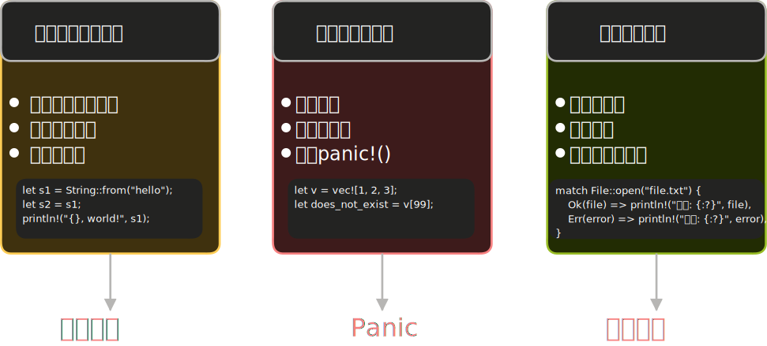

# 错误的两种类型

所有程序都会遇到错误——文件不存在、用户输入了非法数据、网络连接超时。Rust 把这些情况分成截然不同的两类，并用不同的机制分别处理：



- **不可恢复的错误（unrecoverable errors）**：程序遭遇了”不应该发生”的状态，继续运行会带来更大的风险。最典型的例子是代码中的 bug——访问了数组越界位置、违反了程序的核心不变量。这类情况的正确处理是**立即停止程序**。
- **可恢复的错误（recoverable errors）**：错误在预期范围内，程序可以做出响应并继续。文件不存在 → 提示用户或创建文件；格式解析失败 → 报告给调用者处理。这类错误用 `Result<T, E>` 来处理，下一篇会详细讲解。

本文聚焦第一类：**不可恢复的错误**和 `panic!` 宏。

## 使用 panic! 宏

`panic!` 宏用于”程序无法继续执行”的情况，调用后它会：

1. 打印一条错误信息
1. 清理调用栈（默认行为，称为”展开”）
1. 退出程序

<div class="code-runner" data-full-code="fn%20main()%20%7B%0A%20%20%20%20panic!(%22%E5%8F%91%E7%94%9F%E4%BA%86%E4%B8%8D%E5%8F%AF%E6%81%A2%E5%A4%8D%E7%9A%84%E9%94%99%E8%AF%AF%EF%BC%81%22)%3B%0A%7D" data-mode="run"><pre class="code-runner-pre"><code class="language-rust"><span class="line"><span style="color:#F97583">fn</span><span style="color:#B392F0"> main</span><span style="color:#E1E4E8">() {</span></span>
<span class="line"><span style="color:#B392F0">    panic!</span><span style="color:#E1E4E8">(</span><span style="color:#9ECBFF">"发生了不可恢复的错误！"</span><span style="color:#E1E4E8">);</span></span>
<span class="line"><span style="color:#E1E4E8">}</span></span></code></pre></div>

运行后会看到类似这样的输出：

```text
thread 'main' panicked at '发生了不可恢复的错误！', src/main.rs:2:5
note: run with `RUST_BACKTRACE=1` environment variable to display a backtrace
```

第一行告诉你：在哪个文件的哪一行触发了 panic，以及消息内容。第二行提示可以用 `RUST_BACKTRACE=1` 查看完整调用链。

## 自动触发的 panic

很多时候 panic 不是手动调用的，而是 Rust 内部检测到非法操作时**自动触发**的。最常见的例子是访问越界索引：

<div class="code-runner" data-full-code="fn%20main()%20%7B%0A%20%20%20%20let%20v%20%3D%20vec!%5B1%2C%202%2C%203%5D%3B%0A%20%20%20%20println!(%22%7B%7D%22%2C%20v%5B99%5D)%3B%20%20%2F%2F%20%E5%8F%AA%E6%9C%89%203%20%E4%B8%AA%E5%85%83%E7%B4%A0%EF%BC%8Cindex%2099%20%E4%B8%8D%E5%AD%98%E5%9C%A8%0A%7D" data-mode="run"><pre class="code-runner-pre"><code class="language-rust"><span class="line"><span style="color:#F97583">fn</span><span style="color:#B392F0"> main</span><span style="color:#E1E4E8">() {</span></span>
<span class="line"><span style="color:#F97583">    let</span><span style="color:#E1E4E8"> v </span><span style="color:#F97583">=</span><span style="color:#B392F0"> vec!</span><span style="color:#E1E4E8">[</span><span style="color:#79B8FF">1</span><span style="color:#E1E4E8">, </span><span style="color:#79B8FF">2</span><span style="color:#E1E4E8">, </span><span style="color:#79B8FF">3</span><span style="color:#E1E4E8">];</span></span>
<span class="line"><span style="color:#B392F0">    println!</span><span style="color:#E1E4E8">(</span><span style="color:#9ECBFF">"{}"</span><span style="color:#E1E4E8">, v[</span><span style="color:#79B8FF">99</span><span style="color:#E1E4E8">]);  </span><span style="color:#6A737D">// 只有 3 个元素，index 99 不存在</span></span>
<span class="line"><span style="color:#E1E4E8">}</span></span></code></pre></div>

Rust 会 panic 并提示：

```text
thread 'main' panicked at 'index out of bounds: the len is 3 but the index is 99'
```

**为什么 Rust 选择 panic 而不是返回垃圾值？** 这是有意识的安全设计。C 语言中，越界访问会直接读取那块内存里碰巧在那儿的数据，这叫**缓冲区溢出（buffer overread）**，是大量安全漏洞的根源。Rust 宁可程序立即崩溃，也不允许读取不属于该数组的内存。

## 用 backtrace 定位问题

当 panic 发生在标准库内部时，错误信息指向的是标准库的源码，不是你的代码。这时候 **backtrace（调用链追踪）** 很有用。

设置环境变量 `RUST_BACKTRACE=1` 再运行，可以看到从程序入口到 panic 点的完整调用链：

```bash
RUST_BACKTRACE=1 cargo run
```

输出中每一行是一个**栈帧**（函数调用记录）。读 backtrace 的关键是**从上往下找第一个写着你自己文件名的行**——那就是问题的发源地。

对于上面的越界例子，backtrace 里会有一行类似：

```text
12: panic_example::main
         at src/main.rs:3
```

这告诉你：问题在 `src/main.rs` 的第 3 行，也就是 `v[99]` 那里。

> **注意**：backtrace 需要程序以 debug 模式编译（不加 `--release`）。Release 模式下可能缺少调试符号，输出不够完整。

## 展开与终止：panic 的两种行为

panic 触发后，Rust 默认的行为是**展开（unwinding）**：顺着调用栈往回走，逐个清理各函数的数据（调用析构函数、释放内存）。这保证资源正确释放，但有一定开销。

如果你追求更小的二进制文件，可以改为**终止（abort）**：直接退出进程，让操作系统回收内存。在 `Cargo.toml` 里配置：

```toml
[profile.release]
panic = 'abort'
```

这样 release 模式下 panic 时会直接终止，不展开调用栈。

> 对于大多数应用来说，默认的展开行为就够用了。`panic = 'abort'` 主要用在两种场景：一是对二进制体积极度敏感的项目；二是嵌入式开发（`no_std` 环境），那里没有操作系统支持，调用栈展开的实现方式与具体芯片架构强绑定（ARM、RISC-V 等各不相同），通常直接 abort 更可靠。嵌入式场景还需要用 `#[panic_handler]` 自定义 panic 发生时的行为（比如让指示灯闪烁或复位芯片），但这属于嵌入式开发的专题内容。

# 练习题

## panic 基础测验

```rust
fn main() {
    let v = vec![1, 2, 3];
    let x = v[5];
    println!("{}", x);
}
```

加载题目中…

加载题目中…

加载题目中…

加载题目中…

加载题目中…