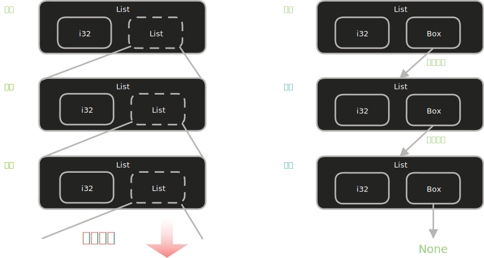

# 智能指针从 `Box<T>` 开始

在 Rust 中，默认情况下所有值都存放在栈上。当值的大小在编译时已知，栈是高效且安全的选择。然而，在以下三种经典场景中，我们必须将数据搬到堆上：

1. 类型大小编译时未知 ：比如递归数据结构，它的实际大小取决于运行时的数据量。
1. 大量数据转移所有权 ：避免将 MB 级别的数据在栈上来回拷贝，而是只拷贝指针。
1. Trait 对象 ：希望持有”实现了某个 Trait 的任意类型”，而不关心具体类型。

`Box<T>` 是 Rust 标准库提供的最简单的智能指针。它在栈上存储一个指针，而将实际数据分配在堆上。除了分配位置不同，它的行为和普通引用几乎相同。

## 最简单的用法

<div class="code-runner" data-full-code="fn%20main()%20%7B%0A%20%20%20%20let%20b%20%3D%20Box%3A%3Anew(5)%3B%0A%20%20%20%20println!(%22b%20%3D%20%7B%7D%22%2C%20b)%3B%0A%20%20%20%20%2F%2F%20b%20%E7%A6%BB%E5%BC%80%E4%BD%9C%E7%94%A8%E5%9F%9F%E6%97%B6%EF%BC%8C%E6%A0%88%E4%B8%8A%E7%9A%84%E6%8C%87%E9%92%88%E5%92%8C%E5%A0%86%E4%B8%8A%E7%9A%84%E6%95%B0%E6%8D%AE%E9%83%BD%E4%BC%9A%E8%A2%AB%E9%87%8A%E6%94%BE%0A%7D" data-mode="run"><pre class="code-runner-pre"><code class="language-rust"><span class="line"><span style="color:#F97583">fn</span><span style="color:#B392F0"> main</span><span style="color:#E1E4E8">() {</span></span>
<span class="line"><span style="color:#F97583">    let</span><span style="color:#E1E4E8"> b </span><span style="color:#F97583">=</span><span style="color:#B392F0"> Box</span><span style="color:#F97583">::</span><span style="color:#B392F0">new</span><span style="color:#E1E4E8">(</span><span style="color:#79B8FF">5</span><span style="color:#E1E4E8">);</span></span>
<span class="line"><span style="color:#B392F0">    println!</span><span style="color:#E1E4E8">(</span><span style="color:#9ECBFF">"b = {}"</span><span style="color:#E1E4E8">, b);</span></span>
<span class="line"><span style="color:#6A737D">    // b 离开作用域时，栈上的指针和堆上的数据都会被释放</span></span>
<span class="line"><span style="color:#E1E4E8">}</span></span></code></pre></div>

这个例子没有什么实际意义——把单个整数放在堆上没有必要。但它清晰地展示了 `Box<T>` 的基本语法：像使用栈上的值一样使用它，Rust 会在离开作用域时自动清理堆内存。

## 递归类型：`Box<T>` 大显身手

递归类型是 `Box<T>` 最重要的使用场景之一。**递归类型**指的是类型定义中包含自身的类型。

### 问题：无限大小的类型



我们来尝试用 Rust 定义一个来自函数式编程的经典数据结构 —— cons list（一种简单的链表）：

```rust
// 这段代码无法编译！
enum List {
    Cons(i32, List),  // Cons 节点包含一个值和下一个节点，是一个具名元组
    Nil,              // 表示列表终止
}
```

如果你尝试编译上面的代码，编译器会给出如下错误：

```text
error[E0072]: recursive type `List` has infinite size
 --> src/main.rs:1:1
  |
1 | enum List {
  | ^^^^^^^^^ recursive type has infinite size
2 |     Cons(i32, List),
  |               ---- recursive without indirection
  |
  = help: insert indirection (e.g., a `Box`, `Rc`, or `&`) at some point
    to make `List` representable
```

这个错误发生的原因很直观：Rust 在编译时需要知道每个类型需要多少内存。当编译器看到 `List` 时，它会去计算 `Cons(i32, List)` 的大小，而这又需要再次计算 `List` 的大小……这个计算永远无法终止。

### 理解编译器的尺寸计算

对于普通的枚举，Rust 会选择其最大成员的大小。比如：

```rust
enum Message {
    Quit,                       // 不占数据空间
    Move { x: i32, y: i32 },   // 需要两个 i32
    Write(String),              // 需要一个 String
    ChangeColor(i32, i32, i32), // 需要三个 i32
}
```

Rust 会取所有成员中最大的那个，为所有 `Message` 实例分配相同大小的内存。但递归类型让这个计算陷入死循环。

### 解决方案：用指针打破递归

编译器错误信息给了提示：在递归处加入”间接性” (indirection)。意思是不直接存储一个 `List` 值，而是存储一个**指向** `List` 的指针：

<div class="code-runner" data-full-code="%23%5Bderive(Debug)%5D%0Aenum%20List%20%7B%0A%20%20%20%20Cons(i32%2C%20Box%3CList%3E)%2C%20%20%2F%2F%20%E7%94%A8%20Box%20%E5%8C%85%E8%A3%B9%EF%BC%8C%E5%AD%98%E5%82%A8%E7%9A%84%E6%98%AF%E6%8C%87%E9%92%88%E8%80%8C%E9%9D%9E%E5%80%BC%0A%20%20%20%20Nil%2C%0A%7D%0A%0Ause%20List%3A%3A%7BCons%2C%20Nil%7D%3B%0A%0Afn%20main()%20%7B%0A%20%20%20%20let%20list%20%3D%20Cons(1%2C%0A%20%20%20%20%20%20%20%20Box%3A%3Anew(Cons(2%2C%0A%20%20%20%20%20%20%20%20%20%20%20%20Box%3A%3Anew(Cons(3%2C%0A%20%20%20%20%20%20%20%20%20%20%20%20%20%20%20%20Box%3A%3Anew(Nil))))))%3B%0A%0A%20%20%20%20println!(%22%E9%93%BE%E8%A1%A8%3A%20%7B%3A%3F%7D%22%2C%20list)%3B%0A%7D" data-mode="run"><pre class="code-runner-pre"><code class="language-rust"><span class="line"><span style="color:#E1E4E8">#[derive(</span><span style="color:#B392F0">Debug</span><span style="color:#E1E4E8">)]</span></span>
<span class="line"><span style="color:#F97583">enum</span><span style="color:#B392F0"> List</span><span style="color:#E1E4E8"> {</span></span>
<span class="line"><span style="color:#B392F0">    Cons</span><span style="color:#E1E4E8">(</span><span style="color:#B392F0">i32</span><span style="color:#E1E4E8">, </span><span style="color:#B392F0">Box</span><span style="color:#E1E4E8">&lt;</span><span style="color:#B392F0">List</span><span style="color:#E1E4E8">&gt;),  </span><span style="color:#6A737D">// 用 Box 包裹，存储的是指针而非值</span></span>
<span class="line"><span style="color:#B392F0">    Nil</span><span style="color:#E1E4E8">,</span></span>
<span class="line"><span style="color:#E1E4E8">}</span></span>
<span class="line"></span>
<span class="line"><span style="color:#F97583">use</span><span style="color:#B392F0"> List</span><span style="color:#F97583">::</span><span style="color:#E1E4E8">{</span><span style="color:#B392F0">Cons</span><span style="color:#E1E4E8">, </span><span style="color:#B392F0">Nil</span><span style="color:#E1E4E8">};</span></span>
<span class="line"></span>
<span class="line"><span style="color:#F97583">fn</span><span style="color:#B392F0"> main</span><span style="color:#E1E4E8">() {</span></span>
<span class="line"><span style="color:#F97583">    let</span><span style="color:#E1E4E8"> list </span><span style="color:#F97583">=</span><span style="color:#B392F0"> Cons</span><span style="color:#E1E4E8">(</span><span style="color:#79B8FF">1</span><span style="color:#E1E4E8">,</span></span>
<span class="line"><span style="color:#B392F0">        Box</span><span style="color:#F97583">::</span><span style="color:#B392F0">new</span><span style="color:#E1E4E8">(</span><span style="color:#B392F0">Cons</span><span style="color:#E1E4E8">(</span><span style="color:#79B8FF">2</span><span style="color:#E1E4E8">,</span></span>
<span class="line"><span style="color:#B392F0">            Box</span><span style="color:#F97583">::</span><span style="color:#B392F0">new</span><span style="color:#E1E4E8">(</span><span style="color:#B392F0">Cons</span><span style="color:#E1E4E8">(</span><span style="color:#79B8FF">3</span><span style="color:#E1E4E8">,</span></span>
<span class="line"><span style="color:#B392F0">                Box</span><span style="color:#F97583">::</span><span style="color:#B392F0">new</span><span style="color:#E1E4E8">(</span><span style="color:#B392F0">Nil</span><span style="color:#E1E4E8">))))));</span></span>
<span class="line"></span>
<span class="line"><span style="color:#B392F0">    println!</span><span style="color:#E1E4E8">(</span><span style="color:#9ECBFF">"链表: {:?}"</span><span style="color:#E1E4E8">, list);</span></span>
<span class="line"><span style="color:#E1E4E8">}</span></span></code></pre></div>

现在 Rust 可以轻松计算出 `Cons` 成员的大小了：一个 `i32` 加上一个 `Box<List>` 指针（在 64 位系统上固定为 8 字节）。无论链表有多长，每个节点的内存布局都是固定且可知的。

## `Box<T>` 的本质

`Box<T>` 之所以称为”智能”指针，是因为它实现了两个关键 Trait：

- `Deref` Trait ：使得 Box<T> 可以像引用一样被解引用（使用 * 运算符），以及享受解引用强制转换的便利。
- `Drop` Trait ：当 Box<T> 离开作用域时，会自动释放堆上的内存，无需手动 free 。

这两个 Trait 正是下一篇文章要深入学习的核心内容。`Box<T>` 的其他功能除此以外，既没有额外的性能开销，也没有额外的运行时检查——它是 Rust 智能指针家族中最”干净”的成员。

# 练习题

## 测验

加载题目中…

加载题目中…

加载题目中…

加载题目中…

```rust
fn main() {
    let x = Box::new(5);
    let y = x;
    println!("{}", x); // 使用 x
}
```

加载题目中…